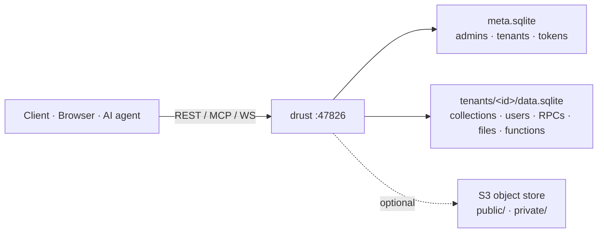

<div align="center">


<br/>

**The backend your AI agents can drive — and your users can trust.**
A self-hosted, multi-tenant SQLite Backend-as-a-Service in one Rust binary:
per-tenant REST **and** a native MCP endpoint, row-level security, realtime,
vector search, and WebAssembly edge functions. One file per tenant. No database server.

[](https://www.rust-lang.org)
[](https://modelcontextprotocol.io)
[](https://www.sqlite.org)
[](#-quickstart)
[](CHANGELOG.md)
[](LICENSE)

[**Quickstart**](#-quickstart) · [**What you can build**](#-what-you-can-build) · [**Why drust**](#-why-drust) · [**Docs**](docs/architecture.md) · [繁體中文](README.zh.md)

</div>

---

## ✨ In one sentence

Spinning up a Postgres or Supabase per project is overkill for the hundreds of small apps, internal tools, and AI-agent scratchpads a team accumulates. **drust** gives each project a self-contained `tenant.sqlite`, a typed API that never accepts raw SQL on the write path, row-level security, and a per-tenant MCP server an AI agent can drive with **zero glue code** — all from a single binary that idles at ~15 MB and serves ~13k req/s.

## 🚀 What you can build

| | |
|---|---|
| 🧱 **A SaaS / CRUD backend** | Define collections in the admin UI, get REST + typed TypeScript/Zod clients instantly. No DB server, no migration tooling. |
| 🤖 **An AI-agent-native datastore** | Point any MCP client at `/t/<id>/mcp` — the agent inspects the schema, does CRUD, runs vector search, manages files through typed tools. Errors carry a `suggested_fix`; destructive ops support `dry_run`. |
| 🏢 **A multi-tenant platform** | One process, many fully-isolated tenants. Cross-tenant access is denied **in-SQL** by the authorizer, not just in app code. |
| 🔒 **Per-user secured data** | Declare an `owner_field`, or write PocketBase-style row-level policies — every read, write, and realtime event is filtered for you. |
| ⚡ **Realtime apps** | Subscribe over SSE, or multiplex many rooms over one WebSocket and broadcast JSON. |
| 🧠 **Semantic search** | Add a `vector` field, query cosine / L2 / L1 top-k over a structured filter. |
| 🪝 **Event-driven automation** | Upload a small WebAssembly edge function that runs in-process on record changes or file uploads. |

## 💡 Why drust

- **🤖 AI-native, not bolted-on.** Every tenant ships a Streamable-HTTP MCP server whose `instructions` prologue is a structured *intent → tool* map, so an agent is productive on first connect — no prompt engineering, no custom tool wrappers.
- **🧊 One binary, one file per tenant.** SQLite embedded, no database server to run or back up separately. Cross-tenant `ATTACH` is impossible — enforced by SQLite's authorizer on read-only connections.
- **🔐 Security that composes.** `owner_field` + per-operation RLS policies (structured Filter AST → `?`-bound SQL) AND-compose on every read/write/realtime surface. The write path **never** accepts raw SQL.
- **🪶 Fast and dense.** ~15 MB idle, ~13k req/s on a laptop, dozens of tenants on a 256 MB box. Built in Rust on [axum](https://github.com/tokio-rs/axum) + [`rmcp`](https://github.com/modelcontextprotocol/rust-sdk).
- **🔋 Batteries included.** Realtime (SSE + WS rooms), vector search, wasm edge functions, stored RPCs, per-tenant OAuth, outbound webhooks (SSRF-guarded), S3 file storage with resumable uploads, typed-client codegen (OpenAPI / TS / Zod), Prometheus metrics, daily backups, and a Supabase-style admin UI.

## 📊 How it compares

| | **drust** | PocketBase | Supabase | Firebase |
|---|:---:|:---:|:---:|:---:|
| **License / open source** | AGPL-3.0 | MIT | Apache-2.0 | proprietary |
| Self-hosted, single binary | ✅ | ✅ | ⚠️ heavy stack | ❌ cloud only |
| Per-tenant DB isolation | ✅ one SQLite/tenant | ❌ one DB | ❌ one Postgres | ⚠️ |
| **Native MCP endpoint for AI agents** | ✅ | ❌ | ❌ | ❌ |
| Row-level security | ✅ owner + policies | ✅ rules | ✅ Postgres RLS | ✅ rules |
| Realtime | ✅ SSE + WS rooms | ✅ | ✅ | ✅ |
| Edge functions | ✅ wasm, in-process | ⚠️ JS hooks | ✅ Deno, separate | ✅ separate |
| Vector search | ✅ sqlite-vec | ❌ | ✅ pgvector | ⚠️ |
| Typed-client codegen | ✅ OpenAPI/TS/Zod | ⚠️ | ✅ | ⚠️ |
| Idle footprint | ~15 MB | small | large | n/a |
| Language | Rust | Go | TS / Elixir | proprietary |

## ⚡ Quickstart

drust serves plain HTTP — front it with a TLS-terminating reverse proxy (Caddy, nginx, Traefik) in production.

```bash
git clone https://github.com/KaelLim/drust.git && cd drust

docker compose up -d                 # drust on http://localhost:47826
# ...or with S3 file storage (drust + MinIO):
docker compose --profile storage up -d
```

```bash
curl -s http://localhost:47826/health        # → ok
open http://localhost/login                  # admin UI via the bundled Caddy (root mode); log in with DRUST_INIT_ADMIN_*
```

> [!CAUTION]
> Don't run the container under a seccomp/AppArmor profile that blocks `mmap(PROT_EXEC)` — wasmtime's JIT (used by edge functions) needs executable memory. Docker's default profile is fine; the guest sandbox is enforced *inside* wasmtime, not by process-wide W^X.

<details>
<summary><b>Build from source instead</b></summary>

```bash
git clone https://github.com/KaelLim/drust.git && cd drust
cp .env.example .env             # edit DRUST_INIT_ADMIN_* and friends
cargo build --release
./target/release/drust            # binds 127.0.0.1:47826 by default
curl -s http://127.0.0.1:47826/health   # → ok
```
For systemd deployment behind a reverse proxy, see [`CLAUDE.md`](CLAUDE.md) and the `deploy/` unit templates.

</details>

## 🏗️ Architecture



Three request surfaces — admin UI (cookie session), tenant REST (`anon` / `user` / `service` bearer), and tenant MCP (`service` only). Public object reads bypass drust entirely; drust only sits in the *write* path. The full per-file source index lives in [`docs/architecture.md`](docs/architecture.md).

<details>
<summary><b>API surfaces</b></summary>

| Surface | Path | Auth | Use |
|---|---|---|---|
| Admin UI | `/admin/*` | Cookie session | Tenant + schema management, policies, files, functions |
| Tenant REST | `/t/<id>/...` | Bearer (`anon` / `user` / `service`) | CRUD, `/list`, `/search`, RPC, files, uploads, realtime |
| Tenant MCP | `/t/<id>/mcp` | Bearer (`service` only) | LLM tool calls — CRUD, schema, indexes, RPCs, files, vector search, webhooks, policies, functions |
| Codegen | `/t/<id>/{openapi.json,types.ts,zod.ts}` | Bearer | Typed clients for the tenant's current schema |
| Health | `/health` | none | Liveness probe |

</details>

<details>
<summary><b>Configuration (environment variables)</b></summary>

| Variable | Required | Purpose |
|---|---|---|
| `DRUST_DATA_DIR` | yes | Base dir for `meta.sqlite`, `meta_logs.sqlite`, `tenants/`, backups |
| `DRUST_LOG_DIR` | yes | Reserved log directory |
| `DRUST_INIT_ADMIN_USERNAME` | first boot | Bootstrap admin account |
| `DRUST_INIT_ADMIN_PASSWORD` | first boot | Bootstrap admin password |
| `DRUST_BIND` | optional (`127.0.0.1:47826`) | Listen address — set `0.0.0.0:47826` in a container |
| `DRUST_PUBLIC_URL` | optional | Public base URL — required for OAuth redirect/callback links |
| `DRUST_CORS_ORIGINS` | optional | Comma-separated allow-list; supports `https://*.example.com`, `http://localhost:*` |
| `DRUST_DISK_MIN_FREE_PCT` | optional (20) | Upload guard for tenant file storage |
| `GARAGE_S3_ENDPOINT` + `GARAGE_S3_ACCESS_KEY` + `GARAGE_S3_SECRET_KEY` | optional | Enables S3 storage features |
| `GARAGE_ADMIN_ENDPOINT` + `GARAGE_ADMIN_TOKEN` | optional | Garage-only: auto-provision buckets |

The S3 data path uses `object_store::aws::AmazonS3`, so any S3-compatible service works (Garage, MinIO, R2, AWS S3, B2). Auto-bucket provisioning is Garage-specific; for other backends, pre-create the buckets.

</details>

## 📚 Learn more

- [`CHANGELOG.md`](CHANGELOG.md) — full version history (keepachangelog, semver)
- [`docs/architecture.md`](docs/architecture.md) — auto-generated per-file source index
- [`CLAUDE.md`](CLAUDE.md) — deep internal guide (architecture, invariants, conventions)

## 📄 License

drust is licensed under the [GNU Affero General Public License v3.0](LICENSE) (AGPL-3.0-only).

Self-hosting for personal, internal, or non-commercial use is fully covered by AGPL-3.0. If you intend to (a) offer drust — or a modified version — as a hosted service to third parties, or (b) integrate it into a proprietary product whose source you cannot release under AGPL, you will likely need a separate **commercial license**. For inquiries, open a GitHub issue with the `commercial-license` label.
