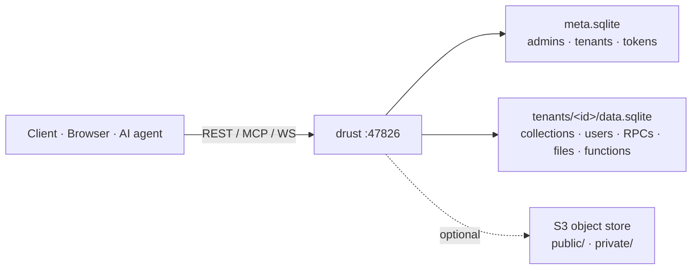

<div align="center">


<br/>

**AI agent 能直接驅動、使用者能信任的後端。**
自架、多租戶的 SQLite Backend-as-a-Service，單一 Rust 執行檔：每個租戶各有 REST
**與**原生 MCP 端點、row-level security、realtime、向量搜尋、WebAssembly edge functions。
一租戶一檔案，不用另外跑資料庫伺服器。

[](https://www.rust-lang.org)
[](https://modelcontextprotocol.io)
[](https://www.sqlite.org)
[](#-快速開始)
[](CHANGELOG.md)
[](LICENSE)

[**快速開始**](#-快速開始) · [**你能做什麼**](#-你能做什麼) · [**為何選 drust**](#-為何選-drust) · [**文件**](docs/architecture.md) · [English](README.md)

</div>

---

## ✨ 一句話

為每個小應用各起一套 Postgres / Supabase 太重了 —— 一個團隊會累積數百個小 app、內部工具、AI agent 暫存區。**drust** 給每個專案一顆自帶的 `tenant.sqlite`、一套寫入路徑絕不吃 raw SQL 的型別化 API、row-level security，以及一個 AI agent **零膠水程式**就能驅動的 per-tenant MCP 伺服器 —— 全部來自單一執行檔，idle 約 15 MB、約 13k req/s。

## 🚀 你能做什麼

| | |
|---|---|
| 🧱 **SaaS / CRUD 後端** | 在後台定義 collection，立刻拿到 REST + 型別化 TypeScript/Zod client。不必跑 DB 伺服器、不必 migration 工具。 |
| 🤖 **AI-agent 原生資料層** | 任何 MCP client 指向 `/t/<id>/mcp` —— agent 透過型別化工具檢視 schema、CRUD、向量搜尋、管理檔案。錯誤帶 `suggested_fix`、破壞性操作支援 `dry_run`。 |
| 🏢 **多租戶平台** | 單一程序、多個完全隔離的租戶。跨租戶存取由 authorizer 在 **SQL 層**就擋掉，不只是應用層。 |
| 🔒 **per-user 受保護資料** | 宣告 `owner_field`，或寫 PocketBase 風格的 row-level policy —— 每次讀、寫、realtime 事件都自動過濾。 |
| ⚡ **Realtime 應用** | 用 SSE 訂閱，或在單一 WebSocket 上多工多個 room 並廣播 JSON。 |
| 🧠 **語意搜尋** | 加一個 `vector` 欄位，對結構化 filter 做 cosine / L2 / L1 top-k。 |
| 🪝 **事件驅動自動化** | 上傳一支小 WebAssembly edge function，在 record 變更或檔案上傳時 in-process 執行。 |

## 💡 為何選 drust

- **🤖 AI 原生，不是事後外掛。** 每個租戶都有一個 Streamable-HTTP MCP 伺服器，其 `instructions` 開場白是結構化的 *intent → tool* 地圖，讓 agent 連上第一次就能上手 —— 不需 prompt engineering、不需自製 tool wrapper。
- **🧊 單一 binary、一租戶一檔。** SQLite 內嵌，不必另跑或另備份資料庫伺服器。跨租戶 `ATTACH` 不可能 —— 由 SQLite authorizer 在唯讀連線上強制。
- **🔐 會疊加的安全。** `owner_field` + per-operation RLS policy（結構化 Filter AST → `?`-bound SQL）在每個讀/寫/realtime 面 AND 疊加。寫入路徑**永不**吃 raw SQL。
- **🪶 最快又最密。** idle 約 15 MB、筆電上約 13k req/s、256 MB 的機器塞數十個租戶。以 Rust 建構於 [axum](https://github.com/tokio-rs/axum) + [`rmcp`](https://github.com/modelcontextprotocol/rust-sdk)。
- **🔋 電池全附。** Realtime（SSE + WS rooms）、向量搜尋、wasm edge functions、stored RPC、per-tenant OAuth、outbound webhooks（含 SSRF 防護）、S3 檔案儲存含可續傳上傳、型別化 client codegen（OpenAPI / TS / Zod）、Prometheus metrics、每日備份，以及 Supabase 風格後台。

## 📊 對照

| | **drust** | PocketBase | Supabase | Firebase |
|---|:---:|:---:|:---:|:---:|
| 自架、單一 binary | ✅ | ✅ | ⚠️ 重型堆疊 | ❌ 僅雲端 |
| Per-tenant DB 隔離 | ✅ 一租戶一 SQLite | ❌ 單一 DB | ❌ 單一 Postgres | ⚠️ |
| **給 AI agent 的原生 MCP 端點** | ✅ | ❌ | ❌ | ❌ |
| Row-level security | ✅ owner + policy | ✅ rules | ✅ Postgres RLS | ✅ rules |
| Realtime | ✅ SSE + WS rooms | ✅ | ✅ | ✅ |
| Edge functions | ✅ wasm, in-process | ⚠️ JS hooks | ✅ Deno, 分離 | ✅ 分離 |
| 向量搜尋 | ✅ sqlite-vec | ❌ | ✅ pgvector | ⚠️ |
| 型別化 client codegen | ✅ OpenAPI/TS/Zod | ⚠️ | ✅ | ⚠️ |
| Idle footprint | ~15 MB | 小 | 大 | n/a |
| 語言 | Rust | Go | TS / Elixir | 專有 |

## ⚡ 快速開始

drust 只服務 plain HTTP —— 正式環境請在前面擺一個負責 TLS 終止的反向代理（Caddy、nginx、Traefik）。

```bash
git clone https://github.com/KaelLim/drust.git && cd drust

docker compose up -d                 # drust 跑在 http://localhost:47826
# ...或連同 S3 檔案儲存（drust + MinIO）：
docker compose --profile storage up -d
```

```bash
curl -s http://localhost:47826/health        # → ok
open http://localhost:47826/admin/login      # 用 docker-compose.yml 裡的 DRUST_INIT_ADMIN_* 登入
```

> [!CAUTION]
> 不要在會擋 `mmap(PROT_EXEC)` 的 seccomp/AppArmor profile 下跑這個容器 —— wasmtime 的 JIT（edge functions 用）需要可執行記憶體。Docker 預設 profile 沒問題；guest 沙箱是在 wasmtime *內部* 落實，不是靠 process 級 W^X。

<details>
<summary><b>改從原始碼建置</b></summary>

```bash
git clone https://github.com/KaelLim/drust.git && cd drust
cp .env.example .env             # 編輯 DRUST_INIT_ADMIN_* 等
cargo build --release
./target/release/drust            # 預設綁 127.0.0.1:47826
curl -s http://127.0.0.1:47826/health   # → ok
```
systemd 搭反向代理的部署見 [`CLAUDE.md`](CLAUDE.md) 與 `deploy/` 的 unit 範本。

</details>

## 🏗️ 架構



三個請求介面 —— 後台 UI（cookie session）、租戶 REST（`anon` / `user` / `service` bearer）、租戶 MCP（僅 `service`）。Public 物件讀取完全繞過 drust；drust 只在*寫入*路徑。完整逐檔原始碼索引在 [`docs/architecture.md`](docs/architecture.md)。

<details>
<summary><b>API 介面</b></summary>

| 介面 | 路徑 | 認證 | 用途 |
|---|---|---|---|
| 後台 UI | `/admin/*` | Cookie session | 租戶 + schema 管理、policy、檔案、function |
| 租戶 REST | `/t/<id>/...` | Bearer（`anon` / `user` / `service`） | CRUD、`/list`、`/search`、RPC、檔案、上傳、realtime |
| 租戶 MCP | `/t/<id>/mcp` | Bearer（僅 `service`） | LLM 工具呼叫 —— CRUD、schema、index、RPC、檔案、向量搜尋、webhook、policy、function |
| Codegen | `/t/<id>/{openapi.json,types.ts,zod.ts}` | Bearer | 依租戶當前 schema 的型別化 client |
| Health | `/health` | 無 | Liveness probe |

</details>

<details>
<summary><b>設定（環境變數）</b></summary>

| 變數 | 必填 | 用途 |
|---|---|---|
| `DRUST_DATA_DIR` | 是 | `meta.sqlite`、`meta_logs.sqlite`、`tenants/`、備份的根目錄 |
| `DRUST_LOG_DIR` | 是 | 保留的 log 目錄 |
| `DRUST_INIT_ADMIN_USERNAME` | 首次開機 | bootstrap admin 帳號 |
| `DRUST_INIT_ADMIN_PASSWORD` | 首次開機 | bootstrap admin 密碼 |
| `DRUST_BIND` | 選用（`127.0.0.1:47826`） | 監聽位址 —— 容器內設 `0.0.0.0:47826` |
| `DRUST_PUBLIC_URL` | 選用 | 對外 base URL —— OAuth redirect/callback 連結需要 |
| `DRUST_CORS_ORIGINS` | 選用 | 逗號分隔允許清單；支援 `https://*.example.com`、`http://localhost:*` |
| `DRUST_DISK_MIN_FREE_PCT` | 選用（20） | 租戶檔案儲存的上傳守門 |
| `GARAGE_S3_ENDPOINT` + `GARAGE_S3_ACCESS_KEY` + `GARAGE_S3_SECRET_KEY` | 選用 | 啟用 S3 儲存功能 |
| `GARAGE_ADMIN_ENDPOINT` + `GARAGE_ADMIN_TOKEN` | 選用 | 僅 Garage：自動建立 bucket |

S3 資料路徑走 `object_store::aws::AmazonS3`，所以任何 S3 相容服務都能用（Garage、MinIO、R2、AWS S3、B2）。自動建 bucket 是 Garage 專屬；其他後端請預先建好 bucket。

</details>

## 📚 深入了解

- [`CHANGELOG.md`](CHANGELOG.md) —— 完整版本歷史（keepachangelog、semver）
- [`docs/architecture.md`](docs/architecture.md) —— 自動產生的逐檔原始碼索引
- [`CLAUDE.md`](CLAUDE.md) —— 深入內部指南（架構、不變式、慣例）

## 📄 授權

drust 採用 [GNU Affero General Public License v3.0](LICENSE)（AGPL-3.0-only）。

個人、內部、或非商業用途的自架完全在 AGPL-3.0 涵蓋範圍內。若你打算 (a) 將 drust —— 或其修改版 —— 作為託管服務提供給第三方，或 (b) 整合進無法以 AGPL 釋出原始碼的專有產品，則很可能需要另外的**商業授權**。洽詢請在 GitHub 開一個帶 `commercial-license` 標籤的 issue。
