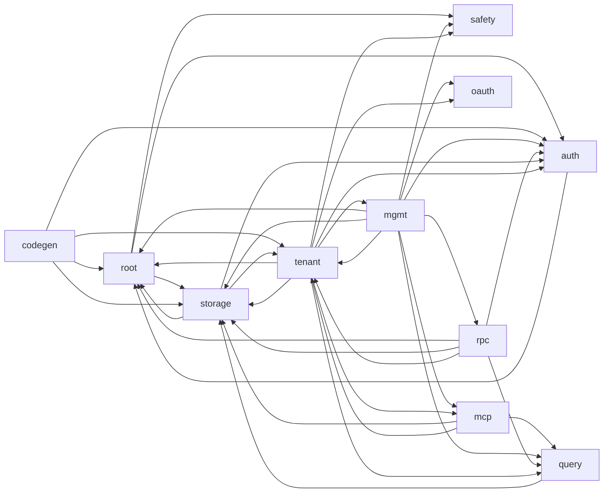

# drust — source architecture index

> [!NOTE]
> **Auto-generated** from `src/**/*.rs`. Do not hand-edit — rebuild with
> `python3 drust/docs/gen-architecture.py` after code changes.
>
> Summaries come from each file's `//!` module doc. Public items come from top-level `pub` declarations. Cross-file edges come from `use crate::...` imports and `mod X;` declarations — this is **textual, not AST**, so calls through fully-qualified paths without a `use` won't appear. Good enough for orientation.

## Module overview

| group | files | public items | imports out | imports in |
|---|---:|---:|---:|---:|
| [`(root)/`](#srcroot) | 5 | 22 | 3 | 22 |
| [`auth/`](#srcauth) | 10 | 49 | 2 | 34 |
| [`bin/`](#srcbin) | 3 | 0 | 0 | 0 |
| [`codegen/`](#srccodegen) | 7 | 26 | 10 | 6 |
| [`db/`](#srcdb) | 2 | 11 | 0 | 0 |
| [`mcp/`](#srcmcp) | 17 | 120 | 53 | 24 |
| [`mgmt/`](#srcmgmt) | 27 | 233 | 80 | 36 |
| [`oauth/`](#srcoauth) | 6 | 27 | 5 | 10 |
| [`query/`](#srcquery) | 7 | 33 | 5 | 23 |
| [`rpc/`](#srcrpc) | 6 | 31 | 15 | 7 |
| [`safety/`](#srcsafety) | 8 | 38 | 1 | 11 |
| [`storage/`](#srcstorage) | 13 | 89 | 9 | 59 |
| [`tenant/`](#srctenant) | 31 | 188 | 98 | 49 |

## Group-level dependency graph

## `src/` (root)

### [`src/bin_helpers.rs`](../src/bin_helpers.rs)

_Shared between bin/set_admin_password.rs and tests._

**Declared by:**

- [`src/lib.rs`](../src/lib.rs)

**Public items:**

- `fn validate_email` — Conservative email well-formedness check — does NOT match all of
- `fn set_admin_password_with_email`

**Imports from:**

- [`src/auth/admin.rs`](../src/auth/admin.rs)
- [`src/storage/meta.rs`](../src/storage/meta.rs)

### [`src/config.rs`](../src/config.rs)

**Declared by:**

- [`src/lib.rs`](../src/lib.rs)

**Public items:**

- `enum ConfigError`
- `struct Config`
- `struct StorageConfig`

**Imported by:**

- [`src/storage/garage.rs`](../src/storage/garage.rs)

### [`src/error.rs`](../src/error.rs)

**Declared by:**

- [`src/lib.rs`](../src/lib.rs)

**Public items:**

- `fn json_error` — Canonical JSON error response. v1.26: auto-attaches `suggested_fix`
- `fn json_error_with_context` — v1.26 — Context-aware variant of `json_error`. Use this at the 4
- `fn json_error_with_aliases` — v1.29.6 — same as `json_error` but additionally emits an

**Imports from:**

- [`src/safety/error_fixes.rs`](../src/safety/error_fixes.rs)

**Imported by:**

- [`src/auth/middleware.rs`](../src/auth/middleware.rs)
- [`src/codegen/handlers.rs`](../src/codegen/handlers.rs)
- [`src/mgmt/admin_pat.rs`](../src/mgmt/admin_pat.rs)
- [`src/mgmt/admin_team.rs`](../src/mgmt/admin_team.rs)
- [`src/rpc/handler.rs`](../src/rpc/handler.rs)
- [`src/tenant/admin_user_routes.rs`](../src/tenant/admin_user_routes.rs)
- [`src/tenant/auth_routes.rs`](../src/tenant/auth_routes.rs)
- [`src/tenant/collections.rs`](../src/tenant/collections.rs)
- [`src/tenant/mcp_dispatch.rs`](../src/tenant/mcp_dispatch.rs)
- [`src/tenant/oauth_admin_routes.rs`](../src/tenant/oauth_admin_routes.rs)
- [`src/tenant/owner_field.rs`](../src/tenant/owner_field.rs)
- [`src/tenant/query_endpoint.rs`](../src/tenant/query_endpoint.rs)
- [`src/tenant/realtime_routes.rs`](../src/tenant/realtime_routes.rs)
- [`src/tenant/records.rs`](../src/tenant/records.rs)
- [`src/tenant/records_list.rs`](../src/tenant/records_list.rs)
- [`src/tenant/rooms/rest.rs`](../src/tenant/rooms/rest.rs)
- [`src/tenant/router.rs`](../src/tenant/router.rs)
- [`src/tenant/sse.rs`](../src/tenant/sse.rs)
- [`src/tenant/uploads/mod.rs`](../src/tenant/uploads/mod.rs)
- [`src/tenant/vector_search.rs`](../src/tenant/vector_search.rs)
- [`src/tenant/webhook_routes.rs`](../src/tenant/webhook_routes.rs)

### [`src/lib.rs`](../src/lib.rs)

**Declares submodules:**

- [`src/auth/mod.rs`](../src/auth/mod.rs)
- [`src/bin_helpers.rs`](../src/bin_helpers.rs)
- [`src/codegen/mod.rs`](../src/codegen/mod.rs)
- [`src/config.rs`](../src/config.rs)
- [`src/db/mod.rs`](../src/db/mod.rs)
- [`src/error.rs`](../src/error.rs)
- [`src/mcp/mod.rs`](../src/mcp/mod.rs)
- [`src/mgmt/mod.rs`](../src/mgmt/mod.rs)
- [`src/oauth/mod.rs`](../src/oauth/mod.rs)
- [`src/query/mod.rs`](../src/query/mod.rs)
- [`src/rpc/mod.rs`](../src/rpc/mod.rs)
- [`src/safety/mod.rs`](../src/safety/mod.rs)
- [`src/storage/mod.rs`](../src/storage/mod.rs)
- [`src/tenant/mod.rs`](../src/tenant/mod.rs)

**Public items:**

- `mod auth`
- `mod bin_helpers`
- `mod codegen`
- `mod config`
- `mod db`
- `mod error`
- `mod mcp`
- `mod mgmt`
- `mod oauth`
- `mod query`
- `mod rpc`
- `mod safety`
- `mod storage`
- `mod tenant`

### [`src/main.rs`](../src/main.rs)

_(no top-level pub items)_

## `src/auth/`

### [`src/auth/admin.rs`](../src/auth/admin.rs)

**Declared by:**

- [`src/auth/mod.rs`](../src/auth/mod.rs)

**Public items:**

- `fn hash_password`
- `fn verify_password`
- `fn dummy_hash` — argon2id PHC string for a password the attacker cannot guess. Used by

**Imported by:**

- [`src/bin_helpers.rs`](../src/bin_helpers.rs)
- [`src/mgmt/routes.rs`](../src/mgmt/routes.rs)
- [`src/storage/meta.rs`](../src/storage/meta.rs)

### [`src/auth/admin_token.rs`](../src/auth/admin_token.rs)

_Per-admin Personal Access Token (PAT) primitives. v1.29.0._

**Declared by:**

- [`src/auth/mod.rs`](../src/auth/mod.rs)

**Public items:**

- `const TOKEN_PREFIX`
- `fn generate_token`
- `fn hash_token`
- `struct AdminTokenHit`
- `fn lookup` — Lookup a PAT by its plaintext bearer. Returns Ok(Some(hit)) if matched,

**Imported by:**

- [`src/mgmt/admin_pat.rs`](../src/mgmt/admin_pat.rs)

### [`src/auth/bearer.rs`](../src/auth/bearer.rs)

**Declared by:**

- [`src/auth/mod.rs`](../src/auth/mod.rs)

**Public items:**

- `fn generate_token`
- `fn hash_token`
- `fn verify_token_hash`
- `fn token_hint`

**Imported by:**

- [`src/mgmt/tenants.rs`](../src/mgmt/tenants.rs)
- [`src/mgmt/tokens.rs`](../src/mgmt/tokens.rs)
- [`src/tenant/router.rs`](../src/tenant/router.rs)

### [`src/auth/middleware.rs`](../src/auth/middleware.rs)

**Declared by:**

- [`src/auth/mod.rs`](../src/auth/mod.rs)

**Public items:**

- `struct AdminSessionState`
- `enum AuthCtx`
- `struct AdminId`
- `const SESSION_COOKIE`
- `fn admin_session_layer`
- `fn build_session_cookie`
- `fn clear_session_cookie`
- `struct ServiceTid` — Path-extracted tenant id, gated by a service-role bearer check.

**Imports from:**

- [`src/auth/session.rs`](../src/auth/session.rs)
- [`src/error.rs`](../src/error.rs)

**Imported by:**

- [`src/codegen/handlers.rs`](../src/codegen/handlers.rs)
- [`src/mgmt/admin_pat.rs`](../src/mgmt/admin_pat.rs)
- [`src/mgmt/admin_rooms.rs`](../src/mgmt/admin_rooms.rs)
- [`src/mgmt/admin_team.rs`](../src/mgmt/admin_team.rs)
- [`src/mgmt/oauth_login.rs`](../src/mgmt/oauth_login.rs)
- [`src/mgmt/public_files.rs`](../src/mgmt/public_files.rs)
- [`src/mgmt/routes.rs`](../src/mgmt/routes.rs)
- [`src/mgmt/tenants.rs`](../src/mgmt/tenants.rs)
- [`src/rpc/handler.rs`](../src/rpc/handler.rs)
- [`src/tenant/admin_user_routes.rs`](../src/tenant/admin_user_routes.rs)
- [`src/tenant/auth_routes.rs`](../src/tenant/auth_routes.rs)
- [`src/tenant/oauth_admin_routes.rs`](../src/tenant/oauth_admin_routes.rs)
- [`src/tenant/owner_field.rs`](../src/tenant/owner_field.rs)
- [`src/tenant/query_endpoint.rs`](../src/tenant/query_endpoint.rs)
- [`src/tenant/records.rs`](../src/tenant/records.rs)
- [`src/tenant/records_list.rs`](../src/tenant/records_list.rs)
- [`src/tenant/rooms/policy.rs`](../src/tenant/rooms/policy.rs)
- [`src/tenant/rooms/rest.rs`](../src/tenant/rooms/rest.rs)
- [`src/tenant/rooms/ws.rs`](../src/tenant/rooms/ws.rs)
- [`src/tenant/router.rs`](../src/tenant/router.rs)
- [`src/tenant/sse.rs`](../src/tenant/sse.rs)
- [`src/tenant/vector_search.rs`](../src/tenant/vector_search.rs)
- [`src/tenant/webhook_routes.rs`](../src/tenant/webhook_routes.rs)

### [`src/auth/mod.rs`](../src/auth/mod.rs)

**Declares submodules:**

- [`src/auth/admin.rs`](../src/auth/admin.rs)
- [`src/auth/admin_token.rs`](../src/auth/admin_token.rs)
- [`src/auth/bearer.rs`](../src/auth/bearer.rs)
- [`src/auth/middleware.rs`](../src/auth/middleware.rs)
- [`src/auth/oauth_sentinel.rs`](../src/auth/oauth_sentinel.rs)
- [`src/auth/profile.rs`](../src/auth/profile.rs)
- [`src/auth/session.rs`](../src/auth/session.rs)
- [`src/auth/user.rs`](../src/auth/user.rs)
- [`src/auth/user_session.rs`](../src/auth/user_session.rs)

**Declared by:**

- [`src/lib.rs`](../src/lib.rs)

**Public items:**

- `mod admin`
- `mod admin_token`
- `mod bearer`
- `mod middleware`
- `mod oauth_sentinel`
- `mod profile`
- `mod session`
- `mod user`
- `mod user_session`

### [`src/auth/oauth_sentinel.rs`](../src/auth/oauth_sentinel.rs)

_OAuth-only user marker. v1.12+ inserts this exact string into_

**Declared by:**

- [`src/auth/mod.rs`](../src/auth/mod.rs)

**Public items:**

- `const OAUTH_ONLY_SENTINEL`
- `fn is_oauth_only` — True iff a stored password_hash is the OAuth-only sentinel.

### [`src/auth/profile.rs`](../src/auth/profile.rs)

_Profile encoding/decoding helpers shared by REST + MCP user paths._

**Declared by:**

- [`src/auth/mod.rs`](../src/auth/mod.rs)

**Public items:**

- `fn encode` — Encode a client-supplied `profile` value to the TEXT form stored in
- `fn decode` — Decode the TEXT form read from `_system_users.profile`. Returns

### [`src/auth/session.rs`](../src/auth/session.rs)

**Declared by:**

- [`src/auth/mod.rs`](../src/auth/mod.rs)

**Public items:**

- `fn create_session`
- `fn validate_session`
- `fn purge_expired`
- `fn revoke_session`

**Imported by:**

- [`src/auth/middleware.rs`](../src/auth/middleware.rs)
- [`src/mgmt/oauth_login.rs`](../src/mgmt/oauth_login.rs)
- [`src/mgmt/routes.rs`](../src/mgmt/routes.rs)

### [`src/auth/user.rs`](../src/auth/user.rs)

**Declared by:**

- [`src/auth/mod.rs`](../src/auth/mod.rs)

**Public items:**

- `fn dummy_hash` — argon2id PHC string for a password the attacker cannot guess. Used by login when the
- `fn hash_password`
- `fn verify_password`

**Imported by:**

- [`src/tenant/auth_routes.rs`](../src/tenant/auth_routes.rs)

### [`src/auth/user_session.rs`](../src/auth/user_session.rs)

**Declared by:**

- [`src/auth/mod.rs`](../src/auth/mod.rs)

**Public items:**

- `struct SessionInfo`
- `fn generate_token`
- `fn hash_token`
- `fn create_session`
- `fn lookup_session`
- `fn slide_expiry`
- `fn revoke_session`
- `fn revoke_session_by_hash`
- `fn revoke_all_sessions`

## `src/bin/`

### [`src/bin/drust_session_janitor.rs`](../src/bin/drust_session_janitor.rs)

_Daily janitor for expired user + admin sessions. Invoked by the_

_(no top-level pub items)_

### [`src/bin/set_admin_password.rs`](../src/bin/set_admin_password.rs)

_(no top-level pub items)_

### [`src/bin/set_admin_role.rs`](../src/bin/set_admin_role.rs)

_Break-glass CLI: set an admin's role by email. v1.29.0._

_(no top-level pub items)_

## `src/codegen/`

### [`src/codegen/filter_ast_schema.rs`](../src/codegen/filter_ast_schema.rs)

_v1.27 — Neutral schema descriptions of FilterAst, shared across all_

**Declared by:**

- [`src/codegen/mod.rs`](../src/codegen/mod.rs)

**Public items:**

- `fn filter_ast_openapi_schema` — OpenAPI 3.1 schema for FilterAst, as a JSON Value. References itself
- `const FILTER_AST_TS` — TypeScript type definition for FilterAst as a single string block.
- `const FILTER_AST_ZOD` — Zod schema for FilterAst — self-referential via z.lazy.

### [`src/codegen/handlers.rs`](../src/codegen/handlers.rs)

_v1.27 — Route handlers for /openapi.json, /types.ts, /zod.ts._

**Declared by:**

- [`src/codegen/mod.rs`](../src/codegen/mod.rs)

**Public items:**

- `fn openapi_handler`
- `fn types_handler`
- `fn zod_handler`

**Imports from:**

- [`src/auth/middleware.rs`](../src/auth/middleware.rs)
- [`src/codegen/mod.rs`](../src/codegen/mod.rs)
- [`src/codegen/openapi.rs`](../src/codegen/openapi.rs)
- [`src/codegen/typescript.rs`](../src/codegen/typescript.rs)
- [`src/codegen/zod.rs`](../src/codegen/zod.rs)
- [`src/error.rs`](../src/error.rs)
- [`src/tenant/router.rs`](../src/tenant/router.rs)

### [`src/codegen/ir.rs`](../src/codegen/ir.rs)

_v1.27 — Neutral intermediate representation. Same shape for OpenAPI,_

**Declared by:**

- [`src/codegen/mod.rs`](../src/codegen/mod.rs)

**Public items:**

- `struct CodegenIr`
- `struct CollectionIr`
- `struct FieldIr`
- `enum FieldType`
- `enum DefaultValue`
- `struct IndexIr`
- `fn build_ir` — Build a `CodegenIr` from a live tenant pool. `include_descriptions`

**Imports from:**

- [`src/storage/pool.rs`](../src/storage/pool.rs)

**Imported by:**

- [`src/codegen/typescript.rs`](../src/codegen/typescript.rs)
- [`src/codegen/zod.rs`](../src/codegen/zod.rs)

### [`src/codegen/mod.rs`](../src/codegen/mod.rs)

_v1.27 — Schema codegen module. Emits OpenAPI 3.1 / TypeScript /_

**Declares submodules:**

- [`src/codegen/filter_ast_schema.rs`](../src/codegen/filter_ast_schema.rs)
- [`src/codegen/handlers.rs`](../src/codegen/handlers.rs)
- [`src/codegen/ir.rs`](../src/codegen/ir.rs)
- [`src/codegen/openapi.rs`](../src/codegen/openapi.rs)
- [`src/codegen/typescript.rs`](../src/codegen/typescript.rs)
- [`src/codegen/zod.rs`](../src/codegen/zod.rs)

**Declared by:**

- [`src/lib.rs`](../src/lib.rs)

**Public items:**

- `mod filter_ast_schema`
- `mod handlers`
- `mod ir`
- `mod openapi`
- `mod typescript`
- `mod zod`
- `fn synthetic_ir`
- `fn render_openapi_for_test`
- `fn render_typescript_for_test`
- `fn render_zod_for_test`

**Imported by:**

- [`src/codegen/handlers.rs`](../src/codegen/handlers.rs)

### [`src/codegen/openapi.rs`](../src/codegen/openapi.rs)

_v1.27 — OpenAPI 3.1 renderer. Output is a serde_json::Value the_

**Declared by:**

- [`src/codegen/mod.rs`](../src/codegen/mod.rs)

**Public items:**

- `fn render_openapi`

**Imported by:**

- [`src/codegen/handlers.rs`](../src/codegen/handlers.rs)

### [`src/codegen/typescript.rs`](../src/codegen/typescript.rs)

_v1.27 — TypeScript renderer. Pure string templating; output is_

**Declared by:**

- [`src/codegen/mod.rs`](../src/codegen/mod.rs)

**Public items:**

- `fn render_typescript`

**Imports from:**

- [`src/codegen/ir.rs`](../src/codegen/ir.rs)

**Imported by:**

- [`src/codegen/handlers.rs`](../src/codegen/handlers.rs)

### [`src/codegen/zod.rs`](../src/codegen/zod.rs)

_v1.27 — Zod renderer. Mirrors the TypeScript renderer's shape with_

**Declared by:**

- [`src/codegen/mod.rs`](../src/codegen/mod.rs)

**Public items:**

- `fn render_zod`

**Imports from:**

- [`src/codegen/ir.rs`](../src/codegen/ir.rs)

**Imported by:**

- [`src/codegen/handlers.rs`](../src/codegen/handlers.rs)

## `src/db/`

### [`src/db/migrations.rs`](../src/db/migrations.rs)

**Declared by:**

- [`src/db/mod.rs`](../src/db/mod.rs)

**Public items:**

- `const SQL_CREATE_ADMIN_TOKENS_IF_NOT_EXISTS`
- `const SQL_CREATE_SYSTEM_USERS_IF_NOT_EXISTS`
- `const SQL_CREATE_SYSTEM_SESSIONS_IF_NOT_EXISTS`
- `const SQL_CREATE_SYSTEM_OAUTH_PROVIDERS_IF_NOT_EXISTS`
- `const SQL_CREATE_SYSTEM_WEBHOOKS_IF_NOT_EXISTS`
- `const SQL_CREATE_SYSTEM_UPLOAD_SESSIONS_IF_NOT_EXISTS`
- `fn add_column_if_missing`
- `fn migrate_tenant_db`
- `struct MigrationReport`
- `fn run_migrations`

### [`src/db/mod.rs`](../src/db/mod.rs)

**Declares submodules:**

- [`src/db/migrations.rs`](../src/db/migrations.rs)

**Declared by:**

- [`src/lib.rs`](../src/lib.rs)

**Public items:**

- `mod migrations`

## `src/mcp/`

### [`src/mcp/handler.rs`](../src/mcp/handler.rs)

_rmcp Streamable HTTP handler that exposes the 13 drust tools._

**Declared by:**

- [`src/mcp/mod.rs`](../src/mcp/mod.rs)

**Public items:**

- `struct DescribeCollectionArgs`
- `struct SampleRowsArgs`
- `struct CountRowsArgs`
- `struct QueryArgs`
- `struct ExplainArgs`
- `struct CreateCollectionArgs`
- `struct AddFieldArgs`
- `struct DropFieldArgs`
- `struct DropCollectionArgs`
- `struct CreateIndexArgs`
- `struct DropIndexArgs`
- `struct RecentWritesArgs`
- `struct SetAnonCapsArgs`
- `struct SetRealtimeArgs`
- `struct SetCollectionDescriptionArgs`
- `struct SetFieldDescriptionArgs`
- `struct SetIndexDescriptionArgs`
- `struct InsertRecordArgs`
- `struct UpdateRecordArgs`
- `struct DeleteRecordArgs`
- `struct CreateRpcParams`
- `struct UpdateRpcParams`
- `struct NameOnly`
- `struct EmptyParams`
- `struct CallRpcParams`
- `struct CreateUserArgs`
- `struct ListUsersArgs`
- `struct UserIdArgs`
- `struct UpdateUserArgs`
- `struct SetOwnerFieldArgs`
- `struct ClearOwnerFieldArgs`
- `struct SetSelfRegisterArgs`
- `struct SetPublishPolicyArgs`
- `struct SetOauthProviderArgs`
- `struct ProviderOnlyArgs`
- `struct CreateWebhookArgs`
- `struct UpdateWebhookArgs`
- `struct WebhookIdArgs`
- `struct BroadcastArgs`
- `struct DrustMcpService`

**Imports from:**

- [`src/mcp/server.rs`](../src/mcp/server.rs)
- [`src/mcp/tools/exploration.rs`](../src/mcp/tools/exploration.rs)
- [`src/mcp/tools/files.rs`](../src/mcp/tools/files.rs)
- [`src/mcp/tools/oauth.rs`](../src/mcp/tools/oauth.rs)
- [`src/mcp/tools/owner_field.rs`](../src/mcp/tools/owner_field.rs)
- [`src/mcp/tools/read.rs`](../src/mcp/tools/read.rs)
- [`src/mcp/tools/schema.rs`](../src/mcp/tools/schema.rs)
- [`src/mcp/tools/user.rs`](../src/mcp/tools/user.rs)
- [`src/mcp/tools/vector.rs`](../src/mcp/tools/vector.rs)
- [`src/mcp/tools/webhook.rs`](../src/mcp/tools/webhook.rs)
- [`src/mcp/tools/write.rs`](../src/mcp/tools/write.rs)
- [`src/tenant/rooms/audit.rs`](../src/tenant/rooms/audit.rs)
- [`src/tenant/rooms/envelope.rs`](../src/tenant/rooms/envelope.rs)
- [`src/tenant/rooms/rest.rs`](../src/tenant/rooms/rest.rs)

**Imported by:**

- [`src/mcp/http_registry.rs`](../src/mcp/http_registry.rs)

### [`src/mcp/http_registry.rs`](../src/mcp/http_registry.rs)

_Per-tenant cache of `StreamableHttpService` instances._

**Declared by:**

- [`src/mcp/mod.rs`](../src/mcp/mod.rs)

**Public items:**

- `type TenantMcpService`
- `struct McpHttpRegistry`

**Imports from:**

- [`src/mcp/handler.rs`](../src/mcp/handler.rs)
- [`src/mcp/server.rs`](../src/mcp/server.rs)

**Imported by:**

- [`src/tenant/mcp_dispatch.rs`](../src/tenant/mcp_dispatch.rs)
- [`src/tenant/mod.rs`](../src/tenant/mod.rs)

### [`src/mcp/mod.rs`](../src/mcp/mod.rs)

**Declares submodules:**

- [`src/mcp/handler.rs`](../src/mcp/handler.rs)
- [`src/mcp/http_registry.rs`](../src/mcp/http_registry.rs)
- [`src/mcp/server.rs`](../src/mcp/server.rs)
- [`src/mcp/tools/mod.rs`](../src/mcp/tools/mod.rs)

**Declared by:**

- [`src/lib.rs`](../src/lib.rs)

**Public items:**

- `mod handler`
- `mod http_registry`
- `mod server`
- `mod tools`

### [`src/mcp/server.rs`](../src/mcp/server.rs)

**Declared by:**

- [`src/mcp/mod.rs`](../src/mcp/mod.rs)

**Public items:**

- `struct DrustMcpInner`
- `struct DrustMcp`
- `struct McpRegistry` — Lazy cache of per-tenant MCP services. Entries are evicted when a tenant is

**Imports from:**

- [`src/storage/garage.rs`](../src/storage/garage.rs)
- [`src/storage/pool.rs`](../src/storage/pool.rs)
- [`src/tenant/events.rs`](../src/tenant/events.rs)
- [`src/tenant/mod.rs`](../src/tenant/mod.rs)
- [`src/tenant/rooms/mod.rs`](../src/tenant/rooms/mod.rs)

**Imported by:**

- [`src/mcp/handler.rs`](../src/mcp/handler.rs)
- [`src/mcp/http_registry.rs`](../src/mcp/http_registry.rs)
- [`src/mcp/tools/exploration.rs`](../src/mcp/tools/exploration.rs)
- [`src/mcp/tools/files.rs`](../src/mcp/tools/files.rs)
- [`src/mcp/tools/read.rs`](../src/mcp/tools/read.rs)
- [`src/mcp/tools/realtime.rs`](../src/mcp/tools/realtime.rs)
- [`src/mcp/tools/schema.rs`](../src/mcp/tools/schema.rs)
- [`src/mcp/tools/vector.rs`](../src/mcp/tools/vector.rs)
- [`src/mcp/tools/write.rs`](../src/mcp/tools/write.rs)

### [`src/mcp/tools/exploration.rs`](../src/mcp/tools/exploration.rs)

**Declared by:**

- [`src/mcp/tools/mod.rs`](../src/mcp/tools/mod.rs)

**Public items:**

- `fn list_collections`
- `fn describe_collection`
- `fn sample_rows`
- `fn count_rows`
- `fn whoami` — Return the calling tenant's identity, both bearer tokens (plaintext),
- `fn get_schema_overview` — MCP impl: one-shot schema bootstrap. Returns every collection's

**Imports from:**

- [`src/mcp/server.rs`](../src/mcp/server.rs)
- [`src/query/authorizer.rs`](../src/query/authorizer.rs)
- [`src/query/executor.rs`](../src/query/executor.rs)
- [`src/query/filter.rs`](../src/query/filter.rs)
- [`src/storage/schema.rs`](../src/storage/schema.rs)

**Imported by:**

- [`src/mcp/handler.rs`](../src/mcp/handler.rs)

### [`src/mcp/tools/files.rs`](../src/mcp/tools/files.rs)

_Y-scope MCP file tools — list / delete / get_file_url._

**Declared by:**

- [`src/mcp/tools/mod.rs`](../src/mcp/tools/mod.rs)

**Public items:**

- `struct ListFilesArgs`
- `fn list_files`
- `struct DeleteFileArgs`
- `fn delete_file`
- `struct GetFileUrlArgs`
- `fn get_file_url`

**Imports from:**

- [`src/mcp/server.rs`](../src/mcp/server.rs)
- [`src/storage/files.rs`](../src/storage/files.rs)

**Imported by:**

- [`src/mcp/handler.rs`](../src/mcp/handler.rs)

### [`src/mcp/tools/index.rs`](../src/mcp/tools/index.rs)

**Declared by:**

- [`src/mcp/tools/mod.rs`](../src/mcp/tools/mod.rs)

**Public items:**

- `fn create_index` — Create a (possibly unique) index on one or more fields of a collection.
- `fn create_index_with_threshold` — Create a (possibly unique) index on one or more fields of a collection.
- `fn create_index_with_threshold_and_desc` — Like [`create_index_with_threshold`] but also accepts an optional
- `fn drop_index`
- `fn explain_select` — Run `EXPLAIN QUERY PLAN <sql>` under the read connection.
- `fn derive_index_name`

**Imports from:**

- [`src/mcp/tools/schema.rs`](../src/mcp/tools/schema.rs)
- [`src/storage/pool.rs`](../src/storage/pool.rs)
- [`src/storage/schema.rs`](../src/storage/schema.rs)

### [`src/mcp/tools/mod.rs`](../src/mcp/tools/mod.rs)

**Declares submodules:**

- [`src/mcp/tools/exploration.rs`](../src/mcp/tools/exploration.rs)
- [`src/mcp/tools/files.rs`](../src/mcp/tools/files.rs)
- [`src/mcp/tools/index.rs`](../src/mcp/tools/index.rs)
- [`src/mcp/tools/oauth.rs`](../src/mcp/tools/oauth.rs)
- [`src/mcp/tools/owner_field.rs`](../src/mcp/tools/owner_field.rs)
- [`src/mcp/tools/read.rs`](../src/mcp/tools/read.rs)
- [`src/mcp/tools/realtime.rs`](../src/mcp/tools/realtime.rs)
- [`src/mcp/tools/schema.rs`](../src/mcp/tools/schema.rs)
- [`src/mcp/tools/user.rs`](../src/mcp/tools/user.rs)
- [`src/mcp/tools/vector.rs`](../src/mcp/tools/vector.rs)
- [`src/mcp/tools/webhook.rs`](../src/mcp/tools/webhook.rs)
- [`src/mcp/tools/write.rs`](../src/mcp/tools/write.rs)

**Declared by:**

- [`src/mcp/mod.rs`](../src/mcp/mod.rs)

**Public items:**

- `mod exploration`
- `mod files`
- `mod index`
- `mod oauth`
- `mod owner_field`
- `mod read`
- `mod realtime`
- `mod schema`
- `mod user`
- `mod vector`
- `mod webhook`
- `mod write`

### [`src/mcp/tools/oauth.rs`](../src/mcp/tools/oauth.rs)

_Pure async helpers for the per-tenant OAuth-provider admin MCP tools_

**Declared by:**

- [`src/mcp/tools/mod.rs`](../src/mcp/tools/mod.rs)

**Public items:**

- `fn list_oauth_providers`
- `fn set_oauth_provider`
- `fn delete_oauth_provider`

**Imports from:**

- [`src/storage/pool.rs`](../src/storage/pool.rs)
- [`src/tenant/oauth_config.rs`](../src/tenant/oauth_config.rs)

**Imported by:**

- [`src/mcp/handler.rs`](../src/mcp/handler.rs)

### [`src/mcp/tools/owner_field.rs`](../src/mcp/tools/owner_field.rs)

_Pure async helpers for T25 MCP owner-field + set_self_register tools._

**Declared by:**

- [`src/mcp/tools/mod.rs`](../src/mcp/tools/mod.rs)

**Public items:**

- `fn set_owner_field` — Validate then persist the owner-field for `collection`.
- `fn clear_owner_field`
- `fn set_self_register` — Update `tenants.allow_self_register` for this tenant in meta.sqlite.
- `fn set_publish_policy` — Update one or both of `tenants.{allow_user_publish, allow_anon_publish}`.

**Imports from:**

- [`src/storage/pool.rs`](../src/storage/pool.rs)

**Imported by:**

- [`src/mcp/handler.rs`](../src/mcp/handler.rs)

### [`src/mcp/tools/read.rs`](../src/mcp/tools/read.rs)

**Declared by:**

- [`src/mcp/tools/mod.rs`](../src/mcp/tools/mod.rs)

**Public items:**

- `fn query`
- `struct ListRecordsArgs`
- `fn list_records` — MCP `list_records` impl. Service-only at the transport layer
- `fn explain`

**Imports from:**

- [`src/mcp/server.rs`](../src/mcp/server.rs)
- [`src/query/authorizer.rs`](../src/query/authorizer.rs)
- [`src/query/executor.rs`](../src/query/executor.rs)
- [`src/query/list_builder.rs`](../src/query/list_builder.rs)
- [`src/query/vector_filter.rs`](../src/query/vector_filter.rs)
- [`src/storage/schema.rs`](../src/storage/schema.rs)

**Imported by:**

- [`src/mcp/handler.rs`](../src/mcp/handler.rs)

### [`src/mcp/tools/realtime.rs`](../src/mcp/tools/realtime.rs)

_MCP `set_realtime` tool — toggle SSE broadcast on one collection._

**Declared by:**

- [`src/mcp/tools/mod.rs`](../src/mcp/tools/mod.rs)

**Public items:**

- `fn set_realtime`

**Imports from:**

- [`src/mcp/server.rs`](../src/mcp/server.rs)
- [`src/storage/schema.rs`](../src/storage/schema.rs)

### [`src/mcp/tools/schema.rs`](../src/mcp/tools/schema.rs)

**Declared by:**

- [`src/mcp/tools/mod.rs`](../src/mcp/tools/mod.rs)

**Public items:**

- `const SYSTEM_COLUMNS` — Columns drust maintains automatically; users cannot drop them.
- `struct FieldSpec`
- `const SQL_DEFAULT_ALLOWLIST` — Allowlist of SQL expressions that may appear as a field default.
- `fn identifier`
- `fn create_collection`
- `fn create_collection_with_desc`
- `fn add_field`
- `fn drop_field` — Drop a user-defined column via `ALTER TABLE … DROP COLUMN`.
- `fn drop_collection` — Drop an entire collection (table + its `<name>_updated_at` trigger).
- `fn set_anon_caps` — Replace the anon-role DML capability set for one collection.
- `fn set_collection_description` — MCP impl: set/clear the collection-level description. Service-key only
- `fn set_field_description` — MCP impl: set/clear a per-field description. Validates collection
- `fn set_index_description` — MCP impl: set/clear a per-index description. Validates index

**Imports from:**

- [`src/mcp/server.rs`](../src/mcp/server.rs)
- [`src/storage/schema.rs`](../src/storage/schema.rs)

**Imported by:**

- [`src/mcp/handler.rs`](../src/mcp/handler.rs)
- [`src/mcp/tools/index.rs`](../src/mcp/tools/index.rs)
- [`src/mgmt/script_json.rs`](../src/mgmt/script_json.rs)

### [`src/mcp/tools/user.rs`](../src/mcp/tools/user.rs)

_Pure async helpers for T24 MCP user-management tools._

**Declared by:**

- [`src/mcp/tools/mod.rs`](../src/mcp/tools/mod.rs)

**Public items:**

- `fn create_user`
- `fn list_users`
- `fn get_user`
- `fn update_user`
- `fn delete_user`
- `fn revoke_user_sessions`

**Imports from:**

- [`src/storage/pool.rs`](../src/storage/pool.rs)

**Imported by:**

- [`src/mcp/handler.rs`](../src/mcp/handler.rs)

### [`src/mcp/tools/vector.rs`](../src/mcp/tools/vector.rs)

_MCP `search_collection` tool. Thin wrapper that constructs the same_

**Declared by:**

- [`src/mcp/tools/mod.rs`](../src/mcp/tools/mod.rs)

**Public items:**

- `struct SearchInput`
- `fn search_collection`

**Imports from:**

- [`src/mcp/server.rs`](../src/mcp/server.rs)
- [`src/query/vector_codec.rs`](../src/query/vector_codec.rs)
- [`src/query/vector_filter.rs`](../src/query/vector_filter.rs)

**Imported by:**

- [`src/mcp/handler.rs`](../src/mcp/handler.rs)

### [`src/mcp/tools/webhook.rs`](../src/mcp/tools/webhook.rs)

_Pure async helpers for Task 7 — webhook subscription MCP tools._

**Declared by:**

- [`src/mcp/tools/mod.rs`](../src/mcp/tools/mod.rs)

**Public items:**

- `fn create_webhook`
- `fn list_webhooks`
- `fn update_webhook`
- `fn delete_webhook`

**Imports from:**

- [`src/storage/pool.rs`](../src/storage/pool.rs)
- [`src/tenant/webhook_routes.rs`](../src/tenant/webhook_routes.rs)

**Imported by:**

- [`src/mcp/handler.rs`](../src/mcp/handler.rs)

### [`src/mcp/tools/write.rs`](../src/mcp/tools/write.rs)

**Declared by:**

- [`src/mcp/tools/mod.rs`](../src/mcp/tools/mod.rs)

**Public items:**

- `fn insert_record`
- `fn update_record`
- `fn delete_record_validate` — v1.26 — Validation half of `delete_record`, used by dry_run mode.
- `fn delete_record`

**Imports from:**

- [`src/mcp/server.rs`](../src/mcp/server.rs)
- [`src/storage/schema.rs`](../src/storage/schema.rs)
- [`src/tenant/events.rs`](../src/tenant/events.rs)

**Imported by:**

- [`src/mcp/handler.rs`](../src/mcp/handler.rs)

## `src/mgmt/`

### [`src/mgmt/admin_pat.rs`](../src/mgmt/admin_pat.rs)

_v1.29.3 S2c — single per-admin PAT reroll endpoint._

**Declared by:**

- [`src/mgmt/mod.rs`](../src/mgmt/mod.rs)

**Public items:**

- `struct RerollResponse`
- `fn reroll` — `POST /drust/admin/settings/token/reroll`

**Imports from:**

- [`src/auth/admin_token.rs`](../src/auth/admin_token.rs)
- [`src/auth/middleware.rs`](../src/auth/middleware.rs)
- [`src/error.rs`](../src/error.rs)
- [`src/mgmt/routes.rs`](../src/mgmt/routes.rs)
- [`src/safety/audit.rs`](../src/safety/audit.rs)

### [`src/mgmt/admin_profile.rs`](../src/mgmt/admin_profile.rs)

_v1.28.9 — admin profile extension surfaced through the sidebar._

**Declared by:**

- [`src/mgmt/mod.rs`](../src/mgmt/mod.rs)

**Public items:**

- `struct AdminProfileExt`
- `fn load_admin_profile` — Load profile from `admins` by id. Returns `Ok(Some(_))` when the row
- `struct AdminProfileLayerState`
- `fn admin_profile_layer`

**Imported by:**

- [`src/mgmt/admin_team.rs`](../src/mgmt/admin_team.rs)
- [`src/mgmt/tenant_broadcast.rs`](../src/mgmt/tenant_broadcast.rs)

### [`src/mgmt/admin_rooms.rs`](../src/mgmt/admin_rooms.rs)

_v1.31 — admin-side broadcast room operations._

**Declared by:**

- [`src/mgmt/mod.rs`](../src/mgmt/mod.rs)

**Public items:**

- `fn evict_all_rooms_handler` — `POST /admin/tenants/{id}/realtime/evict-all` — drop every broadcast
- `fn evict_room_handler` — `POST /admin/tenants/{id}/realtime/rooms/{room}/evict` — drop a single

**Imports from:**

- [`src/auth/middleware.rs`](../src/auth/middleware.rs)
- [`src/mgmt/tenants.rs`](../src/mgmt/tenants.rs)
- [`src/safety/audit.rs`](../src/safety/audit.rs)
- [`src/storage/tenant_db.rs`](../src/storage/tenant_db.rs)
- [`src/tenant/rooms/mod.rs`](../src/tenant/rooms/mod.rs)
- [`src/tenant/rooms/policy.rs`](../src/tenant/rooms/policy.rs)

### [`src/mgmt/admin_team.rs`](../src/mgmt/admin_team.rs)

_Admin team management — list/invite/role-change/remove._

**Declared by:**

- [`src/mgmt/mod.rs`](../src/mgmt/mod.rs)

**Public items:**

- `struct AdminRow`
- `struct InviteBody`
- `struct RoleBody`
- `fn team_page_or_json` — `GET /admin/team` — dispatches to HTML or JSON based on `Accept` header.
- `fn list_admins` — `GET /admin/team` — list all admins (any authenticated admin may read).
- `fn invite_admin` — `POST /admin/team` — invite a new admin (Owner-only).
- `fn change_role` — `PATCH /admin/team/{id}/role` — change an admin's role (Owner-only).
- `fn remove_admin` — `DELETE /admin/team/{id}` — remove an admin (Owner-only).

**Imports from:**

- [`src/auth/middleware.rs`](../src/auth/middleware.rs)
- [`src/error.rs`](../src/error.rs)
- [`src/mgmt/admin_profile.rs`](../src/mgmt/admin_profile.rs)
- [`src/mgmt/i18n.rs`](../src/mgmt/i18n.rs)
- [`src/mgmt/routes.rs`](../src/mgmt/routes.rs)
- [`src/safety/audit.rs`](../src/safety/audit.rs)

### [`src/mgmt/audit.rs`](../src/mgmt/audit.rs)

_Admin-UI audit log viewer._

**Declared by:**

- [`src/mgmt/mod.rs`](../src/mgmt/mod.rs)

**Public items:**

- `enum Window`
- `enum AuditScope`
- `struct ScanResult`
- `struct FilterSpec`
- `struct Overview`
- `struct TopTenant`
- `struct AuditEntryView`
- `fn format_ts_display` — v1.17.2 — reformat an RFC3339 timestamp to `MM-DD HH:MM:SS` for
- `fn resolve_tenant_name` — v1.17.1 — resolve a raw audit tenant id to a display name. Handles
- `fn build_tenant_name_map` — v1.17.1 — read the live tenants table into a `HashMap<id, name>`.
- `fn distinct_ops_capped` — v1.17.1 — collect distinct `op` values from `entries`, sorted
- `struct TenantSummary`
- `fn tenant_summaries`
- `fn enumerate_audit_files` — Enumerate audit files under `dir` whose date falls inside `window` relative
- `fn scan_window` — Scan all audit files in `dir` whose date falls in `window`. Returns parsed
- `fn read_plain`
- `fn read_gz`
- `fn parse_jsonl_line` — Parse a single JSONL line into an `AuditEntry`. Returns `None` for empty
- `fn aggregate` — Compute summary stats over `entries`. `window` is used for RPS denom.
- `fn filter` — Apply filter spec. Result preserves input order (caller scan_window
- `struct AuditQuery`
- `struct WindowChoice`
- `struct BodyCtx` — Precomputed view-model fed to the body partial. Both shell templates
- `fn build_body_ctx` — v1.24 — SQL-backed body builder. Replaces the JSONL scan + in-memory
- `fn audit_host_page`
- `fn audit_tenant_page`
- `fn aggregate_via_sql` — v1.24 — SQL-backed Overview computation. Reads from the audit DB
- `fn query_browse` — v1.24 — paginated browse rows via SQL. `before_ts` is the cursor

**Imports from:**

- [`src/mgmt/i18n.rs`](../src/mgmt/i18n.rs)
- [`src/safety/audit.rs`](../src/safety/audit.rs)

### [`src/mgmt/backups.rs`](../src/mgmt/backups.rs)

_Admin-UI handlers for `drust-backup` snapshot inspection + download._

**Declared by:**

- [`src/mgmt/mod.rs`](../src/mgmt/mod.rs)

**Public items:**

- `struct BackupsState`
- `struct BackupRow`
- `struct TenantInBackup`
- `struct RestoreFlash`
- `struct RestoreForm`
- `struct InspectQs`
- `fn list_page`
- `fn inspect` — `GET /admin/backups/{filename}/inspect` — open the archive on a blocking
- `fn restore_tenant` — `POST /admin/backups/{filename}/restore` — extract the named tenant's
- `fn download_one`

**Imports from:**

- [`src/mgmt/format.rs`](../src/mgmt/format.rs)
- [`src/mgmt/i18n.rs`](../src/mgmt/i18n.rs)

### [`src/mgmt/browse.rs`](../src/mgmt/browse.rs)

**Declared by:**

- [`src/mgmt/mod.rs`](../src/mgmt/mod.rs)

**Public items:**

- `struct BrowseQs`
- `fn collections_page`
- `fn mask_sensitive_columns` — Replace cell values in columns that should never appear in HTML
- `fn collection_rows_page`
- `struct AnonCapsForm`
- `fn update_anon_caps` — POST `/admin/tenants/{tenant}/collections/{coll}/anon-caps`.
- `struct RealtimeForm`
- `fn update_realtime` — POST `/admin/tenants/{tenant}/collections/{coll}/realtime`.
- `struct AdminCreateIndexBody`
- `fn create_index_admin` — POST `/admin/tenants/{id}/collections/{coll}/_indexes`
- `fn drop_index_admin` — DELETE `/admin/tenants/{id}/collections/{coll}/_indexes/{name}`
- `fn explain_admin` — POST `/admin/tenants/{id}/collections/{coll}/_explain`
- `struct DescriptionForm`
- `fn admin_update_collection_description` — POST `/admin/tenants/{id}/collections/{coll}/description`
- `fn admin_update_field_description` — POST `/admin/tenants/{id}/collections/{coll}/fields/{field}/description`
- `fn admin_update_index_description` — POST `/admin/tenants/{id}/collections/{coll}/indexes/{index_name}/description`

**Imports from:**

- [`src/mgmt/i18n.rs`](../src/mgmt/i18n.rs)
- [`src/mgmt/script_json.rs`](../src/mgmt/script_json.rs)
- [`src/mgmt/tenants.rs`](../src/mgmt/tenants.rs)
- [`src/storage/schema.rs`](../src/storage/schema.rs)
- [`src/storage/tenant_db.rs`](../src/storage/tenant_db.rs)

### [`src/mgmt/collection_list.rs`](../src/mgmt/collection_list.rs)

_Admin-only POST /admin/tenants/<id>/collections/<coll>/_list endpoint_

**Declared by:**

- [`src/mgmt/mod.rs`](../src/mgmt/mod.rs)

**Public items:**

- `struct ListRequest`
- `struct FilterTriple`
- `struct SortSpec`
- `enum SortDir`
- `struct ListResponse`
- `fn filter_triples_to_ast` — Translate a flat list of `{field, op, value}` triples to a single
- `fn admin_list_handler` — POST /admin/tenants/<id>/collections/<coll>/_list

**Imports from:**

- [`src/mgmt/tenants.rs`](../src/mgmt/tenants.rs)
- [`src/query/vector_filter.rs`](../src/query/vector_filter.rs)
- [`src/storage/schema.rs`](../src/storage/schema.rs)

### [`src/mgmt/docs.rs`](../src/mgmt/docs.rs)

_Admin-UI handler for the on-disk CHANGELOG viewer._

**Declared by:**

- [`src/mgmt/mod.rs`](../src/mgmt/mod.rs)

**Public items:**

- `struct NavItem`
- `fn changelog_page`

**Imports from:**

- [`src/mgmt/i18n.rs`](../src/mgmt/i18n.rs)

### [`src/mgmt/format.rs`](../src/mgmt/format.rs)

_Small formatting helpers shared across the admin UI._

**Declared by:**

- [`src/mgmt/mod.rs`](../src/mgmt/mod.rs)

**Public items:**

- `fn humanize_bytes` — Format a byte count as `"NNN B"` / `"N.N KB"` / `"N.N MB"` / `"N.NN GB"`.

**Imported by:**

- [`src/mgmt/backups.rs`](../src/mgmt/backups.rs)
- [`src/mgmt/public_files.rs`](../src/mgmt/public_files.rs)
- [`src/mgmt/tenants.rs`](../src/mgmt/tenants.rs)

### [`src/mgmt/i18n.rs`](../src/mgmt/i18n.rs)

_Server-side i18n for the admin UI. See spec_

**Declared by:**

- [`src/mgmt/mod.rs`](../src/mgmt/mod.rs)

**Public items:**

- `enum Locale`
- `fn build_locale_cookie` — Build the `Set-Cookie` header value for the `drust_locale` preference
- `struct LocaleOption` — Public projection for askama templates that iterate the locale catalog.
- `struct Bundle`
- `struct Translator`
- `struct LocaleHint` — Axum extractor that picks `Locale` out of request extensions (placed by
- `static BUNDLES`
- `fn init_bundles` — Idempotent: production calls this exactly once at startup, but unit tests
- `fn parse_toml` — Parses a TOML string into a flat `HashMap<"dotted.path", &'static str>`.

**Imported by:**

- [`src/mgmt/admin_team.rs`](../src/mgmt/admin_team.rs)
- [`src/mgmt/audit.rs`](../src/mgmt/audit.rs)
- [`src/mgmt/backups.rs`](../src/mgmt/backups.rs)
- [`src/mgmt/browse.rs`](../src/mgmt/browse.rs)
- [`src/mgmt/docs.rs`](../src/mgmt/docs.rs)
- [`src/mgmt/locale_layer.rs`](../src/mgmt/locale_layer.rs)
- [`src/mgmt/public_files.rs`](../src/mgmt/public_files.rs)
- [`src/mgmt/routes.rs`](../src/mgmt/routes.rs)
- [`src/mgmt/rpc_admin.rs`](../src/mgmt/rpc_admin.rs)
- [`src/mgmt/tenant_broadcast.rs`](../src/mgmt/tenant_broadcast.rs)
- [`src/mgmt/tenants.rs`](../src/mgmt/tenants.rs)
- [`src/mgmt/tokens.rs`](../src/mgmt/tokens.rs)

### [`src/mgmt/locale_layer.rs`](../src/mgmt/locale_layer.rs)

_Locale resolution + `Extension<Locale>` attachment for admin requests._

**Declared by:**

- [`src/mgmt/mod.rs`](../src/mgmt/mod.rs)

**Public items:**

- `fn locale_layer`
- `fn resolve_locale`

**Imports from:**

- [`src/mgmt/i18n.rs`](../src/mgmt/i18n.rs)

### [`src/mgmt/metrics.rs`](../src/mgmt/metrics.rs)

_v1.32 C1 — Prometheus metrics endpoint._

**Declared by:**

- [`src/mgmt/mod.rs`](../src/mgmt/mod.rs)

**Public items:**

- `struct Metrics`
- `fn metrics`
- `fn handler` — Handler for `GET /admin/_metrics`. Already admin-session-gated by router.

**Imports from:**

- [`src/mgmt/routes.rs`](../src/mgmt/routes.rs)

### [`src/mgmt/mod.rs`](../src/mgmt/mod.rs)

**Declares submodules:**

- [`src/mgmt/admin_pat.rs`](../src/mgmt/admin_pat.rs)
- [`src/mgmt/admin_profile.rs`](../src/mgmt/admin_profile.rs)
- [`src/mgmt/admin_rooms.rs`](../src/mgmt/admin_rooms.rs)
- [`src/mgmt/admin_team.rs`](../src/mgmt/admin_team.rs)
- [`src/mgmt/audit.rs`](../src/mgmt/audit.rs)
- [`src/mgmt/backups.rs`](../src/mgmt/backups.rs)
- [`src/mgmt/browse.rs`](../src/mgmt/browse.rs)
- [`src/mgmt/collection_list.rs`](../src/mgmt/collection_list.rs)
- [`src/mgmt/docs.rs`](../src/mgmt/docs.rs)
- [`src/mgmt/format.rs`](../src/mgmt/format.rs)
- [`src/mgmt/i18n.rs`](../src/mgmt/i18n.rs)
- [`src/mgmt/locale_layer.rs`](../src/mgmt/locale_layer.rs)
- [`src/mgmt/metrics.rs`](../src/mgmt/metrics.rs)
- [`src/mgmt/oauth_login.rs`](../src/mgmt/oauth_login.rs)
- [`src/mgmt/public_files.rs`](../src/mgmt/public_files.rs)
- [`src/mgmt/routes.rs`](../src/mgmt/routes.rs)
- [`src/mgmt/rpc_admin.rs`](../src/mgmt/rpc_admin.rs)
- [`src/mgmt/script_json.rs`](../src/mgmt/script_json.rs)
- [`src/mgmt/signed_bytes.rs`](../src/mgmt/signed_bytes.rs)
- [`src/mgmt/stats.rs`](../src/mgmt/stats.rs)
- [`src/mgmt/tenant_broadcast.rs`](../src/mgmt/tenant_broadcast.rs)
- [`src/mgmt/tenant_files.rs`](../src/mgmt/tenant_files.rs)
- [`src/mgmt/tenants.rs`](../src/mgmt/tenants.rs)
- [`src/mgmt/theme.rs`](../src/mgmt/theme.rs)
- [`src/mgmt/theme_layer.rs`](../src/mgmt/theme_layer.rs)
- [`src/mgmt/tokens.rs`](../src/mgmt/tokens.rs)

**Declared by:**

- [`src/lib.rs`](../src/lib.rs)

**Public items:**

- `mod admin_pat`
- `mod admin_profile`
- `mod admin_rooms`
- `mod admin_team`
- `mod audit`
- `mod backups`
- `mod browse`
- `mod collection_list`
- `mod docs`
- `mod format`
- `mod i18n`
- `mod locale_layer`
- `mod metrics`
- `mod oauth_login`
- `mod public_files`
- `mod routes`
- `mod rpc_admin`
- `mod script_json`
- `mod signed_bytes`
- `mod stats`
- `mod tenant_broadcast`
- `mod tenant_files`
- `mod tenants`
- `mod theme`
- `mod theme_layer`
- `mod tokens`

### [`src/mgmt/oauth_login.rs`](../src/mgmt/oauth_login.rs)

_Admin-specific OAuth glue. Calls into src/oauth/ (provider-agnostic_

**Declared by:**

- [`src/mgmt/mod.rs`](../src/mgmt/mod.rs)

**Public items:**

- `fn secure_from_headers`
- `fn oauth_start`
- `struct CallbackQuery`
- `fn oauth_callback`

**Imports from:**

- [`src/auth/middleware.rs`](../src/auth/middleware.rs)
- [`src/auth/session.rs`](../src/auth/session.rs)
- [`src/mgmt/routes.rs`](../src/mgmt/routes.rs)
- [`src/oauth/state.rs`](../src/oauth/state.rs)

### [`src/mgmt/public_files.rs`](../src/mgmt/public_files.rs)

_Admin UI for the host-level public bucket. Provides list, upload, delete,_

**Declared by:**

- [`src/mgmt/mod.rs`](../src/mgmt/mod.rs)

**Public items:**

- `struct PublicFilesState`
- `struct PublicFileRow`
- `struct Counts` — File counts broken down by visibility.
- `struct DiskView`
- `struct ListQs`
- `struct PendingRevokeRow`
- `struct OrphanBucketRow`
- `fn build_disk_view` — Build a `DiskView` for the Garage data volume. If `/var/lib/garage` is
- `fn list_page`
- `struct UploadFields`
- `fn parse_upload_fields` — Parse and validate the multipart fields from an admin upload form.
- `fn upload_submit`
- `fn delete_submit`
- `fn reconcile_page`
- `struct ReconcileForm`
- `fn reconcile_apply`
- `fn admin_stream_bytes` — GET /drust/admin/files/<key>/bytes
- `struct AdminSignRequest`
- `struct AdminSignResponse`
- `fn admin_sign_url` — POST /drust/admin/files/<key>/sign

**Imports from:**

- [`src/auth/middleware.rs`](../src/auth/middleware.rs)
- [`src/mgmt/format.rs`](../src/mgmt/format.rs)
- [`src/mgmt/i18n.rs`](../src/mgmt/i18n.rs)
- [`src/storage/files.rs`](../src/storage/files.rs)
- [`src/storage/garage.rs`](../src/storage/garage.rs)

**Imported by:**

- [`src/mgmt/routes.rs`](../src/mgmt/routes.rs)
- [`src/mgmt/tenant_files.rs`](../src/mgmt/tenant_files.rs)

### [`src/mgmt/routes.rs`](../src/mgmt/routes.rs)

**Declared by:**

- [`src/mgmt/mod.rs`](../src/mgmt/mod.rs)

**Public items:**

- `struct MgmtState`
- `fn build_mgmt_router`

**Imports from:**

- [`src/auth/admin.rs`](../src/auth/admin.rs)
- [`src/auth/middleware.rs`](../src/auth/middleware.rs)
- [`src/auth/session.rs`](../src/auth/session.rs)
- [`src/mgmt/i18n.rs`](../src/mgmt/i18n.rs)
- [`src/mgmt/public_files.rs`](../src/mgmt/public_files.rs)
- [`src/mgmt/tenant_files.rs`](../src/mgmt/tenant_files.rs)
- [`src/mgmt/tenants.rs`](../src/mgmt/tenants.rs)

**Imported by:**

- [`src/mgmt/admin_pat.rs`](../src/mgmt/admin_pat.rs)
- [`src/mgmt/admin_team.rs`](../src/mgmt/admin_team.rs)
- [`src/mgmt/metrics.rs`](../src/mgmt/metrics.rs)
- [`src/mgmt/oauth_login.rs`](../src/mgmt/oauth_login.rs)

### [`src/mgmt/rpc_admin.rs`](../src/mgmt/rpc_admin.rs)

_Admin-UI handlers for the `_rpc` virtual collection page._

**Declared by:**

- [`src/mgmt/mod.rs`](../src/mgmt/mod.rs)

**Public items:**

- `struct RpcListQs`
- `fn rpc_index` — `GET /admin/tenants/{id}/_rpc` — list stored RPCs for the tenant.
- `fn rpc_new_form` — `GET /admin/tenants/{id}/_rpc/new` — render the empty create form.
- `fn rpc_edit_form` — `GET /admin/tenants/{id}/_rpc/{name}/edit` — render the form pre-filled
- `struct RpcFormBody`
- `fn rpc_save` — `POST /admin/tenants/{id}/_rpc/new` (create) and
- `struct RpcTestRunForm`
- `fn rpc_test_form` — `GET /admin/tenants/{id}/_rpc/{name}/test` — render the test playground
- `fn rpc_test_run` — `POST /admin/tenants/{id}/_rpc/{name}/test/run` — execute the RPC with
- `fn rpc_delete` — `POST /admin/tenants/{id}/_rpc/{name}/delete` — drop a stored RPC.

**Imports from:**

- [`src/mgmt/i18n.rs`](../src/mgmt/i18n.rs)
- [`src/mgmt/tenants.rs`](../src/mgmt/tenants.rs)
- [`src/rpc/params.rs`](../src/rpc/params.rs)
- [`src/rpc/registry.rs`](../src/rpc/registry.rs)
- [`src/storage/schema.rs`](../src/storage/schema.rs)
- [`src/storage/tenant_db.rs`](../src/storage/tenant_db.rs)

### [`src/mgmt/script_json.rs`](../src/mgmt/script_json.rs)

_HTML-`<script>`-safe JSON serialization — single canonical escaper._

**Declared by:**

- [`src/mgmt/mod.rs`](../src/mgmt/mod.rs)

**Public items:**

- `fn escape_json_for_script` — Neutralize `<script>`-breakout sequences in an already-serialized JSON
- `fn json_for_script` — Serialize `value` to script-safe JSON in one step. On the (practically

**Imports from:**

- [`src/mcp/tools/schema.rs`](../src/mcp/tools/schema.rs)

**Imported by:**

- [`src/mgmt/browse.rs`](../src/mgmt/browse.rs)

### [`src/mgmt/signed_bytes.rs`](../src/mgmt/signed_bytes.rs)

_Public (unauth) GET handlers that serve a drust-signed download URL._

**Declared by:**

- [`src/mgmt/mod.rs`](../src/mgmt/mod.rs)

**Public items:**

- `struct SignedBytesState`
- `struct SigQs`
- `fn admin_signed_bytes` — GET /drust/s/admin/{key}?e=<expires>&t=<token>&d=<0|1>
- `fn tenant_signed_bytes` — GET /drust/s/t/{tenant}/{key}?e=<expires>&t=<token>&d=<0|1>

**Imports from:**

- [`src/storage/files.rs`](../src/storage/files.rs)
- [`src/storage/garage.rs`](../src/storage/garage.rs)
- [`src/storage/signed_url.rs`](../src/storage/signed_url.rs)

### [`src/mgmt/stats.rs`](../src/mgmt/stats.rs)

_Tenant-stats denormalization sampler._

**Declared by:**

- [`src/mgmt/mod.rs`](../src/mgmt/mod.rs)

**Public items:**

- `fn sample_bytes` — Sample one tenant's byte counts.
- `fn sample_one` — Sample one tenant and immediately persist the row to `meta.sqlite`.
- `fn sample_all` — Sample every non-deleted tenant once and batch-commit the results.
- `fn run_stats_sampler` — Background task entry point.

**Imports from:**

- [`src/storage/pool.rs`](../src/storage/pool.rs)
- [`src/storage/tenant_db.rs`](../src/storage/tenant_db.rs)

### [`src/mgmt/tenant_broadcast.rs`](../src/mgmt/tenant_broadcast.rs)

_v1.31.5 — Admin Broadcast Inspector page._

**Declared by:**

- [`src/mgmt/mod.rs`](../src/mgmt/mod.rs)

**Public items:**

- `fn broadcast_inspector_page` — `GET /admin/tenants/{id}/_broadcast`

**Imports from:**

- [`src/mgmt/admin_profile.rs`](../src/mgmt/admin_profile.rs)
- [`src/mgmt/i18n.rs`](../src/mgmt/i18n.rs)
- [`src/mgmt/tenants.rs`](../src/mgmt/tenants.rs)
- [`src/mgmt/theme.rs`](../src/mgmt/theme.rs)
- [`src/storage/tenant_db.rs`](../src/storage/tenant_db.rs)

### [`src/mgmt/tenant_files.rs`](../src/mgmt/tenant_files.rs)

_Tenant-side file handlers (private bytes proxy, upload/list/get/delete, sign)._

**Declared by:**

- [`src/mgmt/mod.rs`](../src/mgmt/mod.rs)

**Public items:**

- `struct SignRequest`
- `struct SignResponse`
- `struct TenantFilesState`
- `fn redirect_legacy_files_page` — GET /drust/admin/tenants/<id>/files (legacy alias).
- `fn stream_bytes` — GET /drust/t/<tenant>/files/<key>/bytes
- `fn sign_url` — POST /drust/t/<tenant>/files/<key>/sign
- `struct UploadResponse`
- `struct ListResponse`
- `fn upload` — POST /drust/t/<tenant>/files
- `fn list` — GET /drust/t/<tenant>/files
- `fn get_one` — GET /drust/t/<tenant>/files/<key>
- `fn delete_one` — DELETE /drust/t/<tenant>/files/<key>

**Imports from:**

- [`src/mgmt/public_files.rs`](../src/mgmt/public_files.rs)
- [`src/storage/files.rs`](../src/storage/files.rs)
- [`src/storage/garage.rs`](../src/storage/garage.rs)

**Imported by:**

- [`src/mgmt/routes.rs`](../src/mgmt/routes.rs)
- [`src/tenant/mod.rs`](../src/tenant/mod.rs)
- [`src/tenant/uploads/mod.rs`](../src/tenant/uploads/mod.rs)

### [`src/mgmt/tenants.rs`](../src/mgmt/tenants.rs)

**Declared by:**

- [`src/mgmt/mod.rs`](../src/mgmt/mod.rs)

**Public items:**

- `struct TenantsState`
- `struct CreateTenantJson`
- `struct CreateTenantForm`
- `struct CreatedResp`
- `struct InitialTokens`
- `struct TenantInfo`
- `fn valid_slug`
- `fn list_page_axum`
- `fn create_tenant_json` — Roll back everything `make_tenant_inner` did for `id`: delete token rows,
- `fn create_tenant_form`
- `fn soft_delete_tenant`
- `fn soft_delete_tenant_form`
- `struct ToggleSelfRegisterBody`
- `fn toggle_self_register` — `POST /admin/tenants/{id}/allow-self-register`
- `struct PublishPolicyPatch`
- `struct PublishPolicyView`
- `fn patch_publish_policy` — `PATCH /admin/tenants/{id}/publish-policy`
- `fn get_publish_policy` — `GET /admin/tenants/{id}/publish-policy` — read-only view of the
- `struct TenantFilesPerPageOption`
- `struct TenantFilesListQs`
- `fn cmdk_tenants_json` — `GET /admin/api/cmdk/tenants` — JSON `[{id, name}, ...]` used by the
- `fn tenant_overview_page` — `GET /admin/tenants/{id}/_overview` — virtual sidebar entry that summarises
- `fn tenant_files_admin_page` — GET /admin/tenants/{id}/files
- `struct OauthProviderUpsertForm`
- `fn tenant_oauth_providers_page` — `GET /admin/tenants/{id}/_oauth_providers`
- `fn tenant_oauth_provider_upsert` — `POST /admin/tenants/{id}/_oauth_providers` — upsert. Splits the
- `fn tenant_oauth_provider_delete` — `POST /admin/tenants/{id}/_oauth_providers/{provider}/delete` —
- `struct WebhookCreateForm`
- `fn tenant_webhooks_page` — `GET /admin/tenants/{id}/_webhooks` — render the management page.
- `fn tenant_webhook_create_form` — `POST /admin/tenants/{id}/_webhooks` — form submit. Splits the events
- `fn tenant_webhook_delete_form` — `POST /admin/tenants/{id}/_webhooks/{wid}/delete` — idempotent delete +

**Imports from:**

- [`src/auth/bearer.rs`](../src/auth/bearer.rs)
- [`src/auth/middleware.rs`](../src/auth/middleware.rs)
- [`src/mgmt/format.rs`](../src/mgmt/format.rs)
- [`src/mgmt/i18n.rs`](../src/mgmt/i18n.rs)
- [`src/storage/garage.rs`](../src/storage/garage.rs)
- [`src/storage/tenant_db.rs`](../src/storage/tenant_db.rs)

**Imported by:**

- [`src/mgmt/admin_rooms.rs`](../src/mgmt/admin_rooms.rs)
- [`src/mgmt/browse.rs`](../src/mgmt/browse.rs)
- [`src/mgmt/collection_list.rs`](../src/mgmt/collection_list.rs)
- [`src/mgmt/routes.rs`](../src/mgmt/routes.rs)
- [`src/mgmt/rpc_admin.rs`](../src/mgmt/rpc_admin.rs)
- [`src/mgmt/tenant_broadcast.rs`](../src/mgmt/tenant_broadcast.rs)
- [`src/mgmt/tokens.rs`](../src/mgmt/tokens.rs)

### [`src/mgmt/theme.rs`](../src/mgmt/theme.rs)

_Server-side theming for the admin UI. See spec_

**Declared by:**

- [`src/mgmt/mod.rs`](../src/mgmt/mod.rs)

**Public items:**

- `enum Theme`
- `fn build_theme_cookie` — Build the `Set-Cookie` header value for the `drust_theme` preference
- `struct ThemeOption` — Public projection for askama templates that iterate the theme catalog.
- `struct Palette`
- `struct SystemPalette`
- `enum ResolvedPalette`
- `static PALETTES`
- `fn init_palettes` — Idempotent: production calls this once at startup; tests may also call
- `fn palette_for` — Resolve the runtime palette for a theme. Panics if `init_palettes`
- `struct ThemeHint`
- `struct ThemeRenderCtx` — Bundle of fields every admin Template struct needs to render
- `fn build_all_themes_json` — Build a JSON string containing every theme's palette for the v1.23

**Imported by:**

- [`src/mgmt/tenant_broadcast.rs`](../src/mgmt/tenant_broadcast.rs)
- [`src/mgmt/theme_layer.rs`](../src/mgmt/theme_layer.rs)

### [`src/mgmt/theme_layer.rs`](../src/mgmt/theme_layer.rs)

_Theme resolution + `Extension<Theme>` attachment for admin requests._

**Declared by:**

- [`src/mgmt/mod.rs`](../src/mgmt/mod.rs)

**Public items:**

- `struct ThemeLayerState`
- `fn theme_layer`
- `fn resolve_theme` — Pure-ish resolver: cookie wins, else DB if admin is logged in AND

**Imports from:**

- [`src/mgmt/theme.rs`](../src/mgmt/theme.rs)

### [`src/mgmt/tokens.rs`](../src/mgmt/tokens.rs)

**Declared by:**

- [`src/mgmt/mod.rs`](../src/mgmt/mod.rs)

**Public items:**

- `struct TokenSlotInfo`
- `struct RerollResp`
- `fn reroll_token_json`
- `struct RerollForm`
- `fn reroll_token_form`
- `fn read_slot`
- `fn detail_redirect` — `GET /admin/tenants/{id}` — redirect to the tenant Overview (v1.14+).
- `fn api_keys_page` — `GET /admin/tenants/{id}/_api_keys` — virtual collection that renders the

**Imports from:**

- [`src/auth/bearer.rs`](../src/auth/bearer.rs)
- [`src/mgmt/i18n.rs`](../src/mgmt/i18n.rs)
- [`src/mgmt/tenants.rs`](../src/mgmt/tenants.rs)
- [`src/storage/schema.rs`](../src/storage/schema.rs)
- [`src/storage/tenant_db.rs`](../src/storage/tenant_db.rs)

## `src/oauth/`

### [`src/oauth/config.rs`](../src/oauth/config.rs)

_Reads OAuth provider config from environment variables and builds a_

**Declared by:**

- [`src/oauth/mod.rs`](../src/oauth/mod.rs)

**Public items:**

- `struct ProviderRegistry`
- `fn parse_allowlist`

**Imports from:**

- [`src/oauth/github.rs`](../src/oauth/github.rs)
- [`src/oauth/google.rs`](../src/oauth/google.rs)
- [`src/oauth/provider.rs`](../src/oauth/provider.rs)

### [`src/oauth/github.rs`](../src/oauth/github.rs)

_GitHub OAuth 2.0 adapter (not OIDC). Three round trips:_

**Declared by:**

- [`src/oauth/mod.rs`](../src/oauth/mod.rs)

**Public items:**

- `struct GitHubAdapter`
- `struct GitHubEmail`
- `fn pick_primary_verified`

**Imports from:**

- [`src/oauth/provider.rs`](../src/oauth/provider.rs)

**Imported by:**

- [`src/oauth/config.rs`](../src/oauth/config.rs)
- [`src/tenant/oauth_routes.rs`](../src/tenant/oauth_routes.rs)

### [`src/oauth/google.rs`](../src/oauth/google.rs)

_Google OIDC adapter. Authorization-code flow with PKCE. We obtain_

**Declared by:**

- [`src/oauth/mod.rs`](../src/oauth/mod.rs)

**Public items:**

- `struct GoogleAdapter`
- `fn decode_id_token` — Decode id_token JWT (header.payload.signature). Trust the channel,

**Imports from:**

- [`src/oauth/provider.rs`](../src/oauth/provider.rs)

**Imported by:**

- [`src/oauth/config.rs`](../src/oauth/config.rs)
- [`src/tenant/oauth_routes.rs`](../src/tenant/oauth_routes.rs)

### [`src/oauth/mod.rs`](../src/oauth/mod.rs)

**Declares submodules:**

- [`src/oauth/config.rs`](../src/oauth/config.rs)
- [`src/oauth/github.rs`](../src/oauth/github.rs)
- [`src/oauth/google.rs`](../src/oauth/google.rs)
- [`src/oauth/provider.rs`](../src/oauth/provider.rs)
- [`src/oauth/state.rs`](../src/oauth/state.rs)

**Declared by:**

- [`src/lib.rs`](../src/lib.rs)

**Public items:**

- `mod config`
- `mod github`
- `mod google`
- `mod provider`
- `mod state`

### [`src/oauth/provider.rs`](../src/oauth/provider.rs)

_Actor-agnostic OAuth provider trait + normalized user struct._

**Declared by:**

- [`src/oauth/mod.rs`](../src/oauth/mod.rs)

**Public items:**

- `struct VerifiedUser`
- `enum OauthError`
- `trait OauthProvider` — Implementations return `Pin<Box<dyn Future>>` to stay `dyn`-safe

**Imported by:**

- [`src/oauth/config.rs`](../src/oauth/config.rs)
- [`src/oauth/github.rs`](../src/oauth/github.rs)
- [`src/oauth/google.rs`](../src/oauth/google.rs)
- [`src/tenant/oauth_routes.rs`](../src/tenant/oauth_routes.rs)

### [`src/oauth/state.rs`](../src/oauth/state.rs)

_CSRF state token + cookie helpers for the OAuth start/callback flow._

**Declared by:**

- [`src/oauth/mod.rs`](../src/oauth/mod.rs)

**Public items:**

- `const STATE_COOKIE`
- `const STATE_TTL_SECS`
- `const PKCE_COOKIE`
- `fn issue_state` — Generate a URL-safe random state token (32 bytes → 43 chars base64url).
- `fn verify_state` — Constant-time comparison; returns false on any length mismatch or
- `fn state_cookie` — Build a state cookie with the standard attributes. `secure` should
- `fn clear_state_cookie`
- `fn issue_pkce` — Generate (verifier, challenge) per RFC 7636 S256 method.
- `fn pkce_cookie`
- `fn clear_pkce_cookie`
- `enum TenantOauthStateError`
- `struct TenantOauthStateToken`

**Imported by:**

- [`src/mgmt/oauth_login.rs`](../src/mgmt/oauth_login.rs)
- [`src/tenant/oauth_routes.rs`](../src/tenant/oauth_routes.rs)

## `src/query/`

### [`src/query/authorizer.rs`](../src/query/authorizer.rs)

**Declared by:**

- [`src/query/mod.rs`](../src/query/mod.rs)

**Public items:**

- `fn detach_authorizer` — Replace the connection's authorizer with a permissive allow-all callback.
- `fn attach_readonly_authorizer` — Attach the read-only authorizer. Every SQL action is inspected; anything
- `fn attach_writable_authorizer` — v1.30 — writable authorizer for stored RPC `mode='write'` bodies.

**Imports from:**

- [`src/storage/tenant_db.rs`](../src/storage/tenant_db.rs)

**Imported by:**

- [`src/mcp/tools/exploration.rs`](../src/mcp/tools/exploration.rs)
- [`src/mcp/tools/read.rs`](../src/mcp/tools/read.rs)
- [`src/rpc/prepare.rs`](../src/rpc/prepare.rs)
- [`src/tenant/records.rs`](../src/tenant/records.rs)
- [`src/tenant/records_list.rs`](../src/tenant/records_list.rs)

### [`src/query/executor.rs`](../src/query/executor.rs)

**Declared by:**

- [`src/query/mod.rs`](../src/query/mod.rs)

**Public items:**

- `struct QueryResult`
- `enum ExecError`
- `fn sql_hash`
- `fn value_to_json`
- `fn type_name`
- `fn execute_read_query`
- `fn execute_read_query_admin` — Like [`execute_read_query`] but skips the read-only authorizer. Only
- `fn execute_read_query_with_named` — Same as [`execute_read_query`] but binds `:name`-style placeholders from a

**Imports from:**

- [`src/storage/tenant_db.rs`](../src/storage/tenant_db.rs)

**Imported by:**

- [`src/mcp/tools/exploration.rs`](../src/mcp/tools/exploration.rs)
- [`src/mcp/tools/read.rs`](../src/mcp/tools/read.rs)
- [`src/rpc/exec_write.rs`](../src/rpc/exec_write.rs)
- [`src/rpc/handler.rs`](../src/rpc/handler.rs)
- [`src/tenant/query_endpoint.rs`](../src/tenant/query_endpoint.rs)
- [`src/tenant/records.rs`](../src/tenant/records.rs)

### [`src/query/filter.rs`](../src/query/filter.rs)

**Declared by:**

- [`src/query/mod.rs`](../src/query/mod.rs)

**Public items:**

- `enum SortDir`
- `struct ListParams`
- `fn parse_sort`
- `fn build_list_sql`
- `fn build_count_sql`

**Imported by:**

- [`src/mcp/tools/exploration.rs`](../src/mcp/tools/exploration.rs)
- [`src/tenant/records.rs`](../src/tenant/records.rs)

### [`src/query/list_builder.rs`](../src/query/list_builder.rs)

_Structured list-SQL builder for `POST /t/<id>/collections/<c>/list`_

**Declared by:**

- [`src/query/mod.rs`](../src/query/mod.rs)

**Public items:**

- `struct ListRequest`
- `struct SortSpec`
- `enum ListError`
- `fn build_structured_list_sql` — Compile a structured list request into `(list_sql, count_sql, binds)`.

**Imports from:**

- [`src/query/vector_filter.rs`](../src/query/vector_filter.rs)
- [`src/storage/schema.rs`](../src/storage/schema.rs)

**Imported by:**

- [`src/mcp/tools/read.rs`](../src/mcp/tools/read.rs)
- [`src/tenant/records_list.rs`](../src/tenant/records_list.rs)

### [`src/query/mod.rs`](../src/query/mod.rs)

**Declares submodules:**

- [`src/query/authorizer.rs`](../src/query/authorizer.rs)
- [`src/query/executor.rs`](../src/query/executor.rs)
- [`src/query/filter.rs`](../src/query/filter.rs)
- [`src/query/list_builder.rs`](../src/query/list_builder.rs)
- [`src/query/vector_codec.rs`](../src/query/vector_codec.rs)
- [`src/query/vector_filter.rs`](../src/query/vector_filter.rs)

**Declared by:**

- [`src/lib.rs`](../src/lib.rs)

**Public items:**

- `mod authorizer`
- `mod executor`
- `mod filter`
- `mod list_builder`
- `mod vector_codec`
- `mod vector_filter`

### [`src/query/vector_codec.rs`](../src/query/vector_codec.rs)

_JSON ↔ packed-f32 BLOB codec for vector fields._

**Declared by:**

- [`src/query/mod.rs`](../src/query/mod.rs)

**Public items:**

- `enum VectorCodecError`
- `fn pack` — Encode a JSON array of numbers as a packed-f32 BLOB of exactly
- `fn unpack` — Decode a packed-f32 BLOB back into a JSON array of f32 numbers.

**Imported by:**

- [`src/mcp/tools/vector.rs`](../src/mcp/tools/vector.rs)
- [`src/tenant/vector_search.rs`](../src/tenant/vector_search.rs)

### [`src/query/vector_filter.rs`](../src/query/vector_filter.rs)

_Filter AST used by /search. Intentionally minimal: a tenant-supplied_

**Declared by:**

- [`src/query/mod.rs`](../src/query/mod.rs)

**Public items:**

- `const MAX_FILTER_DEPTH` — Maximum nesting depth of the boolean tree (and/or/not). A deeply nested
- `enum FilterError`
- `enum FilterAst`
- `fn compile`

**Imports from:**

- [`src/storage/schema.rs`](../src/storage/schema.rs)

**Imported by:**

- [`src/mcp/tools/read.rs`](../src/mcp/tools/read.rs)
- [`src/mcp/tools/vector.rs`](../src/mcp/tools/vector.rs)
- [`src/mgmt/collection_list.rs`](../src/mgmt/collection_list.rs)
- [`src/query/list_builder.rs`](../src/query/list_builder.rs)
- [`src/tenant/records_list.rs`](../src/tenant/records_list.rs)
- [`src/tenant/vector_search.rs`](../src/tenant/vector_search.rs)

## `src/rpc/`

### [`src/rpc/exec_write.rs`](../src/rpc/exec_write.rs)

_v1.30 — mutation-RPC executor. Two layers:_

**Declared by:**

- [`src/rpc/mod.rs`](../src/rpc/mod.rs)

**Public items:**

- `struct StatementOutcome`
- `struct WriteRpcOutcome`
- `struct RpcStatementError`
- `fn split_statements` — Split `sql` on `;` and validate each chunk with `sqlite3_complete`.
- `fn execute_one` — Execute a single statement with bound named params. Returns rows
- `struct TxCommitError`
- `fn run_write_rpc` — High-level helper: run a write-mode stored RPC. Acquires the

**Imports from:**

- [`src/query/executor.rs`](../src/query/executor.rs)
- [`src/rpc/params.rs`](../src/rpc/params.rs)
- [`src/storage/pool.rs`](../src/storage/pool.rs)

### [`src/rpc/handler.rs`](../src/rpc/handler.rs)

_REST handler for `POST /t/{tenant}/rpc/{name}`._

**Declared by:**

- [`src/rpc/mod.rs`](../src/rpc/mod.rs)

**Public items:**

- `struct DryRunQs`
- `fn call_rpc`

**Imports from:**

- [`src/auth/middleware.rs`](../src/auth/middleware.rs)
- [`src/error.rs`](../src/error.rs)
- [`src/query/executor.rs`](../src/query/executor.rs)
- [`src/rpc/params.rs`](../src/rpc/params.rs)
- [`src/rpc/registry.rs`](../src/rpc/registry.rs)
- [`src/tenant/router.rs`](../src/tenant/router.rs)

### [`src/rpc/mod.rs`](../src/rpc/mod.rs)

_RPC subsystem: stored Supabase-style named SQL functions._

**Declares submodules:**

- [`src/rpc/exec_write.rs`](../src/rpc/exec_write.rs)
- [`src/rpc/handler.rs`](../src/rpc/handler.rs)
- [`src/rpc/params.rs`](../src/rpc/params.rs)
- [`src/rpc/prepare.rs`](../src/rpc/prepare.rs)
- [`src/rpc/registry.rs`](../src/rpc/registry.rs)

**Declared by:**

- [`src/lib.rs`](../src/lib.rs)

**Public items:**

- `mod exec_write`
- `mod handler`
- `mod params`
- `mod prepare`
- `mod registry`

### [`src/rpc/params.rs`](../src/rpc/params.rs)

_RPC parameter schema and request validation._

**Declared by:**

- [`src/rpc/mod.rs`](../src/rpc/mod.rs)

**Public items:**

- `enum ParamType`
- `struct ParamSpec`
- `enum ParamError`
- `fn parse_params_json`
- `fn validate_and_bind` — Validate an incoming JSON body against a declared param list and
- `enum BoundValue`

**Imported by:**

- [`src/mgmt/rpc_admin.rs`](../src/mgmt/rpc_admin.rs)
- [`src/rpc/exec_write.rs`](../src/rpc/exec_write.rs)
- [`src/rpc/handler.rs`](../src/rpc/handler.rs)
- [`src/rpc/registry.rs`](../src/rpc/registry.rs)

### [`src/rpc/prepare.rs`](../src/rpc/prepare.rs)

_Prepare-time SQL safety: reject anything the mode-matched authorizer_

**Declared by:**

- [`src/rpc/mod.rs`](../src/rpc/mod.rs)

**Public items:**

- `enum PrepareError`
- `fn validate_rpc_sql` — Validate the SQL body of a stored RPC at registry-write time. The

**Imports from:**

- [`src/query/authorizer.rs`](../src/query/authorizer.rs)
- [`src/rpc/registry.rs`](../src/rpc/registry.rs)
- [`src/storage/tenant_db.rs`](../src/storage/tenant_db.rs)

### [`src/rpc/registry.rs`](../src/rpc/registry.rs)

_Persistence wrapper around the `_system_rpc` table._

**Declared by:**

- [`src/rpc/mod.rs`](../src/rpc/mod.rs)

**Public items:**

- `enum RpcMode`
- `struct StoredRpc`
- `enum RegistryError`
- `fn lookup`
- `fn list`
- `fn create`
- `fn update`
- `fn delete`
- `fn increment` — Bump the appropriate counter and `last_called_at`. Bypasses the

**Imports from:**

- [`src/rpc/params.rs`](../src/rpc/params.rs)
- [`src/storage/tenant_db.rs`](../src/storage/tenant_db.rs)
- [`src/tenant/router.rs`](../src/tenant/router.rs)

**Imported by:**

- [`src/mgmt/rpc_admin.rs`](../src/mgmt/rpc_admin.rs)
- [`src/rpc/handler.rs`](../src/rpc/handler.rs)
- [`src/rpc/prepare.rs`](../src/rpc/prepare.rs)

## `src/safety/`

### [`src/safety/audit.rs`](../src/safety/audit.rs)

**Declared by:**

- [`src/safety/mod.rs`](../src/safety/mod.rs)

**Public items:**

- `struct AuditExtra`
- `struct DefaultAuditExtra`
- `struct AuditEntry`
- `fn should_log_body` — Spec S6: path whitelist gating future body logging. Auth bodies must never be persisted.
- `fn write_entry` — Stateless one-shot dispatch to the global SQLite audit writer.

**Imported by:**

- [`src/mgmt/admin_pat.rs`](../src/mgmt/admin_pat.rs)
- [`src/mgmt/admin_rooms.rs`](../src/mgmt/admin_rooms.rs)
- [`src/mgmt/admin_team.rs`](../src/mgmt/admin_team.rs)
- [`src/mgmt/audit.rs`](../src/mgmt/audit.rs)
- [`src/tenant/auth_routes.rs`](../src/tenant/auth_routes.rs)
- [`src/tenant/rooms/audit.rs`](../src/tenant/rooms/audit.rs)
- [`src/tenant/router.rs`](../src/tenant/router.rs)

### [`src/safety/audit_db.rs`](../src/safety/audit_db.rs)

_v1.24 — SQLite-backed audit log storage. See spec_

**Declared by:**

- [`src/safety/mod.rs`](../src/safety/mod.rs)

**Public items:**

- `const INSERT_SQL`
- `fn open_audit_db_write` — Open the audit DB in read-write mode and apply schema + write PRAGMAs.
- `fn open_audit_db_read` — Open the audit DB in read-only mode. Caller is responsible for
- `struct HoistResult` — v1.24 — extracted-column shape returned by `hoist_indexed_fields`.
- `fn hoist_indexed_fields` — Remove `caller_ip` and `user_agent` (if present as strings) from the
- `struct AuditWriter` — v1.24 — process-global audit writer handle. Cheap to clone (Arc-backed
- `enum WriterCmd` — Commands accepted by the background writer task. `Insert` is the hot
- `fn open_audit_db_memory`
- `fn init_globals` — One-time initialisation. Called from `main.rs` after the audit DB is
- `fn try_send` — Non-blocking dispatch from a request handler. No-op when init_globals
- `fn writer_for_init_use` — Test-only / future-main-use accessor. Used by Task 7's retention task
- `fn dropped_total` — Process-lifetime counter: total number of audit entries dropped
- `fn drain_writer` — v1.29.4 — invoke the global AuditWriter's drain. No-op when WRITER
- `fn next_0300_utc` — Compute the next 03:00 UTC fire time strictly after `now`. If `now`
- `fn should_vacuum` — Decide whether the retention pass should also run VACUUM. True when:
- `fn read_last_vacuum_ts` — Read the `last_vacuum_ts` from the audit `_meta` table. Returns None

**Imported by:**

- [`src/safety/recent_writes.rs`](../src/safety/recent_writes.rs)

### [`src/safety/error_fixes.rs`](../src/safety/error_fixes.rs)

_v1.26 — Static suggested_fix catalog. Maps every error_code drust_

**Declared by:**

- [`src/safety/mod.rs`](../src/safety/mod.rs)

**Public items:**

- `const SUGGESTED_FIXES` — Sorted (by error code) catalog. Add new entries in alphabetical order.
- `fn lookup` — Look up a suggested_fix for an error code. Returns `None` when the code
- `enum ErrorContext` — Context for a context-aware fix. Each variant carries just what its
- `fn contextual_fix` — Build a context-aware fix string. Returns `None` when the code

**Imported by:**

- [`src/error.rs`](../src/error.rs)

### [`src/safety/ip.rs`](../src/safety/ip.rs)

**Declared by:**

- [`src/safety/mod.rs`](../src/safety/mod.rs)

**Public items:**

- `fn client_ip` — Returns the verified client IP behind a known proxy chain.

### [`src/safety/mod.rs`](../src/safety/mod.rs)

**Declares submodules:**

- [`src/safety/audit.rs`](../src/safety/audit.rs)
- [`src/safety/audit_db.rs`](../src/safety/audit_db.rs)
- [`src/safety/error_fixes.rs`](../src/safety/error_fixes.rs)
- [`src/safety/ip.rs`](../src/safety/ip.rs)
- [`src/safety/rate_limit.rs`](../src/safety/rate_limit.rs)
- [`src/safety/rate_limit_ip.rs`](../src/safety/rate_limit_ip.rs)
- [`src/safety/recent_writes.rs`](../src/safety/recent_writes.rs)

**Declared by:**

- [`src/lib.rs`](../src/lib.rs)

**Public items:**

- `mod audit`
- `mod audit_db`
- `mod error_fixes`
- `mod ip`
- `mod rate_limit`
- `mod rate_limit_ip`
- `mod recent_writes`

### [`src/safety/rate_limit.rs`](../src/safety/rate_limit.rs)

**Declared by:**

- [`src/safety/mod.rs`](../src/safety/mod.rs)

**Public items:**

- `struct RateLimiter` — Token-bucket rate limiter, keyed on caller-supplied opaque strings
- `struct RateLimitedError`

**Imported by:**

- [`src/tenant/router.rs`](../src/tenant/router.rs)

### [`src/safety/rate_limit_ip.rs`](../src/safety/rate_limit_ip.rs)

**Declared by:**

- [`src/safety/mod.rs`](../src/safety/mod.rs)

**Public items:**

- `struct IpRateLimit`

**Imported by:**

- [`src/tenant/router.rs`](../src/tenant/router.rs)

### [`src/safety/recent_writes.rs`](../src/safety/recent_writes.rs)

_v1.26 — read helper for the `recent_writes` MCP tool. Queries_

**Declared by:**

- [`src/safety/mod.rs`](../src/safety/mod.rs)

**Public items:**

- `struct RecentWrite`
- `fn query_recent` — Look up recent write-op audit entries for `tenant`. `limit` is

**Imports from:**

- [`src/safety/audit_db.rs`](../src/safety/audit_db.rs)

## `src/storage/`

### [`src/storage/blast_radius.rs`](../src/storage/blast_radius.rs)

_v1.26 — Pure read helpers that compute the side effects of a_

**Declared by:**

- [`src/storage/mod.rs`](../src/storage/mod.rs)

**Public items:**

- `struct FkBlocker`
- `struct DeleteBlastRadius`
- `struct ReverseFk`
- `struct DropCollectionBlastRadius`
- `struct DropIndexBlastRadius`
- `fn delete_blast_radius` — Inspect all collections that FK-reference `coll` and count how many
- `fn drop_collection_blast_radius` — Returns row_count + indexes + rpcs + reverse_fks for a target table.
- `fn drop_index_blast_radius` — Confirm index exists (matches existing `drop_index` validation) and

**Imports from:**

- [`src/storage/pool.rs`](../src/storage/pool.rs)

### [`src/storage/disk.rs`](../src/storage/disk.rs)

_Filesystem statistics helper used by upload handlers to enforce the_

**Declared by:**

- [`src/storage/mod.rs`](../src/storage/mod.rs)

**Public items:**

- `struct DiskStats`
- `fn disk_stats`

### [`src/storage/files.rs`](../src/storage/files.rs)

_Shared file-storage helpers used by both admin and tenant upload flows._

**Declared by:**

- [`src/storage/mod.rs`](../src/storage/mod.rs)

**Public items:**

- `enum Owner`
- `enum Visibility`
- `enum Disposition`
- `fn bucket_for` — Bucket for the given visibility. Only two buckets exist host-wide:
- `fn compose_key` — Build the object key for a new upload. Admin uploads land at the
- `fn bucket_for_upload` — Backward-compat shim: some call sites ask for just the bucket based
- `fn build_public_url`
- `fn default_cache_control`
- `struct FileRow`
- `fn map_file_row`

**Imported by:**

- [`src/mcp/tools/files.rs`](../src/mcp/tools/files.rs)
- [`src/mgmt/public_files.rs`](../src/mgmt/public_files.rs)
- [`src/mgmt/signed_bytes.rs`](../src/mgmt/signed_bytes.rs)
- [`src/mgmt/tenant_files.rs`](../src/mgmt/tenant_files.rs)
- [`src/tenant/uploads/mod.rs`](../src/tenant/uploads/mod.rs)

### [`src/storage/garage.rs`](../src/storage/garage.rs)

_Garage S3 client. Thin wrapper over `object_store::aws::AmazonS3` for the_

**Declared by:**

- [`src/storage/mod.rs`](../src/storage/mod.rs)

**Public items:**

- `struct GarageClient`
- `struct BucketInfo`
- `struct ObjectSummary`
- `fn ascii_fallback_filename` — ASCII-safe fallback for the plain `filename="..."` token in
- `fn stream_file_to_store` — Stream a local file into an object store using multipart upload, so a

**Imports from:**

- [`src/config.rs`](../src/config.rs)

**Imported by:**

- [`src/mcp/server.rs`](../src/mcp/server.rs)
- [`src/mgmt/public_files.rs`](../src/mgmt/public_files.rs)
- [`src/mgmt/signed_bytes.rs`](../src/mgmt/signed_bytes.rs)
- [`src/mgmt/tenant_files.rs`](../src/mgmt/tenant_files.rs)
- [`src/mgmt/tenants.rs`](../src/mgmt/tenants.rs)

### [`src/storage/janitor.rs`](../src/storage/janitor.rs)

**Declared by:**

- [`src/storage/mod.rs`](../src/storage/mod.rs)

**Public items:**

- `fn sweep_expired_sessions` — Sweep expired sessions across every active tenant. Returns the total

**Imports from:**

- [`src/storage/pool.rs`](../src/storage/pool.rs)

### [`src/storage/meta.rs`](../src/storage/meta.rs)

**Declared by:**

- [`src/storage/mod.rs`](../src/storage/mod.rs)

**Public items:**

- `fn open_meta`
- `fn find_admin_id_by_email` — Look up an admin's id by email (case-insensitive). Returns `Ok(None)`
- `fn bootstrap_admin`

**Imports from:**

- [`src/auth/admin.rs`](../src/auth/admin.rs)

**Imported by:**

- [`src/bin_helpers.rs`](../src/bin_helpers.rs)

### [`src/storage/mod.rs`](../src/storage/mod.rs)

**Declares submodules:**

- [`src/storage/blast_radius.rs`](../src/storage/blast_radius.rs)
- [`src/storage/disk.rs`](../src/storage/disk.rs)
- [`src/storage/files.rs`](../src/storage/files.rs)
- [`src/storage/garage.rs`](../src/storage/garage.rs)
- [`src/storage/janitor.rs`](../src/storage/janitor.rs)
- [`src/storage/meta.rs`](../src/storage/meta.rs)
- [`src/storage/pool.rs`](../src/storage/pool.rs)
- [`src/storage/quota.rs`](../src/storage/quota.rs)
- [`src/storage/schema.rs`](../src/storage/schema.rs)
- [`src/storage/schema_cache.rs`](../src/storage/schema_cache.rs)
- [`src/storage/signed_url.rs`](../src/storage/signed_url.rs)
- [`src/storage/tenant_db.rs`](../src/storage/tenant_db.rs)

**Declared by:**

- [`src/lib.rs`](../src/lib.rs)

**Public items:**

- `mod blast_radius`
- `mod disk`
- `mod files`
- `mod garage`
- `mod janitor`
- `mod meta`
- `mod pool`
- `mod quota`
- `mod schema`
- `mod schema_cache`
- `mod signed_url`
- `mod tenant_db`

### [`src/storage/pool.rs`](../src/storage/pool.rs)

**Declared by:**

- [`src/storage/mod.rs`](../src/storage/mod.rs)

**Public items:**

- `struct TenantPool`
- `type SharedTenantPool`
- `struct TenantRegistry`

**Imports from:**

- [`src/storage/schema_cache.rs`](../src/storage/schema_cache.rs)
- [`src/storage/tenant_db.rs`](../src/storage/tenant_db.rs)

**Imported by:**

- [`src/codegen/ir.rs`](../src/codegen/ir.rs)
- [`src/mcp/server.rs`](../src/mcp/server.rs)
- [`src/mcp/tools/index.rs`](../src/mcp/tools/index.rs)
- [`src/mcp/tools/oauth.rs`](../src/mcp/tools/oauth.rs)
- [`src/mcp/tools/owner_field.rs`](../src/mcp/tools/owner_field.rs)
- [`src/mcp/tools/user.rs`](../src/mcp/tools/user.rs)
- [`src/mcp/tools/webhook.rs`](../src/mcp/tools/webhook.rs)
- [`src/mgmt/stats.rs`](../src/mgmt/stats.rs)
- [`src/rpc/exec_write.rs`](../src/rpc/exec_write.rs)
- [`src/storage/blast_radius.rs`](../src/storage/blast_radius.rs)
- [`src/storage/janitor.rs`](../src/storage/janitor.rs)
- [`src/tenant/router.rs`](../src/tenant/router.rs)
- [`src/tenant/uploads/session.rs`](../src/tenant/uploads/session.rs)
- [`src/tenant/webhook_dispatcher.rs`](../src/tenant/webhook_dispatcher.rs)

### [`src/storage/quota.rs`](../src/storage/quota.rs)

**Declared by:**

- [`src/storage/mod.rs`](../src/storage/mod.rs)

**Public items:**

- `enum QuotaError`
- `fn check_file_size`
- `fn check_row_count`

### [`src/storage/schema.rs`](../src/storage/schema.rs)

**Declared by:**

- [`src/storage/mod.rs`](../src/storage/mod.rs)

**Public items:**

- `fn is_protected_collection` — System-managed collections are drop-protected. Any name starting with
- `enum DmlVerb`
- `fn default_anon_caps` — Default capability set — anon may SELECT only. Used when a row is
- `fn parse_anon_caps_json` — Parse a JSON array of lowercase verb strings into a `BTreeSet`.
- `fn anon_caps_to_json` — Serialise a capability set as a sorted JSON array (deterministic).
- `const MAX_DESCRIPTION_BYTES` — Maximum byte length for any description string. Applies uniformly to
- `fn check_description` — Pure validator for a description string. Returns the trimmed value
- `struct Collection`
- `struct Field`
- `struct IndexInfo`
- `struct VectorField`
- `struct CollectionSchema`
- `fn list_collections`
- `fn read_collection_description` — Read the collection-level description for `coll`. Returns `None` if
- `fn read_field_descriptions` — Read the per-field description map for `coll`. Missing meta row →
- `fn read_index_descriptions` — Read the per-index description map. Same semantics as
- `fn write_collection_description` — Set / clear the collection-level description. `None` or `Some("")`
- `fn write_field_description` — Set / clear a per-field description. Read-modify-write on the JSON
- `fn write_index_description` — Set / clear a per-index description. Same shape as
- `fn describe_collection`
- `fn collection_exists`
- `fn find_fk_referrers` — Find every other user-table that has a foreign-key column pointing at
- `fn write_anon_caps` — Insert / replace the anon_caps row for a collection. Caller must
- `fn write_realtime_enabled` — Upsert the realtime flag. Mirrors `write_anon_caps`'s upsert shape so
- `fn set_owner_field` — Set or clear `owner_field` + `read_scope` for a collection. Pass `None`
- `fn read_owner_field` — Read the current `(owner_field, read_scope)` pair. Returns `(None, None)`
- `fn write_vector_fields` — Write the full set of vector fields for a collection. Caller holds
- `fn read_vector_fields` — Read the vector fields registered against a collection. Returns an
- `fn delete_collection_meta` — Drop the metadata row for a collection. Called from drop_collection.
- `fn has_dml_cap` — Returns true if the caller's role is permitted to perform `verb` on

**Imports from:**

- [`src/tenant/router.rs`](../src/tenant/router.rs)

**Imported by:**

- [`src/mcp/tools/exploration.rs`](../src/mcp/tools/exploration.rs)
- [`src/mcp/tools/index.rs`](../src/mcp/tools/index.rs)
- [`src/mcp/tools/read.rs`](../src/mcp/tools/read.rs)
- [`src/mcp/tools/realtime.rs`](../src/mcp/tools/realtime.rs)
- [`src/mcp/tools/schema.rs`](../src/mcp/tools/schema.rs)
- [`src/mcp/tools/write.rs`](../src/mcp/tools/write.rs)
- [`src/mgmt/browse.rs`](../src/mgmt/browse.rs)
- [`src/mgmt/collection_list.rs`](../src/mgmt/collection_list.rs)
- [`src/mgmt/rpc_admin.rs`](../src/mgmt/rpc_admin.rs)
- [`src/mgmt/tokens.rs`](../src/mgmt/tokens.rs)
- [`src/query/list_builder.rs`](../src/query/list_builder.rs)
- [`src/query/vector_filter.rs`](../src/query/vector_filter.rs)
- [`src/storage/schema_cache.rs`](../src/storage/schema_cache.rs)
- [`src/tenant/collections.rs`](../src/tenant/collections.rs)
- [`src/tenant/realtime_routes.rs`](../src/tenant/realtime_routes.rs)
- [`src/tenant/records.rs`](../src/tenant/records.rs)
- [`src/tenant/records_list.rs`](../src/tenant/records_list.rs)
- [`src/tenant/sse.rs`](../src/tenant/sse.rs)
- [`src/tenant/vector_search.rs`](../src/tenant/vector_search.rs)

### [`src/storage/schema_cache.rs`](../src/storage/schema_cache.rs)

**Declared by:**

- [`src/storage/mod.rs`](../src/storage/mod.rs)

**Public items:**

- `struct SchemaCache`

**Imports from:**

- [`src/storage/schema.rs`](../src/storage/schema.rs)
- [`src/storage/tenant_db.rs`](../src/storage/tenant_db.rs)

**Imported by:**

- [`src/storage/pool.rs`](../src/storage/pool.rs)

### [`src/storage/signed_url.rs`](../src/storage/signed_url.rs)

_Drust-minted, drust-served signed URLs for private file downloads._

**Declared by:**

- [`src/storage/mod.rs`](../src/storage/mod.rs)

**Public items:**

- `enum Owner`
- `fn mint`
- `fn verify`
- `fn build_url` — Build the drust-public URL for a signed download. The URL format is:

**Imported by:**

- [`src/mgmt/signed_bytes.rs`](../src/mgmt/signed_bytes.rs)

### [`src/storage/tenant_db.rs`](../src/storage/tenant_db.rs)

**Declared by:**

- [`src/storage/mod.rs`](../src/storage/mod.rs)

**Public items:**

- `enum TenantIdError`
- `fn validate_tenant_id`
- `fn tenant_dir`
- `fn tenant_data_path`
- `fn open_write`
- `fn open_read`
- `fn ensure_sqlite_vec_loaded` — Register sqlite-vec's scalar function family (`vec_distance_cosine`

**Imported by:**

- [`src/mgmt/admin_rooms.rs`](../src/mgmt/admin_rooms.rs)
- [`src/mgmt/browse.rs`](../src/mgmt/browse.rs)
- [`src/mgmt/rpc_admin.rs`](../src/mgmt/rpc_admin.rs)
- [`src/mgmt/stats.rs`](../src/mgmt/stats.rs)
- [`src/mgmt/tenant_broadcast.rs`](../src/mgmt/tenant_broadcast.rs)
- [`src/mgmt/tenants.rs`](../src/mgmt/tenants.rs)
- [`src/mgmt/tokens.rs`](../src/mgmt/tokens.rs)
- [`src/query/authorizer.rs`](../src/query/authorizer.rs)
- [`src/query/executor.rs`](../src/query/executor.rs)
- [`src/rpc/prepare.rs`](../src/rpc/prepare.rs)
- [`src/rpc/registry.rs`](../src/rpc/registry.rs)
- [`src/storage/pool.rs`](../src/storage/pool.rs)
- [`src/storage/schema_cache.rs`](../src/storage/schema_cache.rs)

## `src/tenant/`

### [`src/tenant/admin_user_routes.rs`](../src/tenant/admin_user_routes.rs)

_Service-only admin endpoints for managing users within a tenant._

**Declared by:**

- [`src/tenant/mod.rs`](../src/tenant/mod.rs)

**Public items:**

- `struct CreateUserBody`
- `struct UpdateUserBody`
- `struct ListQuery`
- `fn create_user_handler`
- `fn list_users_handler`
- `fn get_user_handler`
- `fn update_user_handler`
- `fn delete_user_handler`
- `fn revoke_sessions_handler`

**Imports from:**

- [`src/auth/middleware.rs`](../src/auth/middleware.rs)
- [`src/error.rs`](../src/error.rs)
- [`src/tenant/router.rs`](../src/tenant/router.rs)

### [`src/tenant/auth_routes.rs`](../src/tenant/auth_routes.rs)

**Declared by:**

- [`src/tenant/mod.rs`](../src/tenant/mod.rs)

**Public items:**

- `struct RegisterBody`
- `fn register_handler`
- `struct LoginBody`
- `fn login_handler`
- `fn logout_handler`
- `fn logout_all_handler`
- `fn me_get_handler`
- `struct PatchMeBody`
- `fn me_patch_handler`
- `struct ChangePasswordBody`
- `fn me_password_handler`

**Imports from:**

- [`src/auth/middleware.rs`](../src/auth/middleware.rs)
- [`src/auth/user.rs`](../src/auth/user.rs)
- [`src/error.rs`](../src/error.rs)
- [`src/safety/audit.rs`](../src/safety/audit.rs)
- [`src/tenant/router.rs`](../src/tenant/router.rs)

### [`src/tenant/collections.rs`](../src/tenant/collections.rs)

**Declared by:**

- [`src/tenant/mod.rs`](../src/tenant/mod.rs)

**Public items:**

- `struct DryRunQuery`
- `fn list_handler`
- `fn describe_handler`
- `struct CreateIndexBody`
- `fn create_index_handler`
- `fn drop_index_handler`
- `struct DescriptionBody`
- `fn put_collection_description_handler` — PUT /t/{tenant}/collections/{coll}/description — service-key only
- `fn put_field_description_handler` — PUT /t/{tenant}/collections/{coll}/fields/{field}/description — service-key only
- `fn put_index_description_handler` — PUT /t/{tenant}/collections/{coll}/indexes/{index_name}/description — service-key only
- `fn get_schema_overview_handler` — GET /t/{tenant}/schema/overview — service-key only.

**Imports from:**

- [`src/error.rs`](../src/error.rs)
- [`src/storage/schema.rs`](../src/storage/schema.rs)
- [`src/tenant/router.rs`](../src/tenant/router.rs)

### [`src/tenant/events.rs`](../src/tenant/events.rs)

**Declared by:**

- [`src/tenant/mod.rs`](../src/tenant/mod.rs)

**Public items:**

- `enum Event`
- `struct EventBus`

**Imported by:**

- [`src/mcp/server.rs`](../src/mcp/server.rs)
- [`src/mcp/tools/write.rs`](../src/mcp/tools/write.rs)
- [`src/tenant/realtime_routes.rs`](../src/tenant/realtime_routes.rs)
- [`src/tenant/records.rs`](../src/tenant/records.rs)
- [`src/tenant/sse.rs`](../src/tenant/sse.rs)
- [`src/tenant/webhook_dispatcher.rs`](../src/tenant/webhook_dispatcher.rs)

### [`src/tenant/mcp_dispatch.rs`](../src/tenant/mcp_dispatch.rs)

_Axum handler that forwards `/t/:tenant/mcp` traffic to the_

**Declared by:**

- [`src/tenant/mod.rs`](../src/tenant/mod.rs)

**Public items:**

- `fn dispatch`

**Imports from:**

- [`src/error.rs`](../src/error.rs)
- [`src/mcp/http_registry.rs`](../src/mcp/http_registry.rs)
- [`src/tenant/router.rs`](../src/tenant/router.rs)

### [`src/tenant/mod.rs`](../src/tenant/mod.rs)

**Declares submodules:**

- [`src/tenant/admin_user_routes.rs`](../src/tenant/admin_user_routes.rs)
- [`src/tenant/auth_routes.rs`](../src/tenant/auth_routes.rs)
- [`src/tenant/collections.rs`](../src/tenant/collections.rs)
- [`src/tenant/events.rs`](../src/tenant/events.rs)
- [`src/tenant/mcp_dispatch.rs`](../src/tenant/mcp_dispatch.rs)
- [`src/tenant/oauth_admin_routes.rs`](../src/tenant/oauth_admin_routes.rs)
- [`src/tenant/oauth_config.rs`](../src/tenant/oauth_config.rs)
- [`src/tenant/oauth_routes.rs`](../src/tenant/oauth_routes.rs)
- [`src/tenant/owner_field.rs`](../src/tenant/owner_field.rs)
- [`src/tenant/query_endpoint.rs`](../src/tenant/query_endpoint.rs)
- [`src/tenant/realtime_routes.rs`](../src/tenant/realtime_routes.rs)
- [`src/tenant/records.rs`](../src/tenant/records.rs)
- [`src/tenant/records_list.rs`](../src/tenant/records_list.rs)
- [`src/tenant/rooms/mod.rs`](../src/tenant/rooms/mod.rs)
- [`src/tenant/router.rs`](../src/tenant/router.rs)
- [`src/tenant/sse.rs`](../src/tenant/sse.rs)
- [`src/tenant/uploads/mod.rs`](../src/tenant/uploads/mod.rs)
- [`src/tenant/vector_search.rs`](../src/tenant/vector_search.rs)
- [`src/tenant/webhook_dispatcher.rs`](../src/tenant/webhook_dispatcher.rs)
- [`src/tenant/webhook_resolver.rs`](../src/tenant/webhook_resolver.rs)
- [`src/tenant/webhook_routes.rs`](../src/tenant/webhook_routes.rs)

**Declared by:**

- [`src/lib.rs`](../src/lib.rs)

**Public items:**

- `mod admin_user_routes`
- `mod auth_routes`
- `mod collections`
- `mod events`
- `mod webhook_dispatcher`
- `mod webhook_resolver`
- `mod mcp_dispatch`
- `mod oauth_admin_routes`
- `mod oauth_config`
- `mod oauth_routes`
- `mod owner_field`
- `mod query_endpoint`
- `mod realtime_routes`
- `mod records`
- `mod records_list`
- `mod rooms`
- `mod router`
- `mod sse`
- `mod uploads`
- `mod vector_search`
- `mod webhook_routes`
- `struct TenantStack`
- `fn build_tenant_router`

**Imports from:**

- [`src/mcp/http_registry.rs`](../src/mcp/http_registry.rs)
- [`src/mgmt/tenant_files.rs`](../src/mgmt/tenant_files.rs)

**Imported by:**

- [`src/mcp/server.rs`](../src/mcp/server.rs)
- [`src/tenant/records.rs`](../src/tenant/records.rs)

### [`src/tenant/oauth_admin_routes.rs`](../src/tenant/oauth_admin_routes.rs)

_Service-only admin endpoints for managing this tenant's OAuth provider_

**Declared by:**

- [`src/tenant/mod.rs`](../src/tenant/mod.rs)

**Public items:**

- `struct OauthProviderListItem`
- `fn list_oauth_providers_handler`
- `struct UpsertBody`
- `fn put_oauth_provider_handler`
- `fn delete_oauth_provider_handler`

**Imports from:**

- [`src/auth/middleware.rs`](../src/auth/middleware.rs)
- [`src/error.rs`](../src/error.rs)
- [`src/tenant/oauth_config.rs`](../src/tenant/oauth_config.rs)
- [`src/tenant/router.rs`](../src/tenant/router.rs)

### [`src/tenant/oauth_config.rs`](../src/tenant/oauth_config.rs)

**Declared by:**

- [`src/tenant/mod.rs`](../src/tenant/mod.rs)

**Public items:**

- `struct OauthProviderConfig`
- `enum OauthConfigError`
- `fn validate_provider`
- `fn validate_redirect_uri`
- `fn validate_upsert`
- `fn list`
- `fn get`
- `fn upsert`
- `fn delete`

**Imported by:**

- [`src/mcp/tools/oauth.rs`](../src/mcp/tools/oauth.rs)
- [`src/tenant/oauth_admin_routes.rs`](../src/tenant/oauth_admin_routes.rs)
- [`src/tenant/oauth_routes.rs`](../src/tenant/oauth_routes.rs)

### [`src/tenant/oauth_routes.rs`](../src/tenant/oauth_routes.rs)

_Per-tenant OAuth start + callback handlers. End users of a tenant's_

**Declared by:**

- [`src/tenant/mod.rs`](../src/tenant/mod.rs)

**Public items:**

- `struct CallbackQuery`
- `const STATE_COOKIE`
- `const PKCE_COOKIE`
- `const COOKIE_TTL_SECS`
- `fn cookie_attrs` — Build the cookie attribute suffix (no `key=value` prefix). Path =
- `fn set_cookie`
- `fn clear_cookie`
- `fn secure_from_headers`
- `fn build_adapter` — Build an adapter from a stored config row. Returns `None` on an
- `fn plain_text`
- `struct StartQuery`
- `fn oauth_start`
- `fn sanitize_email`
- `fn oauth_callback`

**Imports from:**

- [`src/oauth/github.rs`](../src/oauth/github.rs)
- [`src/oauth/google.rs`](../src/oauth/google.rs)
- [`src/oauth/provider.rs`](../src/oauth/provider.rs)
- [`src/oauth/state.rs`](../src/oauth/state.rs)
- [`src/tenant/oauth_config.rs`](../src/tenant/oauth_config.rs)
- [`src/tenant/router.rs`](../src/tenant/router.rs)

### [`src/tenant/owner_field.rs`](../src/tenant/owner_field.rs)

**Declared by:**

- [`src/tenant/mod.rs`](../src/tenant/mod.rs)

**Public items:**

- `struct SetOwnerFieldBody`
- `fn set_owner_field_handler`
- `fn clear_owner_field_handler`

**Imports from:**

- [`src/auth/middleware.rs`](../src/auth/middleware.rs)
- [`src/error.rs`](../src/error.rs)
- [`src/tenant/router.rs`](../src/tenant/router.rs)

### [`src/tenant/query_endpoint.rs`](../src/tenant/query_endpoint.rs)

**Declared by:**

- [`src/tenant/mod.rs`](../src/tenant/mod.rs)

**Public items:**

- `struct QueryBody`
- `fn query_handler`
- `struct ExplainBody`
- `fn explain_handler`

**Imports from:**

- [`src/auth/middleware.rs`](../src/auth/middleware.rs)
- [`src/error.rs`](../src/error.rs)
- [`src/query/executor.rs`](../src/query/executor.rs)
- [`src/tenant/router.rs`](../src/tenant/router.rs)

### [`src/tenant/realtime_routes.rs`](../src/tenant/realtime_routes.rs)

_v1.16 — service-only endpoint to toggle SSE realtime broadcast on_

**Declared by:**

- [`src/tenant/mod.rs`](../src/tenant/mod.rs)

**Public items:**

- `struct PutRealtimeBody`
- `fn put_realtime_handler` — PUT `/t/{tenant}/collections/{coll}/realtime`. Service-only.

**Imports from:**

- [`src/error.rs`](../src/error.rs)
- [`src/storage/schema.rs`](../src/storage/schema.rs)
- [`src/tenant/events.rs`](../src/tenant/events.rs)
- [`src/tenant/router.rs`](../src/tenant/router.rs)

### [`src/tenant/records.rs`](../src/tenant/records.rs)

**Declared by:**

- [`src/tenant/mod.rs`](../src/tenant/mod.rs)

**Public items:**

- `struct ListQs`
- `fn list_handler`
- `fn get_handler`
- `struct DataBody`
- `fn create_handler`
- `fn update_handler`
- `struct DeleteQs`
- `fn delete_handler`

**Imports from:**

- [`src/auth/middleware.rs`](../src/auth/middleware.rs)
- [`src/error.rs`](../src/error.rs)
- [`src/query/authorizer.rs`](../src/query/authorizer.rs)
- [`src/query/executor.rs`](../src/query/executor.rs)
- [`src/query/filter.rs`](../src/query/filter.rs)
- [`src/storage/schema.rs`](../src/storage/schema.rs)
- [`src/tenant/events.rs`](../src/tenant/events.rs)
- [`src/tenant/mod.rs`](../src/tenant/mod.rs)
- [`src/tenant/router.rs`](../src/tenant/router.rs)

### [`src/tenant/records_list.rs`](../src/tenant/records_list.rs)

_`POST /t/<id>/collections/<c>/list` — structured list endpoint._

**Declared by:**

- [`src/tenant/mod.rs`](../src/tenant/mod.rs)

**Public items:**

- `fn post_list` — `POST /t/<id>/collections/<c>/list`
- `fn post_list_explain` — `POST /t/<id>/collections/<c>/list/explain`

**Imports from:**

- [`src/auth/middleware.rs`](../src/auth/middleware.rs)
- [`src/error.rs`](../src/error.rs)
- [`src/query/authorizer.rs`](../src/query/authorizer.rs)
- [`src/query/list_builder.rs`](../src/query/list_builder.rs)
- [`src/query/vector_filter.rs`](../src/query/vector_filter.rs)
- [`src/storage/schema.rs`](../src/storage/schema.rs)
- [`src/tenant/router.rs`](../src/tenant/router.rs)

### [`src/tenant/rooms/audit.rs`](../src/tenant/rooms/audit.rs)

_v1.31 audit emit for broadcast.publish._

**Declared by:**

- [`src/tenant/rooms/mod.rs`](../src/tenant/rooms/mod.rs)

**Public items:**

- `fn write_publish_audit` — Emit a successful publish audit row.
- `fn write_publish_audit_failure` — Emit a failed publish audit row (rate-limited / payload-too-large / etc).

**Imports from:**

- [`src/safety/audit.rs`](../src/safety/audit.rs)

**Imported by:**

- [`src/mcp/handler.rs`](../src/mcp/handler.rs)
- [`src/tenant/rooms/rest.rs`](../src/tenant/rooms/rest.rs)
- [`src/tenant/rooms/ws.rs`](../src/tenant/rooms/ws.rs)

### [`src/tenant/rooms/bus.rs`](../src/tenant/rooms/bus.rs)

**Declared by:**

- [`src/tenant/rooms/mod.rs`](../src/tenant/rooms/mod.rs)

**Public items:**

- `struct RoomBus`
- `struct RoomMessage`

**Imported by:**

- [`src/tenant/rooms/rest.rs`](../src/tenant/rooms/rest.rs)
- [`src/tenant/rooms/ws.rs`](../src/tenant/rooms/ws.rs)

### [`src/tenant/rooms/envelope.rs`](../src/tenant/rooms/envelope.rs)

_v1.31 wire envelope. Client → Server uses `op`-tagged objects;_

**Declared by:**

- [`src/tenant/rooms/mod.rs`](../src/tenant/rooms/mod.rs)

**Public items:**

- `enum ClientOp`
- `enum ServerMessage`
- `mod codes` — Error codes for `ServerMessage::Error.code`.

**Imported by:**

- [`src/mcp/handler.rs`](../src/mcp/handler.rs)
- [`src/tenant/rooms/policy.rs`](../src/tenant/rooms/policy.rs)
- [`src/tenant/rooms/rest.rs`](../src/tenant/rooms/rest.rs)
- [`src/tenant/rooms/ws.rs`](../src/tenant/rooms/ws.rs)

### [`src/tenant/rooms/mod.rs`](../src/tenant/rooms/mod.rs)

_v1.31 — broadcast rooms (WebSocket multiplex)._

**Declares submodules:**

- [`src/tenant/rooms/audit.rs`](../src/tenant/rooms/audit.rs)
- [`src/tenant/rooms/bus.rs`](../src/tenant/rooms/bus.rs)
- [`src/tenant/rooms/envelope.rs`](../src/tenant/rooms/envelope.rs)
- [`src/tenant/rooms/policy.rs`](../src/tenant/rooms/policy.rs)
- [`src/tenant/rooms/rest.rs`](../src/tenant/rooms/rest.rs)
- [`src/tenant/rooms/state.rs`](../src/tenant/rooms/state.rs)
- [`src/tenant/rooms/ws.rs`](../src/tenant/rooms/ws.rs)
- [`src/tenant/rooms/ws_auth.rs`](../src/tenant/rooms/ws_auth.rs)

**Declared by:**

- [`src/tenant/mod.rs`](../src/tenant/mod.rs)

**Public items:**

- `mod audit`
- `mod bus`
- `mod envelope`
- `mod policy`
- `mod rest`
- `mod state`
- `mod ws`
- `mod ws_auth`

**Imported by:**

- [`src/mcp/server.rs`](../src/mcp/server.rs)
- [`src/mgmt/admin_rooms.rs`](../src/mgmt/admin_rooms.rs)

### [`src/tenant/rooms/policy.rs`](../src/tenant/rooms/policy.rs)

_v1.31 policy gates: room-name validation, per-tenant publish_

**Declared by:**

- [`src/tenant/rooms/mod.rs`](../src/tenant/rooms/mod.rs)

**Public items:**

- `fn validate_room_name` — Room name validation. See spec §Room name validation.
- `struct PublishBucket` — Per-tenant token bucket. Refill rate = `max_tokens / 1000` tokens
- `fn check_payload_size` — Payload byte cap check. Caller already has the bytes (REST body or
- `struct TenantPublishPolicy`
- `enum PublishGate`
- `fn check_publish_allowed` — v1.32.5 — single source of truth for publish authorization.

**Imports from:**

- [`src/auth/middleware.rs`](../src/auth/middleware.rs)
- [`src/tenant/rooms/envelope.rs`](../src/tenant/rooms/envelope.rs)

**Imported by:**

- [`src/mgmt/admin_rooms.rs`](../src/mgmt/admin_rooms.rs)
- [`src/tenant/rooms/rest.rs`](../src/tenant/rooms/rest.rs)
- [`src/tenant/rooms/ws.rs`](../src/tenant/rooms/ws.rs)

### [`src/tenant/rooms/rest.rs`](../src/tenant/rooms/rest.rs)

_v1.31 REST publish handler — POST /t/{tenant}/rooms/{room}._

**Declared by:**

- [`src/tenant/rooms/mod.rs`](../src/tenant/rooms/mod.rs)

**Public items:**

- `struct PublishCtx`
- `fn publish_handler` — POST /t/{tenant}/rooms/{room} handler.
- `enum PublishError`
- `fn publish_into_bus` — Shared publish path. Runs gates (room name → payload size → rate

**Imports from:**

- [`src/auth/middleware.rs`](../src/auth/middleware.rs)
- [`src/error.rs`](../src/error.rs)
- [`src/tenant/rooms/audit.rs`](../src/tenant/rooms/audit.rs)
- [`src/tenant/rooms/bus.rs`](../src/tenant/rooms/bus.rs)
- [`src/tenant/rooms/envelope.rs`](../src/tenant/rooms/envelope.rs)
- [`src/tenant/rooms/policy.rs`](../src/tenant/rooms/policy.rs)
- [`src/tenant/rooms/state.rs`](../src/tenant/rooms/state.rs)

**Imported by:**

- [`src/mcp/handler.rs`](../src/mcp/handler.rs)
- [`src/tenant/rooms/ws.rs`](../src/tenant/rooms/ws.rs)

### [`src/tenant/rooms/state.rs`](../src/tenant/rooms/state.rs)

_v1.31 rooms config: env-driven knobs threaded through `TenantStack`._

**Declared by:**

- [`src/tenant/rooms/mod.rs`](../src/tenant/rooms/mod.rs)

**Public items:**

- `struct RoomsConfig`

**Imported by:**

- [`src/tenant/rooms/rest.rs`](../src/tenant/rooms/rest.rs)

### [`src/tenant/rooms/ws.rs`](../src/tenant/rooms/ws.rs)

_v1.31 WebSocket multiplex handler — GET /t/{tenant}/realtime._

**Declared by:**

- [`src/tenant/rooms/mod.rs`](../src/tenant/rooms/mod.rs)

**Public items:**

- `fn ws_handler` — GET /t/{tenant}/realtime — WS multiplex upgrade.

**Imports from:**

- [`src/auth/middleware.rs`](../src/auth/middleware.rs)
- [`src/tenant/rooms/audit.rs`](../src/tenant/rooms/audit.rs)
- [`src/tenant/rooms/bus.rs`](../src/tenant/rooms/bus.rs)
- [`src/tenant/rooms/envelope.rs`](../src/tenant/rooms/envelope.rs)
- [`src/tenant/rooms/policy.rs`](../src/tenant/rooms/policy.rs)
- [`src/tenant/rooms/rest.rs`](../src/tenant/rooms/rest.rs)

### [`src/tenant/rooms/ws_auth.rs`](../src/tenant/rooms/ws_auth.rs)

_v1.31 query-string-to-header bearer adapter for WS upgrade._

**Declared by:**

- [`src/tenant/rooms/mod.rs`](../src/tenant/rooms/mod.rs)

**Public items:**

- `fn ws_query_token_adapter`

### [`src/tenant/router.rs`](../src/tenant/router.rs)

**Declared by:**

- [`src/tenant/mod.rs`](../src/tenant/mod.rs)

**Public items:**

- `struct TenantAuthState`
- `enum TokenRole`
- `struct TenantRef`
- `fn bearer_auth_layer`
- `fn require_service`

**Imports from:**

- [`src/auth/bearer.rs`](../src/auth/bearer.rs)
- [`src/auth/middleware.rs`](../src/auth/middleware.rs)
- [`src/error.rs`](../src/error.rs)
- [`src/safety/audit.rs`](../src/safety/audit.rs)
- [`src/safety/rate_limit.rs`](../src/safety/rate_limit.rs)
- [`src/safety/rate_limit_ip.rs`](../src/safety/rate_limit_ip.rs)
- [`src/storage/pool.rs`](../src/storage/pool.rs)

**Imported by:**

- [`src/codegen/handlers.rs`](../src/codegen/handlers.rs)
- [`src/rpc/handler.rs`](../src/rpc/handler.rs)
- [`src/rpc/registry.rs`](../src/rpc/registry.rs)
- [`src/storage/schema.rs`](../src/storage/schema.rs)
- [`src/tenant/admin_user_routes.rs`](../src/tenant/admin_user_routes.rs)
- [`src/tenant/auth_routes.rs`](../src/tenant/auth_routes.rs)
- [`src/tenant/collections.rs`](../src/tenant/collections.rs)
- [`src/tenant/mcp_dispatch.rs`](../src/tenant/mcp_dispatch.rs)
- [`src/tenant/oauth_admin_routes.rs`](../src/tenant/oauth_admin_routes.rs)
- [`src/tenant/oauth_routes.rs`](../src/tenant/oauth_routes.rs)
- [`src/tenant/owner_field.rs`](../src/tenant/owner_field.rs)
- [`src/tenant/query_endpoint.rs`](../src/tenant/query_endpoint.rs)
- [`src/tenant/realtime_routes.rs`](../src/tenant/realtime_routes.rs)
- [`src/tenant/records.rs`](../src/tenant/records.rs)
- [`src/tenant/records_list.rs`](../src/tenant/records_list.rs)
- [`src/tenant/sse.rs`](../src/tenant/sse.rs)
- [`src/tenant/uploads/mod.rs`](../src/tenant/uploads/mod.rs)
- [`src/tenant/vector_search.rs`](../src/tenant/vector_search.rs)
- [`src/tenant/webhook_routes.rs`](../src/tenant/webhook_routes.rs)

### [`src/tenant/sse.rs`](../src/tenant/sse.rs)

**Declared by:**

- [`src/tenant/mod.rs`](../src/tenant/mod.rs)

**Public items:**

- `fn subscribe_handler`

**Imports from:**

- [`src/auth/middleware.rs`](../src/auth/middleware.rs)
- [`src/error.rs`](../src/error.rs)
- [`src/storage/schema.rs`](../src/storage/schema.rs)
- [`src/tenant/events.rs`](../src/tenant/events.rs)
- [`src/tenant/router.rs`](../src/tenant/router.rs)

### [`src/tenant/uploads/mod.rs`](../src/tenant/uploads/mod.rs)

_v1.33 — Mode B large-file upload: tus 1.0 server + spool-to-Garage._

**Declares submodules:**

- [`src/tenant/uploads/session.rs`](../src/tenant/uploads/session.rs)

**Declared by:**

- [`src/tenant/mod.rs`](../src/tenant/mod.rs)

**Public items:**

- `mod session`
- `const TUS_VERSION`
- `const TUS_EXTENSION` — tus extensions this server implements — advertised by both the
- `fn options` — OPTIONS /t/{tenant}/uploads — tus capability discovery.
- `fn create` — POST /t/{tenant}/uploads — tus creation. Creates the session row + empty
- `fn head` — HEAD /t/{tenant}/uploads/{token} — resume probe.
- `fn patch` — PATCH /t/{tenant}/uploads/{token} — append a chunk; finalize on completion.
- `fn list_sessions` — GET /t/{tenant}/uploads — service-only list of in-flight sessions.
- `fn terminate` — DELETE /t/{tenant}/uploads/{token} — tus termination (= manual discard).

**Imports from:**

- [`src/error.rs`](../src/error.rs)
- [`src/mgmt/tenant_files.rs`](../src/mgmt/tenant_files.rs)
- [`src/storage/files.rs`](../src/storage/files.rs)
- [`src/tenant/router.rs`](../src/tenant/router.rs)

### [`src/tenant/uploads/session.rs`](../src/tenant/uploads/session.rs)

__system_upload_sessions row CRUD + tus metadata/derivation helpers +_

**Declared by:**

- [`src/tenant/uploads/mod.rs`](../src/tenant/uploads/mod.rs)

**Public items:**

- `struct NewSession`
- `struct Session`
- `fn parse_upload_metadata` — Parse a tus `Upload-Metadata` header: comma-separated `key b64value`
- `fn is_valid_token` — tus token = server-minted uuid-v4. Validate shape before any fs/DB use so
- `fn derive_key` — Server-derived bare `_system_files` key: `<uuid>.<ext>` (ext from the
- `fn insert_session`
- `fn get_session`
- `fn delete_session`
- `fn count_in_flight`
- `fn list_sessions` — List in-flight sessions (newest first) — backs `GET /t/<id>/uploads`.
- `fn sweep_tenant` — Sweep one tenant's expired sessions: delete the spool file + session row,
- `fn expired_tokens` — Tokens of sessions whose `expires_at` is in the past — the janitor's work

**Imports from:**

- [`src/storage/pool.rs`](../src/storage/pool.rs)

### [`src/tenant/vector_search.rs`](../src/tenant/vector_search.rs)

_POST /t/{tenant}/collections/{coll}/search_

**Declared by:**

- [`src/tenant/mod.rs`](../src/tenant/mod.rs)

**Public items:**

- `struct SearchBody`
- `fn search_handler`

**Imports from:**

- [`src/auth/middleware.rs`](../src/auth/middleware.rs)
- [`src/error.rs`](../src/error.rs)
- [`src/query/vector_codec.rs`](../src/query/vector_codec.rs)
- [`src/query/vector_filter.rs`](../src/query/vector_filter.rs)
- [`src/storage/schema.rs`](../src/storage/schema.rs)
- [`src/tenant/router.rs`](../src/tenant/router.rs)

### [`src/tenant/webhook_dispatcher.rs`](../src/tenant/webhook_dispatcher.rs)

_WebhookDispatcher — record-CRUD event → subscribed URLs._

**Declared by:**

- [`src/tenant/mod.rs`](../src/tenant/mod.rs)

**Public items:**

- `struct WebhookRow`
- `type PreCheckResolveFn` — Optional pre-check resolver. Production passes `None` and lets
- `fn events_contains` — Returns true if `events_json` (a serialized JSON array of event-name
- `fn compute_signature` — HMAC-SHA256 over `body` keyed by `secret`, hex-encoded, prefixed
- `fn build_payload` — Build the JSON body that goes in the outbound POST. `delivery_id` and
- `struct WebhookDispatcher`
- `fn list_subscriptions` — Pull every active subscription whose `collection` matches. The
- `fn record_failure` — Mark a subscription's last failure. Called once after all retries
- `struct DeliverySchedule`
- `enum DeliveryError`
- `fn deliver`
- `fn deliver_for_test` — Exposed only for integration tests in `tests/`. Production code

**Imports from:**

- [`src/storage/pool.rs`](../src/storage/pool.rs)
- [`src/tenant/events.rs`](../src/tenant/events.rs)

### [`src/tenant/webhook_resolver.rs`](../src/tenant/webhook_resolver.rs)

_Per-dispatch DNS resolver. See spec_

**Declared by:**

- [`src/tenant/mod.rs`](../src/tenant/mod.rs)

**Public items:**

- `fn is_private_ip` — True if `ip` is in any range we forbid for outbound webhook targets:
- `fn resolve_public` — Resolve `host:port` and return only non-private SocketAddrs. Error if
- `struct PinnedPublicResolver`
- `struct ResolverHandle` — Sized newtype around `Arc<dyn Resolve + Send + Sync>` so the trait

**Imported by:**

- [`src/tenant/webhook_routes.rs`](../src/tenant/webhook_routes.rs)

### [`src/tenant/webhook_routes.rs`](../src/tenant/webhook_routes.rs)

_Service-only admin endpoints for managing this tenant's outbound webhook_

**Declared by:**

- [`src/tenant/mod.rs`](../src/tenant/mod.rs)

**Public items:**

- `fn check_url` — Pure validation for the subscriber URL — returns either `Ok(())` or a
- `fn check_events` — Pure validation for the event-name array.
- `fn generate_secret` — Generate a 64-char hex-encoded random secret (32 bytes from `OsRng` via
- `struct CreateBody`
- `struct PatchBody`
- `struct WebhookOut`
- `fn create_handler`
- `fn list_handler`
- `fn get_handler`
- `fn patch_handler`
- `fn delete_handler`

**Imports from:**

- [`src/auth/middleware.rs`](../src/auth/middleware.rs)
- [`src/error.rs`](../src/error.rs)
- [`src/tenant/router.rs`](../src/tenant/router.rs)
- [`src/tenant/webhook_resolver.rs`](../src/tenant/webhook_resolver.rs)

**Imported by:**

- [`src/mcp/tools/webhook.rs`](../src/mcp/tools/webhook.rs)

