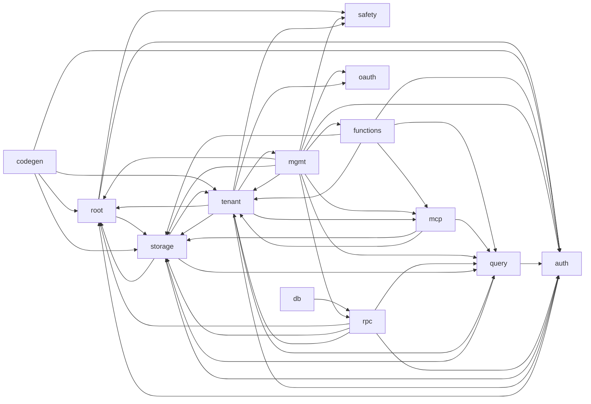

# drust — source architecture index

> [!NOTE]
> **Auto-generated** from `src/**/*.rs` — rebuild with
> `python3 drust/docs/gen-architecture.py` after code changes. Do not hand-edit.
> This is a deliberately concise **orientation map**: module groups, their
> dependency graph, and a one-line summary per file (from each file's `//!`
> doc). For per-file detail — public items, signatures, imports, callers, and
> call graphs — query **codebase-memory-mcp** (`search_graph` / `trace_path`),
> a live indexed knowledge graph. (Edges here are textual `use crate::` imports.)

## Module overview

| group | files | public items | imports out | imports in |
|---|---:|---:|---:|---:|
| [`(root)/`](#srcroot) | 6 | 30 | 3 | 23 |
| [`auth/`](#srcauth) | 10 | 50 | 2 | 38 |
| [`bin/`](#srcbin) | 3 | 0 | 0 | 0 |
| [`codegen/`](#srccodegen) | 7 | 26 | 10 | 6 |
| [`db/`](#srcdb) | 2 | 12 | 1 | 0 |
| [`functions/`](#srcfunctions) | 10 | 68 | 37 | 17 |
| [`mcp/`](#srcmcp) | 19 | 145 | 57 | 30 |
| [`mgmt/`](#srcmgmt) | 34 | 251 | 96 | 43 |
| [`oauth/`](#srcoauth) | 6 | 27 | 5 | 10 |
| [`query/`](#srcquery) | 8 | 49 | 8 | 30 |
| [`rpc/`](#srcrpc) | 6 | 37 | 16 | 9 |
| [`safety/`](#srcsafety) | 8 | 38 | 1 | 11 |
| [`storage/`](#srcstorage) | 14 | 105 | 14 | 80 |
| [`tenant/`](#srctenant) | 34 | 213 | 108 | 61 |

## Group dependency graph

## Files by module

_One line per file (its `//!` summary). Use `search_graph` / `get_code_snippet` for the symbols and signatures inside each._

### `src/` (root)

- [`base_path.rs`](../src/base_path.rs) — Configurable external URL prefix. Every browser-facing path (redirect · 5 pub
- [`bin_helpers.rs`](../src/bin_helpers.rs) — Shared between bin/set_admin_password.rs and tests. · 2 pub
- [`config.rs`](../src/config.rs) — 3 pub
- [`error.rs`](../src/error.rs) — 4 pub
- [`lib.rs`](../src/lib.rs) — 16 pub
- [`main.rs`](../src/main.rs)

### `src/auth/`

- [`admin.rs`](../src/auth/admin.rs) — 3 pub
- [`admin_token.rs`](../src/auth/admin_token.rs) — Per-admin Personal Access Token (PAT) primitives. v1.29.0. · 5 pub
- [`bearer.rs`](../src/auth/bearer.rs) — 4 pub
- [`middleware.rs`](../src/auth/middleware.rs) — 8 pub
- [`mod.rs`](../src/auth/mod.rs) — 9 pub
- [`oauth_sentinel.rs`](../src/auth/oauth_sentinel.rs) — OAuth-only user marker. v1.12+ inserts this exact string into · 2 pub
- [`profile.rs`](../src/auth/profile.rs) — Profile encoding/decoding helpers shared by REST + MCP user paths. · 2 pub
- [`session.rs`](../src/auth/session.rs) — 4 pub
- [`user.rs`](../src/auth/user.rs) — 3 pub
- [`user_session.rs`](../src/auth/user_session.rs) — 10 pub

### `src/bin/`

- [`drust_session_janitor.rs`](../src/bin/drust_session_janitor.rs) — Daily janitor for expired user + admin sessions. Invoked by the
- [`set_admin_password.rs`](../src/bin/set_admin_password.rs)
- [`set_admin_role.rs`](../src/bin/set_admin_role.rs) — Break-glass CLI: set an admin's role by email. v1.29.0.

### `src/codegen/`

- [`filter_ast_schema.rs`](../src/codegen/filter_ast_schema.rs) — v1.27 — Neutral schema descriptions of FilterAst, shared across all · 3 pub
- [`handlers.rs`](../src/codegen/handlers.rs) — v1.27 — Route handlers for /openapi.json, /types.ts, /zod.ts. · 3 pub
- [`ir.rs`](../src/codegen/ir.rs) — v1.27 — Neutral intermediate representation. Same shape for OpenAPI, · 7 pub
- [`mod.rs`](../src/codegen/mod.rs) — v1.27 — Schema codegen module. Emits OpenAPI 3.1 / TypeScript / · 10 pub
- [`openapi.rs`](../src/codegen/openapi.rs) — v1.27 — OpenAPI 3.1 renderer. Output is a serde_json::Value the · 1 pub
- [`typescript.rs`](../src/codegen/typescript.rs) — v1.27 — TypeScript renderer. Pure string templating; output is · 1 pub
- [`zod.rs`](../src/codegen/zod.rs) — v1.27 — Zod renderer. Mirrors the TypeScript renderer's shape with · 1 pub

### `src/db/`

- [`migrations.rs`](../src/db/migrations.rs) — 11 pub
- [`mod.rs`](../src/db/mod.rs) — 1 pub

### `src/functions/`

- [`bindings.rs`](../src/functions/bindings.rs) — Trigger parsing + per-tenant binding cache. · 5 pub
- [`caller.rs`](../src/functions/caller.rs) — `CallerCtx` — the execution identity of a function invocation. · 1 pub
- [`dispatcher.rs`](../src/functions/dispatcher.rs) — `FunctionDispatcher` — mirrors `WebhookDispatcher.dispatch(&self, tenant, · 1 pub
- [`enforce.rs`](../src/functions/enforce.rs) — Reusable, transport-agnostic enforcement core (v-fn-caller-invoke, Task 2). · 8 pub
- [`executor.rs`](../src/functions/executor.rs) — Invocation executor: drains the global bounded queue into per-tenant FIFO · 5 pub
- [`invoke_gate.rs`](../src/functions/invoke_gate.rs) — Per-identity invoke gate for `POST /t/{tenant}/functions/{name}/invoke` (T6). · 1 pub
- [`mod.rs`](../src/functions/mod.rs) — v1.36 — Edge functions: per-tenant user-uploaded wasm components, · 11 pub
- [`routes.rs`](../src/functions/routes.rs) — REST surface: /t/<id>/functions[…]. CRUD + `/logs` are service-only via the · 13 pub
- [`runtime.rs`](../src/functions/runtime.rs) — wasmtime runtime: global Engine (OnceLock + epoch ticker thread), · 6 pub
- [`schema.rs`](../src/functions/schema.rs) — `_system_functions` + `_system_function_logs` — lazy DDL (idempotent · 17 pub

### `src/mcp/`

- [`handler.rs`](../src/mcp/handler.rs) — rmcp Streamable HTTP handler that exposes the 13 drust tools. · 46 pub
- [`http_registry.rs`](../src/mcp/http_registry.rs) — Per-tenant cache of `StreamableHttpService` instances. · 2 pub
- [`mod.rs`](../src/mcp/mod.rs) — 4 pub
- [`server.rs`](../src/mcp/server.rs) — 3 pub
- [`tools/exploration.rs`](../src/mcp/tools/exploration.rs) — 4 pub
- [`tools/files.rs`](../src/mcp/tools/files.rs) — Y-scope MCP file tools — list / delete / get_file_url. · 8 pub
- [`tools/functions.rs`](../src/mcp/tools/functions.rs) — v1.36 — MCP function tools. Service-only by MCP dispatch (transport · 6 pub
- [`tools/index.rs`](../src/mcp/tools/index.rs) — 6 pub
- [`tools/mod.rs`](../src/mcp/tools/mod.rs) — 14 pub
- [`tools/oauth.rs`](../src/mcp/tools/oauth.rs) — Pure async helpers for the per-tenant OAuth-provider admin MCP tools · 4 pub
- [`tools/owner_field.rs`](../src/mcp/tools/owner_field.rs) — Pure async helpers for T25 MCP owner-field + set_self_register tools. · 4 pub
- [`tools/policy.rs`](../src/mcp/tools/policy.rs) — RLS Phase 8 (Config) — MCP delegate fns for per-collection, · 3 pub
- [`tools/read.rs`](../src/mcp/tools/read.rs) — 4 pub
- [`tools/realtime.rs`](../src/mcp/tools/realtime.rs) — MCP `set_realtime` tool — toggle SSE broadcast on one collection. · 1 pub
- [`tools/schema.rs`](../src/mcp/tools/schema.rs) — 16 pub
- [`tools/user.rs`](../src/mcp/tools/user.rs) — Pure async helpers for T24 MCP user-management tools. · 6 pub
- [`tools/vector.rs`](../src/mcp/tools/vector.rs) — MCP `search_collection` tool. Thin wrapper that constructs the same · 2 pub
- [`tools/webhook.rs`](../src/mcp/tools/webhook.rs) — Pure async helpers for Task 7 — webhook subscription MCP tools. · 4 pub
- [`tools/write.rs`](../src/mcp/tools/write.rs) — 8 pub

### `src/mgmt/`

- [`admin_pat.rs`](../src/mgmt/admin_pat.rs) — v1.29.3 S2c — single per-admin PAT reroll endpoint. · 2 pub
- [`admin_profile.rs`](../src/mgmt/admin_profile.rs) — v1.28.9 — admin profile extension surfaced through the sidebar. · 4 pub
- [`admin_rooms.rs`](../src/mgmt/admin_rooms.rs) — v1.31 — admin-side broadcast room operations. · 2 pub
- [`admin_team.rs`](../src/mgmt/admin_team.rs) — Admin team management — list/invite/role-change/remove. · 8 pub
- [`audit.rs`](../src/mgmt/audit.rs) — Admin-UI audit log viewer. · 25 pub
- [`backups.rs`](../src/mgmt/backups.rs) — Admin-UI handlers for `drust-backup` snapshot inspection + download. · 10 pub
- [`browse.rs`](../src/mgmt/browse.rs) — 20 pub
- [`collection_list.rs`](../src/mgmt/collection_list.rs) — Admin-only POST /admin/tenants/<id>/collections/<coll>/_list endpoint · 7 pub
- [`docs.rs`](../src/mgmt/docs.rs) — Admin-UI handler for the on-disk CHANGELOG viewer. · 2 pub
- [`format.rs`](../src/mgmt/format.rs) — Small formatting helpers shared across the admin UI. · 1 pub
- [`functions_admin.rs`](../src/mgmt/functions_admin.rs) — v1.36 — admin UI for the `ƒ _functions` virtual sidebar entry. · 7 pub
- [`i18n.rs`](../src/mgmt/i18n.rs) — Server-side i18n for the admin UI. See spec · 9 pub
- [`locale_layer.rs`](../src/mgmt/locale_layer.rs) — Locale resolution + `Extension<Locale>` attachment for admin requests. · 2 pub
- [`metrics.rs`](../src/mgmt/metrics.rs) — v1.32 C1 — Prometheus metrics endpoint. · 3 pub
- [`mod.rs`](../src/mgmt/mod.rs) — 27 pub
- [`oauth_login.rs`](../src/mgmt/oauth_login.rs) — Admin-specific OAuth glue. Calls into src/oauth/ (provider-agnostic · 4 pub
- [`public_files.rs`](../src/mgmt/public_files.rs) — Admin UI for the host-level public bucket. Provides list, upload, delete, · 20 pub
- [`routes.rs`](../src/mgmt/routes.rs) — 2 pub
- [`rpc_admin.rs`](../src/mgmt/rpc_admin.rs) — Admin-UI handlers for the `_rpc` virtual collection page. · 10 pub
- [`script_json.rs`](../src/mgmt/script_json.rs) — HTML-`<script>`-safe JSON serialization — single canonical escaper. · 2 pub
- [`signed_bytes.rs`](../src/mgmt/signed_bytes.rs) — Public (unauth) GET handlers that serve a drust-signed download URL. · 4 pub
- [`stats.rs`](../src/mgmt/stats.rs) — Tenant-stats denormalization sampler. · 4 pub
- [`tenant_broadcast.rs`](../src/mgmt/tenant_broadcast.rs) — v1.31.5 — Admin Broadcast Inspector page. · 1 pub
- [`tenant_files.rs`](../src/mgmt/tenant_files.rs) — Tenant-side file handlers (private bytes proxy, upload/list/get/delete, sign). · 16 pub
- [`tenants.rs`](../src/mgmt/tenants.rs) — 8 pub
- [`tenants/common.rs`](../src/mgmt/tenants/common.rs) — Cross-page helpers shared by the OAuth-providers and Webhooks admin pages. · 2 pub
- [`tenants/crud.rs`](../src/mgmt/tenants/crud.rs) — Tenant CRUD / lifecycle (group B): list page, create/delete, self-register · 12 pub
- [`tenants/files_page.rs`](../src/mgmt/tenants/files_page.rs) — Tenant-files admin page (group D). Relocated from `tenants.rs` by Finding #4. · 3 pub
- [`tenants/oauth_page.rs`](../src/mgmt/tenants/oauth_page.rs) — OAuth-providers admin page (group E). Relocated from `tenants.rs` by Finding #4. · 6 pub
- [`tenants/overview.rs`](../src/mgmt/tenants/overview.rs) — Tenant overview admin page (group C). Relocated from `tenants.rs` by Finding #4. · 1 pub
- [`tenants/webhooks_page.rs`](../src/mgmt/tenants/webhooks_page.rs) — Webhooks admin page (group F). Relocated from `tenants.rs` by Finding #4. · 4 pub
- [`theme.rs`](../src/mgmt/theme.rs) — Server-side theming for the admin UI. See spec · 12 pub
- [`theme_layer.rs`](../src/mgmt/theme_layer.rs) — Theme resolution + `Extension<Theme>` attachment for admin requests. · 3 pub
- [`tokens.rs`](../src/mgmt/tokens.rs) — 8 pub

### `src/oauth/`

- [`config.rs`](../src/oauth/config.rs) — Reads OAuth provider config from environment variables and builds a · 2 pub
- [`github.rs`](../src/oauth/github.rs) — GitHub OAuth 2.0 adapter (not OIDC). Three round trips: · 3 pub
- [`google.rs`](../src/oauth/google.rs) — Google OIDC adapter. Authorization-code flow with PKCE. We obtain · 2 pub
- [`mod.rs`](../src/oauth/mod.rs) — 5 pub
- [`provider.rs`](../src/oauth/provider.rs) — Actor-agnostic OAuth provider trait + normalized user struct. · 3 pub
- [`state.rs`](../src/oauth/state.rs) — CSRF state token + cookie helpers for the OAuth start/callback flow. · 12 pub

### `src/query/`

- [`authorizer.rs`](../src/query/authorizer.rs) — 3 pub
- [`executor.rs`](../src/query/executor.rs) — 9 pub
- [`filter.rs`](../src/query/filter.rs) — 5 pub
- [`list_builder.rs`](../src/query/list_builder.rs) — Structured list-SQL builder for `POST /t/<id>/collections/<c>/list` · 5 pub
- [`mod.rs`](../src/query/mod.rs) — 7 pub
- [`policy.rs`](../src/query/policy.rs) — Row-level security policy engine. A `Policy` is a per-operation pair of · 12 pub
- [`vector_codec.rs`](../src/query/vector_codec.rs) — JSON ↔ packed-f32 BLOB codec for vector fields. · 3 pub
- [`vector_filter.rs`](../src/query/vector_filter.rs) — Filter AST used by /search. Intentionally minimal: a tenant-supplied · 5 pub

### `src/rpc/`

- [`exec_write.rs`](../src/rpc/exec_write.rs) — v1.30 — mutation-RPC executor. Two layers: · 7 pub
- [`handler.rs`](../src/rpc/handler.rs) — REST handler for `POST /t/{tenant}/rpc/{name}`. · 2 pub
- [`mod.rs`](../src/rpc/mod.rs) — RPC subsystem: stored Supabase-style named SQL functions. · 5 pub
- [`params.rs`](../src/rpc/params.rs) — RPC parameter schema and request validation. · 6 pub
- [`prepare.rs`](../src/rpc/prepare.rs) — Prepare-time SQL safety: reject anything the mode-matched authorizer · 8 pub
- [`registry.rs`](../src/rpc/registry.rs) — Persistence wrapper around the `_system_rpc` table. · 9 pub

### `src/safety/`

- [`audit.rs`](../src/safety/audit.rs) — 5 pub
- [`audit_db.rs`](../src/safety/audit_db.rs) — v1.24 — SQLite-backed audit log storage. See spec · 16 pub
- [`error_fixes.rs`](../src/safety/error_fixes.rs) — v1.26 — Static suggested_fix catalog. Maps every error_code drust · 4 pub
- [`ip.rs`](../src/safety/ip.rs) — 1 pub
- [`mod.rs`](../src/safety/mod.rs) — 7 pub
- [`rate_limit.rs`](../src/safety/rate_limit.rs) — 2 pub
- [`rate_limit_ip.rs`](../src/safety/rate_limit_ip.rs) — 1 pub
- [`recent_writes.rs`](../src/safety/recent_writes.rs) — v1.26 — read helper for the `recent_writes` MCP tool. Queries · 2 pub

### `src/storage/`

- [`blast_radius.rs`](../src/storage/blast_radius.rs) — v1.26 — Pure read helpers that compute the side effects of a · 8 pub
- [`disk.rs`](../src/storage/disk.rs) — Filesystem statistics helper used by upload handlers to enforce the · 4 pub
- [`files.rs`](../src/storage/files.rs) — Shared file-storage helpers used by both admin and tenant upload flows. · 10 pub
- [`garage.rs`](../src/storage/garage.rs) — Garage S3 client. Thin wrapper over `object_store::aws::AmazonS3` for the · 5 pub
- [`janitor.rs`](../src/storage/janitor.rs) — 1 pub
- [`meta.rs`](../src/storage/meta.rs) — 3 pub
- [`mod.rs`](../src/storage/mod.rs) — 13 pub
- [`pool.rs`](../src/storage/pool.rs) — 3 pub
- [`quota.rs`](../src/storage/quota.rs) — 3 pub
- [`schema.rs`](../src/storage/schema.rs) — 41 pub
- [`schema_cache.rs`](../src/storage/schema_cache.rs) — 1 pub
- [`signed_url.rs`](../src/storage/signed_url.rs) — Drust-minted, drust-served signed URLs for private file downloads. · 4 pub
- [`tenant_db.rs`](../src/storage/tenant_db.rs) — 7 pub
- [`visibility.rs`](../src/storage/visibility.rs) — In-place file visibility toggle (public <-> private). · 2 pub

### `src/tenant/`

- [`admin_user_routes.rs`](../src/tenant/admin_user_routes.rs) — Service-only admin endpoints for managing users within a tenant. · 9 pub
- [`auth_cache.rs`](../src/tenant/auth_cache.rs) — v1.35 — process-local invalidate-on-write auth cache for `bearer_auth_layer`. · 3 pub
- [`auth_routes.rs`](../src/tenant/auth_routes.rs) — 11 pub
- [`collections.rs`](../src/tenant/collections.rs) — 11 pub
- [`events.rs`](../src/tenant/events.rs) — 2 pub
- [`file_caps.rs`](../src/tenant/file_caps.rs) — Per-tenant file-storage capabilities (v1.42). · 7 pub
- [`mcp_dispatch.rs`](../src/tenant/mcp_dispatch.rs) — Axum handler that forwards `/t/:tenant/mcp` traffic to the · 1 pub
- [`mod.rs`](../src/tenant/mod.rs) — 26 pub
- [`oauth_admin_routes.rs`](../src/tenant/oauth_admin_routes.rs) — Service-only admin endpoints for managing this tenant's OAuth provider · 7 pub
- [`oauth_config.rs`](../src/tenant/oauth_config.rs) — 10 pub
- [`oauth_routes.rs`](../src/tenant/oauth_routes.rs) — Per-tenant OAuth start + callback handlers. End users of a tenant's · 15 pub
- [`owner_field.rs`](../src/tenant/owner_field.rs) — 3 pub
- [`policy_routes.rs`](../src/tenant/policy_routes.rs) — RLS Phase 8 (Config) — service-only REST surface for per-collection, · 4 pub
- [`query_endpoint.rs`](../src/tenant/query_endpoint.rs) — 4 pub
- [`realtime_routes.rs`](../src/tenant/realtime_routes.rs) — v1.16 — service-only endpoint to toggle SSE realtime broadcast on · 2 pub
- [`records.rs`](../src/tenant/records.rs) — 10 pub
- [`records_list.rs`](../src/tenant/records_list.rs) — `POST /t/<id>/collections/<c>/list` — structured list endpoint. · 2 pub
- [`rooms/audit.rs`](../src/tenant/rooms/audit.rs) — v1.31 audit emit for broadcast.publish. · 2 pub
- [`rooms/bus.rs`](../src/tenant/rooms/bus.rs) — 2 pub
- [`rooms/envelope.rs`](../src/tenant/rooms/envelope.rs) — v1.31 wire envelope. Client → Server uses `op`-tagged objects; · 3 pub
- [`rooms/mod.rs`](../src/tenant/rooms/mod.rs) — v1.31 — broadcast rooms (WebSocket multiplex). · 8 pub
- [`rooms/policy.rs`](../src/tenant/rooms/policy.rs) — v1.31 policy gates: room-name validation, per-tenant publish · 6 pub
- [`rooms/rest.rs`](../src/tenant/rooms/rest.rs) — v1.31 REST publish handler — POST /t/{tenant}/rooms/{room}. · 4 pub
- [`rooms/state.rs`](../src/tenant/rooms/state.rs) — v1.31 rooms config: env-driven knobs threaded through `TenantStack`. · 1 pub
- [`rooms/ws.rs`](../src/tenant/rooms/ws.rs) — v1.31 WebSocket multiplex handler — GET /t/{tenant}/realtime. · 1 pub
- [`rooms/ws_auth.rs`](../src/tenant/rooms/ws_auth.rs) — v1.31 query-string-to-header bearer adapter for WS upgrade. · 1 pub
- [`router.rs`](../src/tenant/router.rs) — 6 pub
- [`sse.rs`](../src/tenant/sse.rs) — 1 pub
- [`uploads/mod.rs`](../src/tenant/uploads/mod.rs) — v1.33 — Mode B large-file upload: tus 1.0 server + spool-to-Garage. · 9 pub
- [`uploads/session.rs`](../src/tenant/uploads/session.rs) — _system_upload_sessions row CRUD + tus metadata/derivation helpers + · 12 pub
- [`vector_search.rs`](../src/tenant/vector_search.rs) — POST /t/{tenant}/collections/{coll}/search · 2 pub
- [`webhook_dispatcher.rs`](../src/tenant/webhook_dispatcher.rs) — WebhookDispatcher — record-CRUD event → subscribed URLs. · 12 pub
- [`webhook_resolver.rs`](../src/tenant/webhook_resolver.rs) — Per-dispatch DNS resolver. See spec · 5 pub
- [`webhook_routes.rs`](../src/tenant/webhook_routes.rs) — Service-only admin endpoints for managing this tenant's outbound webhook · 11 pub

