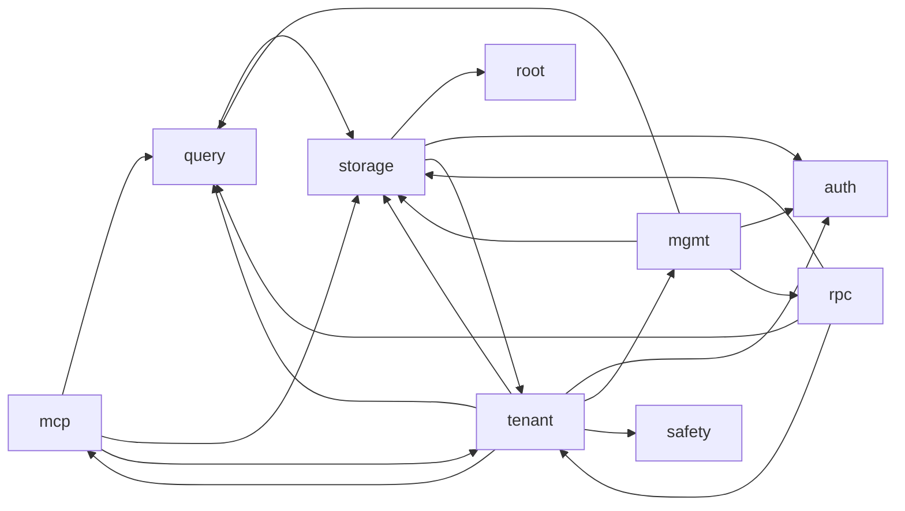

# drust — source architecture index

> [!NOTE]
> **Auto-generated** from `src/**/*.rs`. Do not hand-edit — rebuild with
> `python3 drust/docs/gen-architecture.py` after code changes.
>
> Summaries come from each file's `//!` module doc. Public items come from top-level `pub` declarations. Cross-file edges come from `use crate::...` imports and `mod X;` declarations — this is **textual, not AST**, so calls through fully-qualified paths without a `use` won't appear. Good enough for orientation.

## Module overview

| group | files | public items | imports out | imports in |
|---|---:|---:|---:|---:|
| [`(root)/`](#srcroot) | 4 | 15 | 0 | 1 |
| [`auth/`](#srcauth) | 5 | 20 | 1 | 10 |
| [`bin/`](#srcbin) | 1 | 0 | 0 | 0 |
| [`mcp/`](#srcmcp) | 10 | 54 | 26 | 15 |
| [`mgmt/`](#srcmgmt) | 10 | 80 | 33 | 8 |
| [`query/`](#srcquery) | 4 | 16 | 2 | 14 |
| [`rpc/`](#srcrpc) | 5 | 21 | 9 | 4 |
| [`safety/`](#srcsafety) | 3 | 6 | 0 | 2 |
| [`storage/`](#srcstorage) | 11 | 61 | 7 | 32 |
| [`tenant/`](#srctenant) | 8 | 29 | 20 | 12 |

## Group-level dependency graph

## `src/` (root)

### [`src/config.rs`](../src/config.rs)

**Declared by:**

- [`src/lib.rs`](../src/lib.rs)

**Public items:**

- `enum ConfigError`
- `struct Config`
- `struct StorageConfig`

**Imported by:**

- [`src/storage/garage.rs`](../src/storage/garage.rs)

### [`src/error.rs`](../src/error.rs)

**Declared by:**

- [`src/lib.rs`](../src/lib.rs)

**Public items:**

- `enum ErrorCode`
- `struct ToolError`

### [`src/lib.rs`](../src/lib.rs)

**Declares submodules:**

- [`src/auth/mod.rs`](../src/auth/mod.rs)
- [`src/config.rs`](../src/config.rs)
- [`src/error.rs`](../src/error.rs)
- [`src/mcp/mod.rs`](../src/mcp/mod.rs)
- [`src/mgmt/mod.rs`](../src/mgmt/mod.rs)
- [`src/query/mod.rs`](../src/query/mod.rs)
- [`src/rpc/mod.rs`](../src/rpc/mod.rs)
- [`src/safety/mod.rs`](../src/safety/mod.rs)
- [`src/storage/mod.rs`](../src/storage/mod.rs)
- [`src/tenant/mod.rs`](../src/tenant/mod.rs)

**Public items:**

- `mod auth`
- `mod config`
- `mod error`
- `mod mcp`
- `mod mgmt`
- `mod query`
- `mod rpc`
- `mod safety`
- `mod storage`
- `mod tenant`

### [`src/main.rs`](../src/main.rs)

_(no top-level pub items)_

## `src/auth/`

### [`src/auth/admin.rs`](../src/auth/admin.rs)

**Declared by:**

- [`src/auth/mod.rs`](../src/auth/mod.rs)

**Public items:**

- `fn hash_password`
- `fn verify_password`

**Imported by:**

- [`src/mgmt/routes.rs`](../src/mgmt/routes.rs)
- [`src/storage/meta.rs`](../src/storage/meta.rs)

### [`src/auth/bearer.rs`](../src/auth/bearer.rs)

**Declared by:**

- [`src/auth/mod.rs`](../src/auth/mod.rs)

**Public items:**

- `fn generate_token`
- `fn hash_token`
- `fn verify_token_hash`
- `fn token_hint`

**Imported by:**

- [`src/mgmt/tenants.rs`](../src/mgmt/tenants.rs)
- [`src/mgmt/tokens.rs`](../src/mgmt/tokens.rs)
- [`src/tenant/router.rs`](../src/tenant/router.rs)

### [`src/auth/middleware.rs`](../src/auth/middleware.rs)

**Declared by:**

- [`src/auth/mod.rs`](../src/auth/mod.rs)

**Public items:**

- `struct AdminSessionState`
- `struct AdminId`
- `const SESSION_COOKIE`
- `fn admin_session_layer`
- `fn build_session_cookie`
- `fn clear_session_cookie`

**Imports from:**

- [`src/auth/session.rs`](../src/auth/session.rs)

**Imported by:**

- [`src/mgmt/public_files.rs`](../src/mgmt/public_files.rs)
- [`src/mgmt/routes.rs`](../src/mgmt/routes.rs)
- [`src/mgmt/tenants.rs`](../src/mgmt/tenants.rs)

### [`src/auth/mod.rs`](../src/auth/mod.rs)

**Declares submodules:**

- [`src/auth/admin.rs`](../src/auth/admin.rs)
- [`src/auth/bearer.rs`](../src/auth/bearer.rs)
- [`src/auth/middleware.rs`](../src/auth/middleware.rs)
- [`src/auth/session.rs`](../src/auth/session.rs)

**Declared by:**

- [`src/lib.rs`](../src/lib.rs)

**Public items:**

- `mod admin`
- `mod bearer`
- `mod middleware`
- `mod session`

### [`src/auth/session.rs`](../src/auth/session.rs)

**Declared by:**

- [`src/auth/mod.rs`](../src/auth/mod.rs)

**Public items:**

- `fn create_session`
- `fn validate_session`
- `fn purge_expired`
- `fn revoke_session`

**Imported by:**

- [`src/auth/middleware.rs`](../src/auth/middleware.rs)
- [`src/mgmt/routes.rs`](../src/mgmt/routes.rs)

## `src/bin/`

### [`src/bin/set_admin_password.rs`](../src/bin/set_admin_password.rs)

_(no top-level pub items)_

## `src/mcp/`

### [`src/mcp/handler.rs`](../src/mcp/handler.rs)

_rmcp Streamable HTTP handler that exposes the 13 drust tools._

**Declared by:**

- [`src/mcp/mod.rs`](../src/mcp/mod.rs)

**Public items:**

- `struct DescribeCollectionArgs`
- `struct SampleRowsArgs`
- `struct CountRowsArgs`
- `struct QueryArgs`
- `struct ExplainArgs`
- `struct CreateCollectionArgs`
- `struct AddFieldArgs`
- `struct DropFieldArgs`
- `struct DropCollectionArgs`
- `struct InsertRecordArgs`
- `struct UpdateRecordArgs`
- `struct DeleteRecordArgs`
- `struct CreateRpcParams`
- `struct UpdateRpcParams`
- `struct NameOnly`
- `struct EmptyParams`
- `struct CallRpcParams`
- `struct DrustMcpService`

**Imports from:**

- [`src/mcp/server.rs`](../src/mcp/server.rs)
- [`src/mcp/tools/exploration.rs`](../src/mcp/tools/exploration.rs)
- [`src/mcp/tools/files.rs`](../src/mcp/tools/files.rs)
- [`src/mcp/tools/read.rs`](../src/mcp/tools/read.rs)
- [`src/mcp/tools/schema.rs`](../src/mcp/tools/schema.rs)
- [`src/mcp/tools/write.rs`](../src/mcp/tools/write.rs)

**Imported by:**

- [`src/mcp/http_registry.rs`](../src/mcp/http_registry.rs)

### [`src/mcp/http_registry.rs`](../src/mcp/http_registry.rs)

_Per-tenant cache of `StreamableHttpService` instances._

**Declared by:**

- [`src/mcp/mod.rs`](../src/mcp/mod.rs)

**Public items:**

- `type TenantMcpService`
- `struct McpHttpRegistry`

**Imports from:**

- [`src/mcp/handler.rs`](../src/mcp/handler.rs)
- [`src/mcp/server.rs`](../src/mcp/server.rs)

**Imported by:**

- [`src/tenant/mcp_dispatch.rs`](../src/tenant/mcp_dispatch.rs)
- [`src/tenant/mod.rs`](../src/tenant/mod.rs)

### [`src/mcp/mod.rs`](../src/mcp/mod.rs)

**Declares submodules:**

- [`src/mcp/handler.rs`](../src/mcp/handler.rs)
- [`src/mcp/http_registry.rs`](../src/mcp/http_registry.rs)
- [`src/mcp/server.rs`](../src/mcp/server.rs)
- [`src/mcp/tools/mod.rs`](../src/mcp/tools/mod.rs)

**Declared by:**

- [`src/lib.rs`](../src/lib.rs)

**Public items:**

- `mod handler`
- `mod http_registry`
- `mod server`
- `mod tools`

### [`src/mcp/server.rs`](../src/mcp/server.rs)

**Declared by:**

- [`src/mcp/mod.rs`](../src/mcp/mod.rs)

**Public items:**

- `struct DrustMcpInner`
- `struct DrustMcp`
- `struct McpRegistry` — Lazy cache of per-tenant MCP services. Entries are evicted when a tenant is

**Imports from:**

- [`src/storage/garage.rs`](../src/storage/garage.rs)
- [`src/storage/pool.rs`](../src/storage/pool.rs)
- [`src/tenant/events.rs`](../src/tenant/events.rs)

**Imported by:**

- [`src/mcp/handler.rs`](../src/mcp/handler.rs)
- [`src/mcp/http_registry.rs`](../src/mcp/http_registry.rs)
- [`src/mcp/tools/exploration.rs`](../src/mcp/tools/exploration.rs)
- [`src/mcp/tools/files.rs`](../src/mcp/tools/files.rs)
- [`src/mcp/tools/read.rs`](../src/mcp/tools/read.rs)
- [`src/mcp/tools/schema.rs`](../src/mcp/tools/schema.rs)
- [`src/mcp/tools/write.rs`](../src/mcp/tools/write.rs)

### [`src/mcp/tools/exploration.rs`](../src/mcp/tools/exploration.rs)

**Declared by:**

- [`src/mcp/tools/mod.rs`](../src/mcp/tools/mod.rs)

**Public items:**

- `fn list_collections`
- `fn describe_collection`
- `fn sample_rows`
- `fn count_rows`

**Imports from:**

- [`src/mcp/server.rs`](../src/mcp/server.rs)
- [`src/query/authorizer.rs`](../src/query/authorizer.rs)
- [`src/query/executor.rs`](../src/query/executor.rs)
- [`src/query/filter.rs`](../src/query/filter.rs)
- [`src/storage/schema.rs`](../src/storage/schema.rs)

**Imported by:**

- [`src/mcp/handler.rs`](../src/mcp/handler.rs)

### [`src/mcp/tools/files.rs`](../src/mcp/tools/files.rs)

_Y-scope MCP file tools — list / delete / get_file_url._

**Declared by:**

- [`src/mcp/tools/mod.rs`](../src/mcp/tools/mod.rs)

**Public items:**

- `struct ListFilesArgs`
- `fn list_files`
- `struct DeleteFileArgs`
- `fn delete_file`
- `struct GetFileUrlArgs`
- `fn get_file_url`

**Imports from:**

- [`src/mcp/server.rs`](../src/mcp/server.rs)
- [`src/storage/files.rs`](../src/storage/files.rs)

**Imported by:**

- [`src/mcp/handler.rs`](../src/mcp/handler.rs)

### [`src/mcp/tools/mod.rs`](../src/mcp/tools/mod.rs)

**Declares submodules:**

- [`src/mcp/tools/exploration.rs`](../src/mcp/tools/exploration.rs)
- [`src/mcp/tools/files.rs`](../src/mcp/tools/files.rs)
- [`src/mcp/tools/read.rs`](../src/mcp/tools/read.rs)
- [`src/mcp/tools/schema.rs`](../src/mcp/tools/schema.rs)
- [`src/mcp/tools/write.rs`](../src/mcp/tools/write.rs)

**Declared by:**

- [`src/mcp/mod.rs`](../src/mcp/mod.rs)

**Public items:**

- `mod exploration`
- `mod files`
- `mod read`
- `mod schema`
- `mod write`

### [`src/mcp/tools/read.rs`](../src/mcp/tools/read.rs)

**Declared by:**

- [`src/mcp/tools/mod.rs`](../src/mcp/tools/mod.rs)

**Public items:**

- `fn query`
- `fn explain`

**Imports from:**

- [`src/mcp/server.rs`](../src/mcp/server.rs)
- [`src/query/authorizer.rs`](../src/query/authorizer.rs)
- [`src/query/executor.rs`](../src/query/executor.rs)

**Imported by:**

- [`src/mcp/handler.rs`](../src/mcp/handler.rs)

### [`src/mcp/tools/schema.rs`](../src/mcp/tools/schema.rs)

**Declared by:**

- [`src/mcp/tools/mod.rs`](../src/mcp/tools/mod.rs)

**Public items:**

- `const SYSTEM_COLUMNS` — Columns drust maintains automatically; users cannot drop them.
- `struct FieldSpec`
- `const SQL_DEFAULT_ALLOWLIST` — Allowlist of SQL expressions that may appear as a field default.
- `fn create_collection`
- `fn add_field`
- `fn drop_field` — Drop a user-defined column via `ALTER TABLE … DROP COLUMN`.
- `fn drop_collection` — Drop an entire collection (table + its `<name>_updated_at` trigger).

**Imports from:**

- [`src/mcp/server.rs`](../src/mcp/server.rs)
- [`src/storage/schema.rs`](../src/storage/schema.rs)

**Imported by:**

- [`src/mcp/handler.rs`](../src/mcp/handler.rs)

### [`src/mcp/tools/write.rs`](../src/mcp/tools/write.rs)

**Declared by:**

- [`src/mcp/tools/mod.rs`](../src/mcp/tools/mod.rs)

**Public items:**

- `fn insert_record`
- `fn update_record`
- `fn delete_record`

**Imports from:**

- [`src/mcp/server.rs`](../src/mcp/server.rs)
- [`src/storage/schema.rs`](../src/storage/schema.rs)
- [`src/tenant/events.rs`](../src/tenant/events.rs)

**Imported by:**

- [`src/mcp/handler.rs`](../src/mcp/handler.rs)

## `src/mgmt/`

### [`src/mgmt/browse.rs`](../src/mgmt/browse.rs)

**Declared by:**

- [`src/mgmt/mod.rs`](../src/mgmt/mod.rs)

**Public items:**

- `struct BrowseQs`
- `fn collections_page`
- `fn collection_rows_page`
- `struct AnonCapsForm`
- `fn update_anon_caps` — POST `/admin/tenants/{tenant}/collections/{coll}/anon-caps`.

**Imports from:**

- [`src/mgmt/tenants.rs`](../src/mgmt/tenants.rs)
- [`src/query/authorizer.rs`](../src/query/authorizer.rs)
- [`src/query/executor.rs`](../src/query/executor.rs)
- [`src/query/filter.rs`](../src/query/filter.rs)
- [`src/storage/schema.rs`](../src/storage/schema.rs)
- [`src/storage/tenant_db.rs`](../src/storage/tenant_db.rs)

### [`src/mgmt/docs.rs`](../src/mgmt/docs.rs)

_Admin-UI handler for the on-disk CHANGELOG viewer._

**Declared by:**

- [`src/mgmt/mod.rs`](../src/mgmt/mod.rs)

**Public items:**

- `struct NavItem`
- `fn changelog_page`

### [`src/mgmt/mod.rs`](../src/mgmt/mod.rs)

**Declares submodules:**

- [`src/mgmt/browse.rs`](../src/mgmt/browse.rs)
- [`src/mgmt/docs.rs`](../src/mgmt/docs.rs)
- [`src/mgmt/public_files.rs`](../src/mgmt/public_files.rs)
- [`src/mgmt/routes.rs`](../src/mgmt/routes.rs)
- [`src/mgmt/rpc_admin.rs`](../src/mgmt/rpc_admin.rs)
- [`src/mgmt/signed_bytes.rs`](../src/mgmt/signed_bytes.rs)
- [`src/mgmt/tenant_files.rs`](../src/mgmt/tenant_files.rs)
- [`src/mgmt/tenants.rs`](../src/mgmt/tenants.rs)
- [`src/mgmt/tokens.rs`](../src/mgmt/tokens.rs)

**Declared by:**

- [`src/lib.rs`](../src/lib.rs)

**Public items:**

- `mod browse`
- `mod docs`
- `mod public_files`
- `mod routes`
- `mod rpc_admin`
- `mod signed_bytes`
- `mod tenant_files`
- `mod tenants`
- `mod tokens`

### [`src/mgmt/public_files.rs`](../src/mgmt/public_files.rs)

_Admin UI for the host-level public bucket. Provides list, upload, delete,_

**Declared by:**

- [`src/mgmt/mod.rs`](../src/mgmt/mod.rs)

**Public items:**

- `struct PublicFilesState`
- `struct PublicFileRow`
- `struct Counts` — File counts broken down by visibility.
- `struct DiskView`
- `struct ListQs`
- `struct PendingRevokeRow`
- `struct OrphanBucketRow`
- `fn build_disk_view` — Build a `DiskView` for the Garage data volume. If `/var/lib/garage` is
- `fn list_page`
- `struct UploadFields`
- `fn parse_upload_fields` — Parse and validate the multipart fields from an admin upload form.
- `fn upload_submit`
- `fn delete_submit`
- `fn reconcile_page`
- `struct ReconcileForm`
- `fn reconcile_apply`
- `fn humanize_bytes`
- `fn admin_stream_bytes` — GET /drust/admin/files/<key>/bytes
- `struct AdminSignRequest`
- `struct AdminSignResponse`
- `fn admin_sign_url` — POST /drust/admin/files/<key>/sign

**Imports from:**

- [`src/auth/middleware.rs`](../src/auth/middleware.rs)
- [`src/storage/files.rs`](../src/storage/files.rs)
- [`src/storage/garage.rs`](../src/storage/garage.rs)

**Imported by:**

- [`src/mgmt/routes.rs`](../src/mgmt/routes.rs)
- [`src/mgmt/tenant_files.rs`](../src/mgmt/tenant_files.rs)

### [`src/mgmt/routes.rs`](../src/mgmt/routes.rs)

**Declared by:**

- [`src/mgmt/mod.rs`](../src/mgmt/mod.rs)

**Public items:**

- `struct MgmtState`
- `fn build_mgmt_router`

**Imports from:**

- [`src/auth/admin.rs`](../src/auth/admin.rs)
- [`src/auth/middleware.rs`](../src/auth/middleware.rs)
- [`src/auth/session.rs`](../src/auth/session.rs)
- [`src/mgmt/public_files.rs`](../src/mgmt/public_files.rs)
- [`src/mgmt/tenant_files.rs`](../src/mgmt/tenant_files.rs)
- [`src/mgmt/tenants.rs`](../src/mgmt/tenants.rs)

### [`src/mgmt/rpc_admin.rs`](../src/mgmt/rpc_admin.rs)

_Admin-UI handlers for the `_rpc` virtual collection page._

**Declared by:**

- [`src/mgmt/mod.rs`](../src/mgmt/mod.rs)

**Public items:**

- `fn rpc_index` — `GET /admin/tenants/{id}/_rpc` — list stored RPCs for the tenant.
- `fn rpc_new_form` — `GET /admin/tenants/{id}/_rpc/new` — render the empty create form.
- `fn rpc_edit_form` — `GET /admin/tenants/{id}/_rpc/{name}/edit` — render the form pre-filled
- `struct RpcFormBody`
- `fn rpc_save` — `POST /admin/tenants/{id}/_rpc/new` (create) and
- `fn rpc_delete` — `POST /admin/tenants/{id}/_rpc/{name}/delete` — drop a stored RPC.

**Imports from:**

- [`src/mgmt/tenants.rs`](../src/mgmt/tenants.rs)
- [`src/rpc/registry.rs`](../src/rpc/registry.rs)
- [`src/storage/schema.rs`](../src/storage/schema.rs)
- [`src/storage/tenant_db.rs`](../src/storage/tenant_db.rs)

### [`src/mgmt/signed_bytes.rs`](../src/mgmt/signed_bytes.rs)

_Public (unauth) GET handlers that serve a drust-signed download URL._

**Declared by:**

- [`src/mgmt/mod.rs`](../src/mgmt/mod.rs)

**Public items:**

- `struct SignedBytesState`
- `struct SigQs`
- `fn admin_signed_bytes` — GET /drust/s/admin/{key}?e=<expires>&t=<token>&d=<0|1>
- `fn tenant_signed_bytes` — GET /drust/s/t/{tenant}/{key}?e=<expires>&t=<token>&d=<0|1>

**Imports from:**

- [`src/storage/files.rs`](../src/storage/files.rs)
- [`src/storage/garage.rs`](../src/storage/garage.rs)
- [`src/storage/signed_url.rs`](../src/storage/signed_url.rs)

### [`src/mgmt/tenant_files.rs`](../src/mgmt/tenant_files.rs)

_Tenant-side file handlers (private bytes proxy, upload/list/get/delete, sign)._

**Declared by:**

- [`src/mgmt/mod.rs`](../src/mgmt/mod.rs)

**Public items:**

- `struct SignRequest`
- `struct SignResponse`
- `struct TenantFilesState`
- `fn stream_bytes` — GET /drust/t/<tenant>/files/<key>/bytes
- `fn sign_url` — POST /drust/t/<tenant>/files/<key>/sign
- `struct UploadResponse`
- `struct ListResponse`
- `fn upload` — POST /drust/t/<tenant>/files
- `fn list` — GET /drust/t/<tenant>/files
- `fn get_one` — GET /drust/t/<tenant>/files/<key>
- `fn delete_one` — DELETE /drust/t/<tenant>/files/<key>

**Imports from:**

- [`src/mgmt/public_files.rs`](../src/mgmt/public_files.rs)
- [`src/storage/files.rs`](../src/storage/files.rs)
- [`src/storage/garage.rs`](../src/storage/garage.rs)

**Imported by:**

- [`src/mgmt/routes.rs`](../src/mgmt/routes.rs)
- [`src/tenant/mod.rs`](../src/tenant/mod.rs)

### [`src/mgmt/tenants.rs`](../src/mgmt/tenants.rs)

**Declared by:**

- [`src/mgmt/mod.rs`](../src/mgmt/mod.rs)

**Public items:**

- `struct TenantsState`
- `struct CreateTenantJson`
- `struct CreateTenantForm`
- `struct CreatedResp`
- `struct InitialTokens`
- `struct TenantInfo`
- `fn valid_slug`
- `fn list_page_axum`
- `fn create_tenant_json` — Roll back everything `make_tenant_inner` did for `id`: delete token rows,
- `fn create_tenant_form`
- `fn soft_delete_tenant`
- `fn soft_delete_tenant_form`
- `fn tenant_files_admin_page` — GET /admin/tenants/{id}/files

**Imports from:**

- [`src/auth/bearer.rs`](../src/auth/bearer.rs)
- [`src/auth/middleware.rs`](../src/auth/middleware.rs)
- [`src/storage/garage.rs`](../src/storage/garage.rs)
- [`src/storage/tenant_db.rs`](../src/storage/tenant_db.rs)

**Imported by:**

- [`src/mgmt/browse.rs`](../src/mgmt/browse.rs)
- [`src/mgmt/routes.rs`](../src/mgmt/routes.rs)
- [`src/mgmt/rpc_admin.rs`](../src/mgmt/rpc_admin.rs)
- [`src/mgmt/tokens.rs`](../src/mgmt/tokens.rs)

### [`src/mgmt/tokens.rs`](../src/mgmt/tokens.rs)

**Declared by:**

- [`src/mgmt/mod.rs`](../src/mgmt/mod.rs)

**Public items:**

- `struct TokenSlotInfo`
- `struct RerollResp`
- `fn reroll_token_json`
- `struct RerollForm`
- `fn reroll_token_form`
- `fn detail_redirect` — `GET /admin/tenants/{id}` — preserved as a 302 to `/_api_keys`. The old
- `fn api_keys_page` — `GET /admin/tenants/{id}/_api_keys` — virtual collection that renders the

**Imports from:**

- [`src/auth/bearer.rs`](../src/auth/bearer.rs)
- [`src/mgmt/tenants.rs`](../src/mgmt/tenants.rs)
- [`src/storage/schema.rs`](../src/storage/schema.rs)
- [`src/storage/tenant_db.rs`](../src/storage/tenant_db.rs)

## `src/query/`

### [`src/query/authorizer.rs`](../src/query/authorizer.rs)

**Declared by:**

- [`src/query/mod.rs`](../src/query/mod.rs)

**Public items:**

- `fn detach_authorizer` — Replace the connection's authorizer with a permissive allow-all callback.
- `fn attach_readonly_authorizer` — Attach the read-only authorizer. Every SQL action is inspected; anything

**Imports from:**

- [`src/storage/tenant_db.rs`](../src/storage/tenant_db.rs)

**Imported by:**

- [`src/mcp/tools/exploration.rs`](../src/mcp/tools/exploration.rs)
- [`src/mcp/tools/read.rs`](../src/mcp/tools/read.rs)
- [`src/mgmt/browse.rs`](../src/mgmt/browse.rs)
- [`src/rpc/prepare.rs`](../src/rpc/prepare.rs)
- [`src/tenant/records.rs`](../src/tenant/records.rs)

### [`src/query/executor.rs`](../src/query/executor.rs)

**Declared by:**

- [`src/query/mod.rs`](../src/query/mod.rs)

**Public items:**

- `struct QueryResult`
- `enum ExecError`
- `fn sql_hash`
- `fn execute_read_query`
- `fn execute_read_query_with_named` — Same as [`execute_read_query`] but binds `:name`-style placeholders from a
- `struct InterruptGuard` — Spawn a task that interrupts the connection if a deadline passes.

**Imports from:**

- [`src/storage/tenant_db.rs`](../src/storage/tenant_db.rs)

**Imported by:**

- [`src/mcp/tools/exploration.rs`](../src/mcp/tools/exploration.rs)
- [`src/mcp/tools/read.rs`](../src/mcp/tools/read.rs)
- [`src/mgmt/browse.rs`](../src/mgmt/browse.rs)
- [`src/rpc/handler.rs`](../src/rpc/handler.rs)
- [`src/tenant/query_endpoint.rs`](../src/tenant/query_endpoint.rs)
- [`src/tenant/records.rs`](../src/tenant/records.rs)

### [`src/query/filter.rs`](../src/query/filter.rs)

**Declared by:**

- [`src/query/mod.rs`](../src/query/mod.rs)

**Public items:**

- `enum SortDir`
- `struct ListParams`
- `fn parse_sort`
- `fn build_list_sql`
- `fn build_count_sql`

**Imported by:**

- [`src/mcp/tools/exploration.rs`](../src/mcp/tools/exploration.rs)
- [`src/mgmt/browse.rs`](../src/mgmt/browse.rs)
- [`src/tenant/records.rs`](../src/tenant/records.rs)

### [`src/query/mod.rs`](../src/query/mod.rs)

**Declares submodules:**

- [`src/query/authorizer.rs`](../src/query/authorizer.rs)
- [`src/query/executor.rs`](../src/query/executor.rs)
- [`src/query/filter.rs`](../src/query/filter.rs)

**Declared by:**

- [`src/lib.rs`](../src/lib.rs)

**Public items:**

- `mod authorizer`
- `mod executor`
- `mod filter`

## `src/rpc/`

### [`src/rpc/handler.rs`](../src/rpc/handler.rs)

_REST handler for `POST /t/{tenant}/rpc/{name}`._

**Declared by:**

- [`src/rpc/mod.rs`](../src/rpc/mod.rs)

**Public items:**

- `fn call_rpc`

**Imports from:**

- [`src/query/executor.rs`](../src/query/executor.rs)
- [`src/rpc/params.rs`](../src/rpc/params.rs)
- [`src/rpc/registry.rs`](../src/rpc/registry.rs)
- [`src/tenant/router.rs`](../src/tenant/router.rs)

### [`src/rpc/mod.rs`](../src/rpc/mod.rs)

_RPC subsystem: stored Supabase-style named SQL functions._

**Declares submodules:**

- [`src/rpc/handler.rs`](../src/rpc/handler.rs)
- [`src/rpc/params.rs`](../src/rpc/params.rs)
- [`src/rpc/prepare.rs`](../src/rpc/prepare.rs)
- [`src/rpc/registry.rs`](../src/rpc/registry.rs)

**Declared by:**

- [`src/lib.rs`](../src/lib.rs)

**Public items:**

- `mod handler`
- `mod params`
- `mod prepare`
- `mod registry`

### [`src/rpc/params.rs`](../src/rpc/params.rs)

_RPC parameter schema and request validation._

**Declared by:**

- [`src/rpc/mod.rs`](../src/rpc/mod.rs)

**Public items:**

- `enum ParamType`
- `struct ParamSpec`
- `enum ParamError`
- `fn parse_params_json`
- `fn validate_and_bind` — Validate an incoming JSON body against a declared param list and
- `enum BoundValue`

**Imported by:**

- [`src/rpc/handler.rs`](../src/rpc/handler.rs)
- [`src/rpc/registry.rs`](../src/rpc/registry.rs)

### [`src/rpc/prepare.rs`](../src/rpc/prepare.rs)

_Prepare-time SQL safety: reject anything the read-only authorizer_

**Declared by:**

- [`src/rpc/mod.rs`](../src/rpc/mod.rs)

**Public items:**

- `enum PrepareError`
- `fn validate_rpc_sql` — Open a read-only-style preparation: attach the authorizer, prepare

**Imports from:**

- [`src/query/authorizer.rs`](../src/query/authorizer.rs)
- [`src/storage/tenant_db.rs`](../src/storage/tenant_db.rs)

### [`src/rpc/registry.rs`](../src/rpc/registry.rs)

_Persistence wrapper around the `_system_rpc` table._

**Declared by:**

- [`src/rpc/mod.rs`](../src/rpc/mod.rs)

**Public items:**

- `struct StoredRpc`
- `enum RegistryError`
- `fn lookup`
- `fn list`
- `fn create`
- `fn update`
- `fn delete`
- `fn increment` — Bump the appropriate counter and `last_called_at`. Bypasses the

**Imports from:**

- [`src/rpc/params.rs`](../src/rpc/params.rs)
- [`src/storage/tenant_db.rs`](../src/storage/tenant_db.rs)
- [`src/tenant/router.rs`](../src/tenant/router.rs)

**Imported by:**

- [`src/mgmt/rpc_admin.rs`](../src/mgmt/rpc_admin.rs)
- [`src/rpc/handler.rs`](../src/rpc/handler.rs)

## `src/safety/`

### [`src/safety/audit.rs`](../src/safety/audit.rs)

**Declared by:**

- [`src/safety/mod.rs`](../src/safety/mod.rs)

**Public items:**

- `struct AuditEntry`
- `struct AuditLog`

**Imported by:**

- [`src/tenant/router.rs`](../src/tenant/router.rs)

### [`src/safety/mod.rs`](../src/safety/mod.rs)

**Declares submodules:**

- [`src/safety/audit.rs`](../src/safety/audit.rs)
- [`src/safety/rate_limit.rs`](../src/safety/rate_limit.rs)

**Declared by:**

- [`src/lib.rs`](../src/lib.rs)

**Public items:**

- `mod audit`
- `mod rate_limit`

### [`src/safety/rate_limit.rs`](../src/safety/rate_limit.rs)

**Declared by:**

- [`src/safety/mod.rs`](../src/safety/mod.rs)

**Public items:**

- `struct RateLimiter`
- `struct RateLimitedError`

**Imported by:**

- [`src/tenant/router.rs`](../src/tenant/router.rs)

## `src/storage/`

### [`src/storage/disk.rs`](../src/storage/disk.rs)

_Filesystem statistics helper used by upload handlers to enforce the_

**Declared by:**

- [`src/storage/mod.rs`](../src/storage/mod.rs)

**Public items:**

- `struct DiskStats`
- `fn disk_stats`

### [`src/storage/files.rs`](../src/storage/files.rs)

_Shared file-storage helpers used by both admin and tenant upload flows._

**Declared by:**

- [`src/storage/mod.rs`](../src/storage/mod.rs)

**Public items:**

- `enum Owner`
- `enum Visibility`
- `enum Disposition`
- `fn bucket_for` — Bucket for the given visibility. Only two buckets exist host-wide:
- `fn compose_key` — Build the object key for a new upload. Admin uploads land at the
- `fn bucket_for_upload` — Backward-compat shim: some call sites ask for just the bucket based
- `fn build_public_url`
- `fn default_cache_control`
- `struct FileRow`
- `fn map_file_row`

**Imported by:**

- [`src/mcp/tools/files.rs`](../src/mcp/tools/files.rs)
- [`src/mgmt/public_files.rs`](../src/mgmt/public_files.rs)
- [`src/mgmt/signed_bytes.rs`](../src/mgmt/signed_bytes.rs)
- [`src/mgmt/tenant_files.rs`](../src/mgmt/tenant_files.rs)

### [`src/storage/garage.rs`](../src/storage/garage.rs)

_Garage S3 client. Thin wrapper over `object_store::aws::AmazonS3` for the_

**Declared by:**

- [`src/storage/mod.rs`](../src/storage/mod.rs)

**Public items:**

- `struct GarageClient`
- `struct BucketInfo`
- `struct ObjectSummary`
- `fn ascii_fallback_filename` — ASCII-safe fallback for the plain `filename="..."` token in

**Imports from:**

- [`src/config.rs`](../src/config.rs)

**Imported by:**

- [`src/mcp/server.rs`](../src/mcp/server.rs)
- [`src/mgmt/public_files.rs`](../src/mgmt/public_files.rs)
- [`src/mgmt/signed_bytes.rs`](../src/mgmt/signed_bytes.rs)
- [`src/mgmt/tenant_files.rs`](../src/mgmt/tenant_files.rs)
- [`src/mgmt/tenants.rs`](../src/mgmt/tenants.rs)

### [`src/storage/meta.rs`](../src/storage/meta.rs)

**Declared by:**

- [`src/storage/mod.rs`](../src/storage/mod.rs)

**Public items:**

- `fn open_meta`
- `fn bootstrap_admin`

**Imports from:**

- [`src/auth/admin.rs`](../src/auth/admin.rs)

### [`src/storage/mod.rs`](../src/storage/mod.rs)

**Declares submodules:**

- [`src/storage/disk.rs`](../src/storage/disk.rs)
- [`src/storage/files.rs`](../src/storage/files.rs)
- [`src/storage/garage.rs`](../src/storage/garage.rs)
- [`src/storage/meta.rs`](../src/storage/meta.rs)
- [`src/storage/pool.rs`](../src/storage/pool.rs)
- [`src/storage/quota.rs`](../src/storage/quota.rs)
- [`src/storage/schema.rs`](../src/storage/schema.rs)
- [`src/storage/schema_cache.rs`](../src/storage/schema_cache.rs)
- [`src/storage/signed_url.rs`](../src/storage/signed_url.rs)
- [`src/storage/tenant_db.rs`](../src/storage/tenant_db.rs)

**Declared by:**

- [`src/lib.rs`](../src/lib.rs)

**Public items:**

- `mod disk`
- `mod files`
- `mod garage`
- `mod meta`
- `mod pool`
- `mod quota`
- `mod schema`
- `mod schema_cache`
- `mod signed_url`
- `mod tenant_db`

### [`src/storage/pool.rs`](../src/storage/pool.rs)

**Declared by:**

- [`src/storage/mod.rs`](../src/storage/mod.rs)

**Public items:**

- `struct TenantPool`
- `type SharedTenantPool`
- `struct TenantRegistry`

**Imports from:**

- [`src/storage/schema_cache.rs`](../src/storage/schema_cache.rs)
- [`src/storage/tenant_db.rs`](../src/storage/tenant_db.rs)

**Imported by:**

- [`src/mcp/server.rs`](../src/mcp/server.rs)
- [`src/tenant/router.rs`](../src/tenant/router.rs)

### [`src/storage/quota.rs`](../src/storage/quota.rs)

**Declared by:**

- [`src/storage/mod.rs`](../src/storage/mod.rs)

**Public items:**

- `enum QuotaError`
- `fn check_file_size`
- `fn check_row_count`

### [`src/storage/schema.rs`](../src/storage/schema.rs)

**Declared by:**

- [`src/storage/mod.rs`](../src/storage/mod.rs)

**Public items:**

- `fn is_protected_collection` — System-managed collections are drop-protected. Any name starting with
- `enum DmlVerb`
- `fn default_anon_caps` — Default capability set — anon may SELECT only. Used when a row is
- `fn parse_anon_caps_json` — Parse a JSON array of lowercase verb strings into a `BTreeSet`.
- `fn anon_caps_to_json` — Serialise a capability set as a sorted JSON array (deterministic).
- `struct Collection`
- `struct Field`
- `struct IndexInfo`
- `struct CollectionSchema`
- `fn list_collections`
- `fn describe_collection`
- `fn collection_exists`
- `fn find_fk_referrers` — Find every other user-table that has a foreign-key column pointing at
- `fn write_anon_caps` — Insert / replace the anon_caps row for a collection. Caller must
- `fn delete_collection_meta` — Drop the metadata row for a collection. Called from drop_collection.
- `fn has_dml_cap` — Returns true if the caller's role is permitted to perform `verb` on

**Imports from:**

- [`src/tenant/router.rs`](../src/tenant/router.rs)

**Imported by:**

- [`src/mcp/tools/exploration.rs`](../src/mcp/tools/exploration.rs)
- [`src/mcp/tools/schema.rs`](../src/mcp/tools/schema.rs)
- [`src/mcp/tools/write.rs`](../src/mcp/tools/write.rs)
- [`src/mgmt/browse.rs`](../src/mgmt/browse.rs)
- [`src/mgmt/rpc_admin.rs`](../src/mgmt/rpc_admin.rs)
- [`src/mgmt/tokens.rs`](../src/mgmt/tokens.rs)
- [`src/storage/schema_cache.rs`](../src/storage/schema_cache.rs)
- [`src/tenant/collections.rs`](../src/tenant/collections.rs)
- [`src/tenant/records.rs`](../src/tenant/records.rs)

### [`src/storage/schema_cache.rs`](../src/storage/schema_cache.rs)

**Declared by:**

- [`src/storage/mod.rs`](../src/storage/mod.rs)

**Public items:**

- `struct SchemaCache`

**Imports from:**

- [`src/storage/schema.rs`](../src/storage/schema.rs)
- [`src/storage/tenant_db.rs`](../src/storage/tenant_db.rs)

**Imported by:**

- [`src/storage/pool.rs`](../src/storage/pool.rs)

### [`src/storage/signed_url.rs`](../src/storage/signed_url.rs)

_Drust-minted, drust-served signed URLs for private file downloads._

**Declared by:**

- [`src/storage/mod.rs`](../src/storage/mod.rs)

**Public items:**

- `enum Owner`
- `fn mint`
- `fn verify`
- `fn build_url` — Build the drust-public URL for a signed download. The URL format is:

**Imported by:**

- [`src/mgmt/signed_bytes.rs`](../src/mgmt/signed_bytes.rs)

### [`src/storage/tenant_db.rs`](../src/storage/tenant_db.rs)

**Declared by:**

- [`src/storage/mod.rs`](../src/storage/mod.rs)

**Public items:**

- `enum TenantIdError`
- `fn validate_tenant_id`
- `fn tenant_dir`
- `fn tenant_data_path`
- `fn open_write`
- `fn open_read`

**Imported by:**

- [`src/mgmt/browse.rs`](../src/mgmt/browse.rs)
- [`src/mgmt/rpc_admin.rs`](../src/mgmt/rpc_admin.rs)
- [`src/mgmt/tenants.rs`](../src/mgmt/tenants.rs)
- [`src/mgmt/tokens.rs`](../src/mgmt/tokens.rs)
- [`src/query/authorizer.rs`](../src/query/authorizer.rs)
- [`src/query/executor.rs`](../src/query/executor.rs)
- [`src/rpc/prepare.rs`](../src/rpc/prepare.rs)
- [`src/rpc/registry.rs`](../src/rpc/registry.rs)
- [`src/storage/pool.rs`](../src/storage/pool.rs)
- [`src/storage/schema_cache.rs`](../src/storage/schema_cache.rs)

## `src/tenant/`

### [`src/tenant/collections.rs`](../src/tenant/collections.rs)

**Declared by:**

- [`src/tenant/mod.rs`](../src/tenant/mod.rs)

**Public items:**

- `fn list_handler`
- `fn describe_handler`

**Imports from:**

- [`src/storage/schema.rs`](../src/storage/schema.rs)
- [`src/tenant/router.rs`](../src/tenant/router.rs)

### [`src/tenant/events.rs`](../src/tenant/events.rs)

**Declared by:**

- [`src/tenant/mod.rs`](../src/tenant/mod.rs)

**Public items:**

- `enum Event`
- `struct EventBus`

**Imported by:**

- [`src/mcp/server.rs`](../src/mcp/server.rs)
- [`src/mcp/tools/write.rs`](../src/mcp/tools/write.rs)
- [`src/tenant/records.rs`](../src/tenant/records.rs)
- [`src/tenant/sse.rs`](../src/tenant/sse.rs)

### [`src/tenant/mcp_dispatch.rs`](../src/tenant/mcp_dispatch.rs)

_Axum handler that forwards `/t/:tenant/mcp` traffic to the_

**Declared by:**

- [`src/tenant/mod.rs`](../src/tenant/mod.rs)

**Public items:**

- `fn dispatch`

**Imports from:**

- [`src/mcp/http_registry.rs`](../src/mcp/http_registry.rs)
- [`src/tenant/router.rs`](../src/tenant/router.rs)

### [`src/tenant/mod.rs`](../src/tenant/mod.rs)

**Declares submodules:**

- [`src/tenant/collections.rs`](../src/tenant/collections.rs)
- [`src/tenant/events.rs`](../src/tenant/events.rs)
- [`src/tenant/mcp_dispatch.rs`](../src/tenant/mcp_dispatch.rs)
- [`src/tenant/query_endpoint.rs`](../src/tenant/query_endpoint.rs)
- [`src/tenant/records.rs`](../src/tenant/records.rs)
- [`src/tenant/router.rs`](../src/tenant/router.rs)
- [`src/tenant/sse.rs`](../src/tenant/sse.rs)

**Declared by:**

- [`src/lib.rs`](../src/lib.rs)

**Public items:**

- `mod collections`
- `mod events`
- `mod mcp_dispatch`
- `mod query_endpoint`
- `mod records`
- `mod router`
- `mod sse`
- `struct TenantStack`
- `fn build_tenant_router`

**Imports from:**

- [`src/mcp/http_registry.rs`](../src/mcp/http_registry.rs)
- [`src/mgmt/tenant_files.rs`](../src/mgmt/tenant_files.rs)

### [`src/tenant/query_endpoint.rs`](../src/tenant/query_endpoint.rs)

**Declared by:**

- [`src/tenant/mod.rs`](../src/tenant/mod.rs)

**Public items:**

- `struct QueryBody`
- `fn query_handler`

**Imports from:**

- [`src/query/executor.rs`](../src/query/executor.rs)
- [`src/tenant/router.rs`](../src/tenant/router.rs)

### [`src/tenant/records.rs`](../src/tenant/records.rs)

**Declared by:**

- [`src/tenant/mod.rs`](../src/tenant/mod.rs)

**Public items:**

- `struct ListQs`
- `fn list_handler`
- `fn get_handler`
- `struct DataBody`
- `fn create_handler`
- `fn update_handler`
- `fn delete_handler`

**Imports from:**

- [`src/query/authorizer.rs`](../src/query/authorizer.rs)
- [`src/query/executor.rs`](../src/query/executor.rs)
- [`src/query/filter.rs`](../src/query/filter.rs)
- [`src/storage/schema.rs`](../src/storage/schema.rs)
- [`src/tenant/events.rs`](../src/tenant/events.rs)
- [`src/tenant/router.rs`](../src/tenant/router.rs)

### [`src/tenant/router.rs`](../src/tenant/router.rs)

**Declared by:**

- [`src/tenant/mod.rs`](../src/tenant/mod.rs)

**Public items:**

- `struct TenantAuthState`
- `enum TokenRole`
- `struct TenantRef`
- `fn bearer_auth_layer`
- `fn require_service`

**Imports from:**

- [`src/auth/bearer.rs`](../src/auth/bearer.rs)
- [`src/safety/audit.rs`](../src/safety/audit.rs)
- [`src/safety/rate_limit.rs`](../src/safety/rate_limit.rs)
- [`src/storage/pool.rs`](../src/storage/pool.rs)

**Imported by:**

- [`src/rpc/handler.rs`](../src/rpc/handler.rs)
- [`src/rpc/registry.rs`](../src/rpc/registry.rs)
- [`src/storage/schema.rs`](../src/storage/schema.rs)
- [`src/tenant/collections.rs`](../src/tenant/collections.rs)
- [`src/tenant/mcp_dispatch.rs`](../src/tenant/mcp_dispatch.rs)
- [`src/tenant/query_endpoint.rs`](../src/tenant/query_endpoint.rs)
- [`src/tenant/records.rs`](../src/tenant/records.rs)
- [`src/tenant/sse.rs`](../src/tenant/sse.rs)

### [`src/tenant/sse.rs`](../src/tenant/sse.rs)

**Declared by:**

- [`src/tenant/mod.rs`](../src/tenant/mod.rs)

**Public items:**

- `fn subscribe_handler`

**Imports from:**

- [`src/tenant/events.rs`](../src/tenant/events.rs)
- [`src/tenant/router.rs`](../src/tenant/router.rs)

